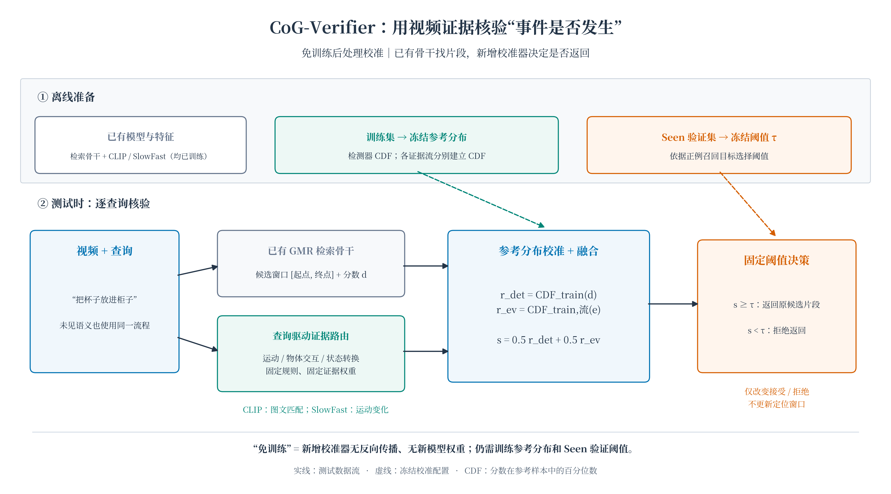

# CoG：用视频证据核验事件是否发生

**Idea：给已有 GMR 视频检索模型加一道免训练的事件核验，尝试少拒绝陌生但真实发生的事件、多拒绝合理却没有发生的事件，并保留正确的时间片段。**

本分支为 [`cog`](https://github.com/chinagalaxy2002/GMR_Unseen/tree/cog)，方法名称是 **Co-Generalization Verifier（CoG-Verifier）**。主实验目录为 [`experiments/agy_test/co_generalization_gmr/`](experiments/agy_test/co_generalization_gmr/)。这是现有 CoG 实验的归档与解释，不是重新训练或重新跑出的结果。继承仓库中的其他验证器属于历史实验，本 README 的主表仅描述 CoG。

## 1. 最快怎么复现？

```bash
git clone --single-branch --branch cog https://github.com/chinagalaxy2002/GMR_Unseen.git
cd GMR_Unseen
```

数据、原始视频、特征和 baseline 权重沿用 [Google Drive 数据包](https://drive.google.com/drive/folders/17wf_qE7wdGpplPxaHuYA-JGdnb_1CHHs)。将包中的归档和 `restore_bundle.py` 下载到自己的目录，恢复到本次克隆的仓库：

```bash
# 替换为你下载数据包的实际路径
python /path/to/gmr_assets/restore_bundle.py --repo-root "$PWD" --verify-files
# 连接已恢复的 15 份 SDCV 特征缓存；不重新提取特征、不训练模型
python reproduction/prepare_evidence_calibration.py
# 复算三个 backbone 的 baseline 与 CoG 指标
python experiments/agy_test/co_generalization_gmr/evaluate_co_generalization.py
# 2,000 次联合视频聚类 Bootstrap，复算配对差值的区间
python experiments/agy_test/co_generalization_gmr/run_bootstrap_significance.py
```

若数据包在当前服务器 `/home/guoxiangyu/paper/Openword/repro/data/`，恢复命令可写成：

```bash
python /home/guoxiangyu/paper/Openword/repro/data/restore_bundle.py --repo-root "$PWD" --verify-files
```

使用已有科研 Python 环境，评估所需依赖包括 `numpy`、`scipy`、`scikit-learn`。以上是**已有骨干与缓存的评估复算**，不等于从原始视频开始重训骨干。baseline 训练、推理和环境入口见[历史复现指南](docs/reproduction/INDEPENDENT_CANDIDATE_REPRODUCTION.md)的 baseline 章节；具体数据归档见[数据资产说明](docs/datasets/GMR_DRIVE_ASSETS_20261006.md)。该历史数据文档提到的旧分支名称不影响本分支的数据恢复。

### 输入与输出

| 路径 | 用途 |
|---|---|
| `data/release/semantic_existence_v2/{split}/{train,val,test}.jsonl` | 查询、划分、存在标签、真实时间窗口 |
| `experiments/agy_test/detr_decoder_gmr/cache/{split}/{train,val,test}.npz` | 恢复并连接后的检测器及多模态特征 |
| `results/semantic_existence/multi_split_v2/{split}/{moment,qd,flash}/test/` | 各 backbone 既有测试候选窗口 |
| `experiments/agy_test/co_generalization_gmr/benchmark_summary.json` | 评估脚本写出的五划分宏平均指标 |
| `experiments/agy_test/co_generalization_gmr/bootstrap_significance_summary.json` | Bootstrap 脚本写出的差值区间 |
| `experiments/agy_test/co_generalization_gmr/runs/{split}/predictions.npz` | 本分支归档的逐查询得分、阈值和决策 |

两条评估命令会覆盖对应汇总 JSON。原始评估脚本**不重新保存** `runs/*/predictions.npz`；本分支保存的是已有预测归档，不将其称为脚本自动新生成的产物。当前 CoG 源目录没有独立原始运行日志，本分支没有补造日志。需要留存复算日志时，可用 `set -o pipefail` 后将上述命令通过 `tee` 保存。

## 2. 方法怎么做？为什么叫免训练？



[PDF 矢量图](docs/cog/cog_verifier_overview.pdf) · [SVG 可编辑图](docs/cog/cog_verifier_overview.svg) · [绘图脚本](docs/cog/draw_figure.py)

原 backbone 先输出候选窗口与存在分数。CoG 用已有 CLIP/SlowFast 特征核验查询，再决定是否返回**原候选窗口**，不修改时间边界、不访问 Decoder 内部状态。

新增校准器没有需要梯度学习的参数：没有反向传播，也没有新的 CoG checkpoint。已有 backbone 和 CLIP/SlowFast 已经训练过；CoG 仍需训练参考分布，以及带标签的 Seen 验证集确定阈值。因此，“免训练”准确指**无需额外梯度训练的后处理校准**。

### 2.1 数字从哪里来？

| 类型 | 数字例子 | 来源 |
|---|---|---|
| 模型输出 | 检测器分数、CLIP/SlowFast 特征向量 | 已训练模型前向计算 |
| 视频证据 | 全局匹配、物体匹配、运动变化、端点变化 | 特征上的数学运算 |
| 固定权重 | 0.45 / 0.35 / 0.20；融合的 0.5 / 0.5 | 人为指定的超参数，不是训练学到的 |
| 百分位数 | 0.331679 | 当前分数与训练参考分数比较 |
| 拒绝阈值 | 0.387699 | Seen 验证集搜索得到 |

### 2.2 CLIP 匹配分数怎么计算？

CLIP 将完整查询、动作短语、物体短语和视频画面编码为向量。对齐文本使用投影后的 512 维表示。向量归一化后，内积就是余弦相似度。

用训练集唯一视频的全局表示建立固定参考向量 `v_ref`，计算：

```text
参考中心化匹配 = cos(文本向量, 视频向量) - cos(文本向量, v_ref)
```

这表示当前视频比训练视频平均视觉参考更接近该查询多少，允许为负值。

- **全局匹配**：全视频帧特征平均并归一化，与完整查询匹配，减去参考匹配。
- **物体匹配**：候选窗口内帧特征平均并归一化，与查询解析出的物体短语匹配，减去参考匹配。
- **显著帧匹配**：计算每帧与完整查询的中心化匹配，取最大值。当前实现是在**全视频**取最大值，不是只在候选窗口取最大值。

“分数高”表示特征相似，并不直接证明事件发生。物体或背景吻合也可能得高分。

### 2.3 SlowFast 与方向差值怎么计算？

```text
相邻特征变化 a_t = ||f_(t+1) - f_t||₂
运动变化 m = 候选窗口内 mean(a_t) - 全视频 mean(a_t)
动作状态差值 Δ = cos(v_end, q_action) - cos(v_start, q_action)
```

SlowFast 的变化幅度是运动强度代理，不是以米/秒测量的真实速度。动作差值保留符号，但不能直接等同于可靠的“放入/取出”方向识别，更不能据此宣称物理因果推断。

### 2.4 查询选择哪条证据流？

当前是固定关键词规则，按以下顺序判断：

1. 包含 `run / walk / slow / fast`：运动流。
2. 否则包含 `chair / couch / bed / sofa / box / cabinet / shelf / table / cup / book`：物体交互流。
3. 否则：默认状态转换流。

证据总分为：

```text
运动流：      e = 0.50 × 显著帧 + 0.35 × 运动变化 + 0.15 × 动作状态差值
物体交互流：  e = 0.45 × 显著帧 + 0.35 × 物体匹配 + 0.20 × 全局匹配
默认流：      e = 0.55 × 显著帧 + 0.30 × 全局匹配 + 0.15 × 动作状态差值
```

这些权重是当前实现中的经验设置，没有证明最优。权重和为 1 不意味着各特征具有相同尺度，也不意味着 `e` 是概率。

缓存中相关列：`X[:,3]` 全局匹配、`X[:,5]` 显著帧、`X[:,6]` 物体匹配、`X[:,8]` SlowFast 运动变化、`X[:,12]` 带符号动作差值。检测器列为 Flash 0、Moment 1、QD 2。

### 2.5 为什么转换成百分位数？

不同检测器与视频证据的数值尺度不同，直接比较原始数字容易误判强弱。当前实现使用保留并列的经验 CDF：

```text
CDF_ref(s) = [参考中小于 s 的数量 + 0.5 × 等于 s 的数量] / 参考样本数
```

- 检测器用对应 backbone、对应划分的整体训练参考分布。
- 视频证据用对应划分、对应证据流的训练参考分布。
- 测试时参考分布冻结，不用测试标签拟合 CDF。

CDF 表示“分数在参考样本中处于多高的位置”，**不是事件发生概率**。每条流的统计样本数和分布可靠性会影响校准效果。

### 2.6 为什么最终两路各占一半？

```text
r_det = CDF_train(检测器分数)
r_ev  = CDF_train,stream(视频证据总分)
s     = 0.5 × r_det + 0.5 × r_ev
```

它是一种简单的等权融合，避免训练额外融合网络。没有理论保证 0.5/0.5 最优，也没有保证融合后就是校准概率，需要消融和权重敏感性实验验证。

### 2.7 阈值怎么来？

Baseline 在 Seen 验证集的 5%–95% 分位上取 91 个候选阈值，最大化 Balanced Accuracy。记录该阈值下正例接受率 `TPR₀`。

CoG 设置目标 `TPR_target = min(0.95, TPR₀ + 0.04)`，在其验证分数的 1%–99% 分位上取 197 个候选阈值，选择正例接受率**最接近目标**的阈值。0.04 和 0.95 是人为超参数；实现没有严格保证 TPR 不低于目标，也没有在满足 TPR 约束后最大化负例拒绝率。

测试规则：`s >= τ` 返回 backbone 原片段，否则返回空片段。Baseline 与 CoG 的阈值政策不同，新增消融已给 Baseline 应用相同的 Seen-Val TPR 目标，见第 4 节；相同目标不保证相同测试集 TPR，也不证明 ROC 曲线处处优于基线。

## 3. 一条真实样本：所有数字逐步计算

以下来自归档数据，不是虚构示例：A1、Moment-DETR，`qid=test550`，测试数组索引 400。

> person open a cabinet door get a cup out.（打开柜门，取出一个杯子。）

查询包含 cabinet/cup，进入物体交互流。

| 视频证据 | 实际值（四舍五入） | 固定权重 |
|---|---:|---:|
| 显著帧匹配 | -0.005589634 | 0.45 |
| 物体匹配 | -0.037178993 | 0.35 |
| 全局匹配 | -0.013103336 | 0.20 |

```text
e = 0.45 × (-0.005589634)
  + 0.35 × (-0.037178993)
  + 0.20 × (-0.013103336)
  ≈ -0.018148649
```

同一流的 A1 训练参考有 **2,620 条**，其中 **869 条**证据分数更低，没有并列，因此：

```text
r_ev = 869 / 2620 ≈ 0.331679
```

检测器原分数为 `0.973100`。整体训练参考有 **8,608 条**，其中 **2,471 条**检测器分数更低，没有并列，因此：

```text
r_det = 2471 / 8608 ≈ 0.287059
s = 0.5 × 0.287059 + 0.5 × 0.331679 ≈ 0.309369
```

这说明 0.9731 虽然数值很高，相对于训练时经常接近饱和的检测器输出，百分位仍较低。

该划分保存的 CoG 阈值为 `τ=0.387699`；`s < τ`，最终拒绝。这个例子展示**计算链条**，不用于证明该次拒绝正确；判断正确与否还需事件标注。前期讲解中的 0.30 / 0.40 / 0.20 / 0.95 / 0.72 等简化数值是教学假设，不是本实验数据。

## 4. 当前实验结果

五个划分等权宏平均，所有表中数值为 **%**；AUROC 也用百分制。增减以百分点 pp 表示。以下是保存的测试集点估计，不是 Bootstrap 均值。

| Backbone | 方法 | Seen AUROC ↑ | Unseen AUROC ↑ | U−正确拒绝率 ↑ | U+误拒率 ↓ | U+门控 R@1≥0.5 ↑ | U+门控 R@1≥0.3 ↑ | U+门控 G-mIoU@1 ↑ | Unseen Rej-F1 ↑ |
|---|---|---:|---:|---:|---:|---:|---:|---:|---:|
| Moment-DETR | Baseline | 75.18 | 52.87 | 31.96 | 29.71 | 24.28 | 36.13 | 23.82 | 35.10 |
| Moment-DETR | CoG | 73.34 | 61.42 | 34.27 | 25.95 | 26.76 | 39.63 | 26.05 | 41.46 |
| QD-DETR | Baseline | 74.76 | 51.44 | 21.47 | 18.76 | 30.63 | 42.33 | 28.27 | 28.51 |
| QD-DETR | CoG | 73.00 | 60.01 | 25.58 | 15.89 | 32.27 | 45.24 | 29.94 | 35.90 |
| FlashVTG | Baseline | 77.30 | 57.14 | 27.04 | 21.85 | 33.63 | 44.31 | 30.65 | 33.42 |
| FlashVTG | CoG | 74.15 | 62.50 | 31.97 | 21.19 | 34.30 | 45.13 | 31.01 | 41.15 |

### 指标具体是什么意思？

- **U+**：未见语义、真实发生的事件；**U−**：未见语义、标注为不存在的事件。
- **U−正确拒绝率**：正确拒绝的 U− / 全部 U−；不是整体拒绝比例。
- **U+误拒率（FRR）**：被拒绝的 U+ / 全部 U+。
- **Unseen Rej-F1**：只在 U+/U− 中计算，把“拒绝不存在的查询”作为正类；精确率为 TN/(TN+FN)，召回率为 TN/(TN+FP)。TN/FN/FP 按事件存在 y=1 的混淆矩阵命名。
- **U+门控 R@1≥δ**：全部 U+ 中，接受且 top-1 门控片段的集合 IoU≥δ 的比例。被拒绝的真实事件记零。
- **U+门控 G-mIoU@1**：只在 U+ 上计算门控 top-1 片段与真实窗口的集合 IoU 均值，拒绝记零；与 All 范围 G-mIoU 不同。
- **AUROC**：事件存在分数对正负查询的排序能力，不依赖拒绝阈值，不代表概率校准质量。

集合 IoU 与 top-1 清理使用仓库 `eval/metrics.py`。窗口未更新，因此 U+ 定位指标的改善表示更多已有正确片段被接受，不意味着原始定位边界变得更准确。

### 配对联合视频 Bootstrap：95% 区间，pp

固定种子 3407，2,000 次全局视频联合采样，跨划分共享同一视频抽样次数。CDF、阈值和模型保持固定。以下全部为 CoG 相对 Baseline 的差值；FRR 列使用“下降量”，正值表示改善。

| Backbone | ΔUnseen AUROC | ΔU−正确拒绝率 | U+ FRR下降量 | ΔU+门控 R@1≥0.5 | ΔU+门控 G-mIoU | ΔUnseen Rej-F1 |
|---|---|---|---|---|---|---|
| Moment-DETR | [+6.23, +11.07] | [+0.41, +4.39] | [+1.30, +6.38] | [+0.81, +4.24] | [+0.96, +3.50] | [+4.12, +8.88] |
| QD-DETR | [+6.55, +10.64] | [+1.88, +6.44] | [-0.32, +5.85] | [-0.27, +3.68] | [+0.28, +3.13] | [+4.84, +9.96] |
| FlashVTG | [+3.00, +7.80] | [+2.41, +7.49] | [-2.63, +4.17] | [-1.73, +2.95] | [-1.40, +2.13] | [+5.06, +10.45] |

在现有数据和协议下，三个 backbone 的 Unseen AUROC、负例拒绝与 Rej-F1 的改善区间均高于零。Moment 的正例误拒与门控定位指标也有区间支持；QD 的 FRR 与 R@1 区间跨零；Flash 的 FRR、R@1、U+ G-mIoU 区间跨零。不能写“三骨干三项目标均已显著达成”。这些是未经多重比较校正的名义 95% 区间，也不覆盖训练/超参数选择、负例标注和校准样本不确定性。

源 JSON 的 `p_value` 是 Bootstrap 差值落在零另一侧的经验比例，不按严格零假设检验 p 值解释，尤其不能把有限抽样中的 0 写成真实 p=0。本 README 以区间陈述结果。

### 代价：Seen 与 All 指标仍下降

| Backbone | ΔSeen AUROC，pp | All Rej-F1，Baseline → CoG，% | All G-mIoU@1，Baseline → CoG，% |
|---|---:|---|---|
| Moment-DETR | -1.84 | 58.03 → 54.77 | 37.99 → 36.22 |
| QD-DETR | -1.76 | 56.27 → 50.13 | 38.06 → 35.31 |
| FlashVTG | -3.15 | 58.70 → 54.69 | 43.34 → 41.71 |

“全部”是宏平均，不表示每个划分都改善。不能根据 Unseen 部分的收益宣称整体无代价提升。

<!-- COG_ABLATIONS_START -->

### 新增：四组消融与独立重放核验

已重放四组消融；已核验的固定规则变体共 1800 个数值指标，最大误差 0 pp；15 份缓存与查询 QID、标签顺序一致。逻辑回归另有 90 项指标，其中 49 项未重放一致，最大差 2.083 pp，排除在已核验表格之外。这里只确认固定规则变体数值复算一致，不意味着数据构造或机制解释均已无误。

[完整核验后报告](experiments/agy_test/co_generalization_gmr/MECHANISM_AND_ABLATION_STUDY.md) · [已核验逐划分 JSON](docs/cog/ablation_audit/verified_ablation_results.json) · [原始完整 JSON（含未通过项）](experiments/agy_test/co_generalization_gmr/ablation_results.json) · [重放日志](docs/cog/ablation_audit/replay.log) · [核验结果](docs/cog/ablation_audit/verification.json)

**阈值与证据分开比较：** 下表来自实际 JSON，修正了原说明中的部分 FRR、Recall 和 Rej-F1。两种方法使用相同 Seen-Val TPR 目标，测试集 TPR 仍可能不同。

| Backbone | 配置 | U−正确拒绝率 ↑ | U+误拒率 ↓ | U+门控 R@1≥0.5 ↑ | U+门控 G-mIoU ↑ | Unseen Rej-F1 ↑ | Unseen AUROC ↑ |
|---|---|---:|---:|---:|---:|---:|---:|
| Moment-DETR | Baseline + BAcc | 31.96 | 29.71 | 24.28 | 23.82 | 35.10 | 52.87 |
| Moment-DETR | Baseline + TPR target | 28.81 | 26.65 | 25.90 | 25.27 | 31.61 | 52.87 |
| Moment-DETR | CoG + BAcc | 37.09 | 24.72 | 27.12 | 26.58 | 46.08 | 61.42 |
| Moment-DETR | CoG + TPR target | 34.27 | 25.95 | 26.76 | 26.05 | 41.46 | 61.42 |
| QD-DETR | Baseline + BAcc | 21.47 | 18.76 | 30.63 | 28.27 | 28.51 | 51.44 |
| QD-DETR | Baseline + TPR target | 15.43 | 14.31 | 32.35 | 30.04 | 22.20 | 51.44 |
| QD-DETR | CoG + BAcc | 33.56 | 28.05 | 28.35 | 26.04 | 41.48 | 60.01 |
| QD-DETR | CoG + TPR target | 25.58 | 15.89 | 32.27 | 29.94 | 35.90 | 60.01 |
| FlashVTG | Baseline + BAcc | 27.04 | 21.85 | 33.63 | 30.65 | 33.42 | 57.14 |
| FlashVTG | Baseline + TPR target | 23.59 | 18.17 | 35.12 | 32.02 | 30.12 | 57.14 |
| FlashVTG | CoG + BAcc | 41.66 | 28.51 | 31.23 | 28.35 | 50.23 | 62.50 |
| FlashVTG | CoG + TPR target | 31.97 | 21.19 | 34.30 | 31.01 | 41.15 | 62.50 |

相比平移基线，CoG 的 U−正确拒绝率提升 5.45 / 10.15 / 8.38 pp；但 QD 和 Flash 的 U+误拒率也更高。Moment 的 CoG+BAcc 在本表指标上优于 CoG+TPR target，保护阈值不是所有骨干的最优选项。新增对照尚未做配对 Bootstrap。

**两路融合权重：Unseen AUROC，%。** 实际扫描 7 个离散权重；不能据此证明 50/50 最优，也未测该扫描的 Seen 保留。

| 配置 | Moment-DETR | QD-DETR | FlashVTG |
|---|---:|---:|---:|
| w_det=0.0 | 61.34 | 61.34 | 61.34 |
| w_det=0.2 | 61.88 | 61.50 | 62.17 |
| w_det=0.4 | 61.87 | 60.78 | 62.47 |
| w_det=0.5 | 61.42 | 60.01 | 62.50 |
| w_det=0.6 | 60.46 | 59.11 | 62.22 |
| w_det=0.8 | 57.28 | 56.84 | 60.51 |
| w_det=1.0 | 52.87 | 51.44 | 57.15 |

**证据通道：Unseen AUROC，%。** 分支内等权与经验权重相近，最大差约 0.201 pp。单通道使用全局 CDF，完整模型使用分支 CDF，尚未完全隔离通道贡献。

| 配置 | Moment-DETR | QD-DETR | FlashVTG |
|---|---:|---:|---:|
| 经验权重 | 61.42 | 60.01 | 62.50 |
| 分支内等权 | 61.21 | 59.81 | 62.32 |
| 显著帧单通道 | 60.00 | 58.27 | 60.75 |
| 物体匹配单通道 | 57.10 | 56.08 | 57.87 |
| SlowFast 变化单通道 | 53.17 | 51.50 | 54.42 |

**路由：Unseen AUROC，%。** 二分支保留多数收益；无路由对照同时改了证据组合和 CDF，交换路由也不证明物理因果。

| 配置 | Moment-DETR | QD-DETR | FlashVTG |
|---|---:|---:|---:|
| 三分支 | 61.42 | 60.01 | 62.50 |
| 统一证据 + 全局 CDF | 53.62 | 51.96 | 54.85 |
| 交换运动/交互证据 | 52.55 | 51.08 | 53.49 |
| 二分支 | 61.35 | 59.88 | 62.33 |

当前能说的是经验校准在这组冻结划分上改善了 Unseen 排序，存在 Seen/All 代价。尚未证明帕累托最优；不能将词汇规则对当前数据集的适应排除。新动作/组合、同义改写、原生候选和严格留出审计仍需补充。

```bash
# 不覆盖归档结果：重放四组消融并核对 JSON
# 当前返回 PARTIAL / exit 1，表示逻辑回归未通过；固定规则变体 PASS
python experiments/agy_test/co_generalization_gmr/verify_ablations.py
# 从核验后的 JSON 生成报告和本节
python experiments/agy_test/co_generalization_gmr/render_ablation_report.py
# 如需重新运行原实验（会覆盖 ablation_results.json）
python experiments/agy_test/co_generalization_gmr/ablation_and_mechanism_study.py
```

<!-- COG_ABLATIONS_END -->

## 5. 已知问题与下一步

1. **阈值公平性**：已补 Baseline/CoG × BAcc/TPR target 对照；仍需固定证据组合的全局/分流 CDF 对照、严格守卫和配对区间，不能把相同 Seen TPR 目标称为相同 Unseen 灵敏度。
2. **未见语义定义**：A3 训练 S+ 仍含 `person smiling walks to a desk.` 和 `a person holding a paper runs across a room.`，解析器分别将主动作记为 smile/hold。标注动作留出并不等于查询完全未出现 run/walk，需审计多动作查询。
3. **关键词与小样本参考**：substring 路由会将 breakfast 的 fast、running shoes 的 run、walk-in closet 的 walk 当成运动信号；A3 运动流训练参考只有 11 条，不能忽略校准不稳定性。
4. **候选依赖**：局部多模态证据继承共享 HQ 候选缓存，不是各 backbone 独立提取自身窗口证据；需补目标原生候选对照。
5. **概率饱和**：当前检测器 CDF 仍使用缓存分数，未从机制上修复全部饱和问题；需原始 logit 对照。
6. **机制与新语义**：本次补充路由、分支权重及两路融合扫描；+4 pp TPR 目标仍缺敏感性分析，现有消融仍有混杂。固定规则后用新动作/组合及同义改写评估。Seen-only 阈值选择不等于排除了长期根据同一测试集反馈改超参数。
7. **归档与复算一致性**：此前只读重建发现 A3 保存得分与当前脚本有最大约 3.68e-5 差异，接受决策一致；其他四划分重建得分一致。不得宣称所有预测逐位零误差重放。需补保存脚本版本和逐查询输出的可重建链路。

当前可以说：**CoG 提出了清楚的免训练校准算法，在现有五划分上改善 Unseen 事件存在判断，Moment-DETR 上也有正例保护与有效定位共同改善的证据。完整的跨骨干共同泛化、机制解释与严格未见语义结论仍需补实验。**

## 6. 文件索引与来源

| 文件 | 内容 |
|---|---|
| [evaluate_co_generalization.py](experiments/agy_test/co_generalization_gmr/evaluate_co_generalization.py) | 三 backbone、五划分、Baseline/CoG 评估 |
| [消融脚本](experiments/agy_test/co_generalization_gmr/ablation_and_mechanism_study.py) | 阈值、融合权重、证据通道、路由四组对照 |
| [消融报告](experiments/agy_test/co_generalization_gmr/MECHANISM_AND_ABLATION_STUDY.md) | 由已核验 JSON 生成的全部结果与解释边界 |
| [核验脚本](experiments/agy_test/co_generalization_gmr/verify_ablations.py) | 重放四组消融，不覆盖归档 JSON |
| [run_bootstrap_significance.py](experiments/agy_test/co_generalization_gmr/run_bootstrap_significance.py) | 2,000 次联合视频聚类 Bootstrap |
| [benchmark_summary.json](experiments/agy_test/co_generalization_gmr/benchmark_summary.json) | 完整宏平均，包括 Seen/All 指标 |
| [bootstrap_significance_summary.json](experiments/agy_test/co_generalization_gmr/bootstrap_significance_summary.json) | 全部六项差值区间，不只列显著结果 |
| [runs/](experiments/agy_test/co_generalization_gmr/runs/) | 五份原始逐查询预测 NPZ，无新 CoG 权重 |
| [原始研究报告](experiments/agy_test/co_generalization_gmr/CO_GENERALIZATION_BENCHMARK_REPORT.md) | 原样归档；夸大或与实现不一致处以本 README 为准 |
| [SOURCE_ASSET_MANIFEST.json](docs/cog/SOURCE_ASSET_MANIFEST.json) | 本次复制的 10 个原始 CoG 文件大小与 SHA256 |
| [SDCV 特征组装](experiments/agy_test/semantic_directional_calibrated_verifier/prepare_data.py) | 14 列缓存及带符号端点差值来源 |
| [CLIP 对齐特征](experiments/agy_test/aligned_calibration_verifier/extract_aligned_features.py) | 文本投影、候选物体/全局匹配、训练参考中心 |
| [运动与显著帧提取](experiments/agy_test/multiscale_counterfactual_verifier/prepare_features.py) | SlowFast 变化与全视频峰值匹配来源 |

这些特征源码用于追溯来源；从头提取还依赖上游导出和预训练资产，部分历史提取器含原服务器路径，主复算流程使用数据包的现有缓存。绘图脚本需要 matplotlib 和中文字体，默认原服务器 Noto CJK 字体路径；其他机器按安装位置修改。
