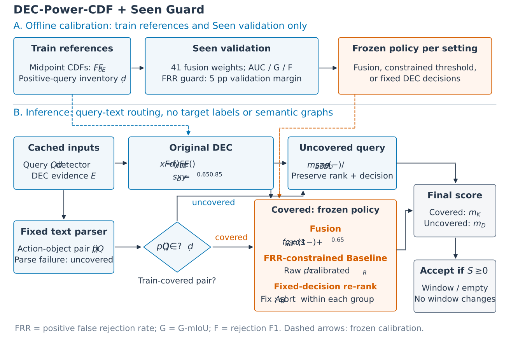

# DEC-Power-CDF + Seen Guard

训练查询组合路由与 Seen 验证校准保护熟悉查询，未覆盖查询保留原 DEC。当前 **五划分 × 三骨干**恢复 Seen AUROC，同时完整保留 Unseen 增益，G-mIoU、Rej-F1、正例误拒率也未变差。没有新训练权重。

**这是阈值协议变体，包含验证校准与冻结文本解析器。测试集已在方法探索中反复使用，尚需独立数据确认。**



- [方法与边界](METHOD.md) / [算法伪代码](docs/ALGORITHM.md)
- [完整结果](results/FULL_RESULTS.md) / [数值与阈值](results/metrics.csv) / [差值](results/comparisons.csv)
- [复现验证](VALIDATION.md)
- 算法图：[SVG](figures/algorithm_overview.svg) / [PDF](figures/algorithm_overview.pdf) / [PNG](figures/algorithm_overview.png) / [源码](figures/draw_algorithm.py)

## 五划分等权宏平均

| Backbone | Baseline Seen | 原 DEC Seen | 新版 Seen | 原 DEC → 新版 Unseen | G-mIoU 原 DEC → 新版 | Rej-F1 原 DEC → 新版 |
|---|---:|---:|---:|---:|---:|---:|
| Moment-DETR | 0.7518 | 0.7180 | **0.7622** | 0.6122 → 0.6122 | 39.74 → 40.75 | 59.40 → 62.07 |
| QD-DETR | 0.7476 | 0.7262 | **0.7565** | 0.6086 → 0.6086 | 40.23 → 40.79 | 58.93 → 60.60 |
| FlashVTG | 0.7730 | 0.7211 | **0.7772** | 0.6200 → 0.6200 | 44.04 → 45.30 | 59.41 → 61.88 |

不是合并样本 AUROC；逐设置六项检查均通过当前点估计。Seen 恢复后 Gap 增大，A1/A2_alt 的原 DEC Unseen<0.60 仍存在。

## 直接复现

Python 3.8–3.11，CPU 即可。分支包含数据、文本解析缓存与冻结校准配置，无需原实验目录、GPU、权重下载或新训练。

```bash
python -m pip install -r requirements.txt
python evaluate_seen_guard.py --output reproduced_seen_guard --bootstrap 2000
python calibrate_seen_guard.py --output calibration/rebuilt_seen_guard.json
python validate_release.py --reproduced reproduced_seen_guard --rebuilt calibration/rebuilt_seen_guard.json
```

评估生成三方法的 54 行逐设置/宏平均结果、路由审计及 2,000 次视频 bootstrap。校准脚本只用 train/Seen-val 重建 15 项策略与参数。

原 DEC 独立复现仍可用：

```bash
python evaluate.py --output reproduced_dec --bootstrap 2000
python reproduce_baseline.py --output reproduced_baseline
```

## 从文本重建解析缓存

spaCy 解析环境与 NumPy 1.24.4 数值环境分开。解析器固定为 en_core_web_sm 3.8.0，不做任务微调。

```bash
python3.10 -m venv .venv-parser
.venv-parser/bin/python -m pip install -r requirements-parser.txt
.venv-parser/bin/python text_router.py --output calibration/reparsed_query_keys.json
python evaluate_seen_guard.py --query-keys calibration/reparsed_query_keys.json --output reproduced_from_text --bootstrap 0
```

推理无需目标标签、分区或语义图。解析规则与基准构建一致，当前路由恰好对应 Seen/Unseen；这不等于通用 OOD 路由的独立验证。

## 文件

无标签推理输入只需 X（14 维缓存）与 queries：

```bash
python predict_seen_guard.py --split A1 --backbone qd --input data/A1/test.npz --parser-python .venv-parser/bin/python --output reproduced_predictions/A1_qd.npz
```

重新生成算法图：`python -m pip install -r figures/requirements.txt`，随后 `python figures/draw_algorithm.py`。

| 文件 | 用途 |
|---|---|
| `dec.py` | 原 DEC 与 Seen-BA 阈值 |
| `seen_guard.py` | 最终无目标标注打分，阈值零 |
| `text_router.py` | 固定文本解析器 |
| `calibrate_seen_guard.py` | train/Seen-val 校准 |
| `evaluate_seen_guard.py` | 三方法全量评测与 bootstrap |
| `validate_release.py` | 结果、六项保护、重建与资产校验 |
| `calibration/seen_guard.json` | 15 项策略、阈值与训练组合表 |
| `calibration/query_keys.json` | 从文本生成的可重建缓存 |
| `data/<split>/val_quality.npz` | 原验证窗口 IoU，供校准 |
| `results/dec_reference/` | 原 DEC 完整存档 |
| `figures/` | SVG/PDF/PNG 算法图及源码 |

原 DEC 基础提交：`06b0f59b83e0cd20de20b19041e4172be34582d2`。输入来源、资产哈希、新增校准数据来源见 `data/SOURCE_MANIFEST.json`、`data/ASSET_MANIFEST.json`、`data/SEEN_GUARD_SOURCE_MANIFEST.json`。
