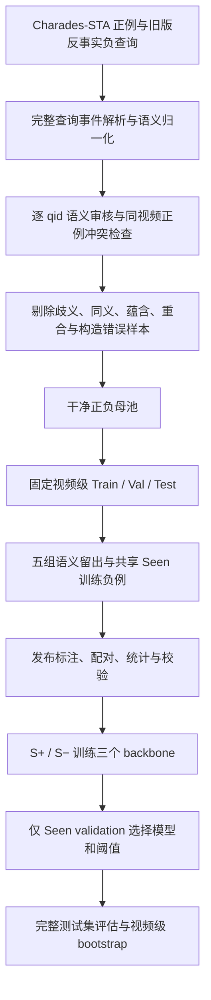

# Semantic Existence v3 未补充负样本版：数据制作与泛化退化明白纸

更新：2026-10-10。本文对应本分支的干净数据集 [`semantic_existence_v3_release`](data/release/semantic_existence_v3_release/)，以及在该版本上重新训练的 **5 个划分 × 3 个 backbone，共 15 个 baseline**。训练、完整测试集推理和 bootstrap 均已完成，失败任务为 0；最终评估于 2026-10-10 04:23（北京时间）完成。本文数值来自干净发布版，早期 v3 快照及 v1/v2 的历史结果不混入本表。

## 版本对照：未补充版与补充负样本版

**本页以及提交 `4ea67e9` 的指标均属于未补充版 `semantic_existence_v3_release`。** 该版本有原始审核保留的负例，但没有追加跨视频伪负例。补充负样本的版本叫 `semantic_existence_v3_balanced`，是另一套独立数据和独立重新训练实验。

| 版本 | 是否追加跨视频伪负例 | 每组 Test | 实验结果 |
|---|---|---:|---|
| `semantic_existence_v3_release` | 否；仅保留审核后的负例 | 4,611 | 15/15 完成；本页结果 |
| `semantic_existence_v3_balanced` | 是；补齐完整 split 的正负 1:1 | 6,906 | 截至补充记录时 8/15 评估完成；不得引用本页数值作为该版本结果 |

未补充版的独立明白纸见[该数据集 README](data/release/semantic_existence_v3_release/README.md)。两版本的生成流程差异、数据规模、实验归属与补充版阶段性结果见[版本对照与实验归属说明](docs/reports/SEMANTIC_EXISTENCE_V3_VERSION_GUIDE.md)。补充版数据当前保留在本地 `data/release/semantic_existence_v3_balanced/`，尚未随本分支发布。

## 1. 这套数据想测什么？

**事件语义没有在下游训练中见过时，模型还能否判断它在视频中是否发生，并在发生时找出时间段？** 例如搜索“把杯子放进柜子”：发生了就定位，没有发生就返回空集合。语义陌生不等于事件缺席，语义熟悉也不等于事件发生。

| 分区 | 下游训练是否见过对应语义 | 事件是否发生 | 期望输出 |
|---|---|---|---|
| S+ | 已见 | 存在 | 时间区间 |
| S− | 已见 | 缺席 | 空集合 |
| U+ | 未见 | 存在 | 时间区间 |
| U− | 未见 | 缺席 | 空集合 |

这里的 unseen 指**任务训练中的语义留出**，不表示 CLIP 或 SlowFast 预训练从未接触过这些概念。模型输入为视频特征和完整自然语言查询，输出事件存在分数及候选时间区间。

## 2. 数据怎样制作？

1. **整理来源。** 正例来自 Charades-STA 原始标注，保留查询、视频和 GT 时间窗；负查询来自 v2 五划分的旧反事实候选，按 qid 去重审核。负例使用 `relevant_windows=[]`，其源事件时间窗只作追溯，不是负例的定位 GT。
2. **解析完整事件。** 归一化动作词义、对象及 theme/source/goal/location 等角色；统一 sofa/couch，区分实体取放、穿脱衣和 “take a drink” 等不同词义。一次查询可以包含多个事件，按整句处理，不能只匹配单个动作词。
3. **语义审核。** 对 18,661 个初始候选 qid 逐条检查完整查询、事件元数据及已有同视频原始正例文本；修正事件标注，排除同义、蕴含、语义重合、歧义和构造错误负例。无法可靠判断的样本隔离。全量复审修订了 4,405 条正例及 1,218 条负例的元数据，隔离 42 条正例；审核档案与干净发布分开保存。
4. **冻结干净母池。** 最终保留 **15,034 个正例 qid、2,869 个负例 qid**；干净发布中隔离/排除样本均为 0。这里的“干净”表示通过当前文本语义审核规则，不是逐视频验证的缺席真值。
5. **固定视频归属。** 沿用已保存的视频级分配，保留原始 test 视频；其余原始 train 视频按 seed 3407 补充分配。源正例及派生负例继承同一视频 split。各组共用视频分配，组内 Train/Val/Test 视频互斥。
6. **施加语义留出。** 训练查询含任一已断言发生的 held 事件时整条移除；目的/意图事件和否定事件不当作已发生事件。训练仅含 S+/S−；验证和测试保留 S+/S−/U+/U−。动作轴三组共享合法 S− 训练交集，组合轴两组也共享合法 S− 训练交集。
7. **校验与冻结实验输入。** 检查 qid、存在标签与空/非空时间窗、视频互斥、Seen-only 训练及 `val_seen` 一致性。实验复制独立标注快照并记录 SHA-256；文本特征仅在 qid 与查询文本完全一致时复用，同时检查视频特征覆盖。

**负例依据与边界：** 本轮采用“Charades 短视频中，语义确实不同且未被同视频已有正例描述的新事件，通常可视为缺席”的构造假设。审核使用文本和已有标注，**没有逐条视频复核，也没有使用 baseline 预测筛样**。因此仍可能存在文本无法揭示的缺席标签噪声。详见[构造协议](data/release/semantic_existence_v3_release/construction_protocol.json)、[审核汇总](data/release/semantic_existence_v3_release/audit_summary.json)及[发布验收](data/release/semantic_existence_v3_release/validation_report.json)。

## 3. 五组怎么划分，有多大？

| 划分 | 留出语义 | Train | Validation | Test | 验证+测试 U+ / U− | Test 匹配 U 对 |
|---|---|---:|---:|---:|---:|---:|
| A1_v3 | 物理放置 / 拿取：physical_place、physical_take | 9,819 | 1,514 | 4,611 | 792 / 239 | 128 |
| A2_v3 | 饮用 / 倾倒：drink、pour | 10,809 | 1,514 | 4,611 | 292 / 119 | 90 |
| A3_v3 | 跑步 / 行走：run、walk | 10,765 | 1,514 | 4,611 | 303 / 152 | 100 |
| C1_v3 | sit × {bed, chair, couch}；sofa 归一为 couch | 10,881 | 1,514 | 4,611 | 198 / 361 | 116 |
| C2_v3 | {open, close} × {box, cabinet}，含明确箱/柜上下文的部件 | 10,939 | 1,514 | 4,611 | 176 / 120 | 32 |

A1–A3 留出动作族，C1–C2 留出动作与对象的组合。动作轴每组 S− 训练样本为 1,018 条，组合轴每组为 839 条；同轴使用相同负例 qid 池。各组复用 qid，**不能把五组行数相加视作独立数据量**。

普通实验读取 `splits/<group>/train.jsonl`、`val_seen.jsonl` 和 `test.jsonl`。`val_seen.jsonl` 是验证集的 S+/S− 子集；`matched_u_pairs.jsonl` 是配对索引，`test_matched_u.jsonl` 是展开后的测试配对样本。**下文结果来自完整 test，每组 4,611 条，不是 matched-U 子集。**

## 4. Baseline 怎样训练和评估？

| 项目 | 本次设置 |
|---|---|
| 模型 | Moment-DETR-GMR、QD-DETR-GMR、FlashVTG-GMR |
| 特征 | 固定 CLIP 文本特征，CLIP + SlowFast 视频特征；每个模型保留自身原生定位输出 |
| 训练 | 五组各自从头训练，仅 S+/S−；seed 3407；最多 100 epochs；连续 27 次验证无最佳更新时早停 |
| 模型选择 | Moment/QD：Seen validation MR-full-mAP；Flash：Seen validation R1@0.5 与 R1@0.7 的均值 |
| 拒绝阈值 | 完整 Seen validation 上，91 个分位数候选（5–95）最大化 Balanced Accuracy；并列取最早候选 |
| 决策 | score ≥ threshold 为接受，否则拒绝；Seen/Unseen 共用同一冻结阈值 |
| 存在分数 | Moment/QD：原生四位小数 sigmoid；Flash：原生六位小数 logit，避免三位小数概率饱和并列 |
| 定位窗口 | 每个 backbone 自身原生提交中的第一个合法窗口；不因终点超过标注视频时长而跳到另一候选 |
| 测试 | 全部 Seen 与 Unseen 测试样本；不使用 Unseen 验证或测试调参 |
| 置信区间 | 2,000 次视频级聚类 bootstrap，seed 3407；同一视频内查询整体重采样，checkpoint 与阈值固定 |
| 宏平均 | 五划分等权平均；使用共同视频抽样计算宏平均 CI，不能直接平均五个 CI 端点 |

**三项指标分别衡量什么？**

- **AUROC**：存在/缺席分数的排序能力，不依赖选定拒绝阈值；展示为 0–1。
- **Actual Rejection F1（Rej-F1）**：把“拒绝”视为正决策，`2TN/(2TN+FP+FN)`。TN 是正确拒绝缺席，FP 是错误接受缺席，FN 是错误拒绝存在。Seen 在 S+/S− 上单独计算，Unseen 在 U+/U− 上单独计算。
- **G-mIoU@1**：端到端存在判断与定位的共同结果。接受时取原生 top-1 与 GT 的集合 IoU（单个预测时为最大 IoU / GT 窗口数）；拒绝的负例得 1，拒绝的正例得 0，再在对应子集平均。

退化差值统一为 **Gap = Seen − Unseen**，单位百分点（pp）；AUROC 差值乘 100，百分比指标直接相减。正值为下降，负值为 Unseen 更高，保留原符号。**本次只有 baseline，不定义相对方法的 Unseen Net Gain、Seen Change 和 Gap Reduction，因此原标准表中这些列为“—”。** 后续方法须与同划分、同 backbone baseline 成对比较，并报告三项指标各自的增益、Seen 变化、Gap 缩小及成对 bootstrap CI。

## 5. 退化结果：先看五划分宏平均

| Backbone | 指标 | Seen | Unseen | Gap（pp） | Gap 95% CI（pp） |
|---|---|---:|---:|---:|---|
| Moment-DETR-GMR | AUROC | 0.7238 | 0.5224 | +20.14 | [+17.55, +22.56] |
| Moment-DETR-GMR | Rej-F1 | 50.51% | 22.25% | +28.27 | [+25.47, +31.15] |
| Moment-DETR-GMR | G-mIoU@1 | 34.54% | 25.51% | +9.03 | [+7.19, +10.88] |
| QD-DETR-GMR | AUROC | 0.7413 | 0.5337 | +20.76 | [+18.09, +23.36] |
| QD-DETR-GMR | Rej-F1 | 51.30% | 30.61% | +20.68 | [+16.92, +24.74] |
| QD-DETR-GMR | G-mIoU@1 | 34.86% | 28.02% | +6.84 | [+4.72, +8.97] |
| FlashVTG-GMR | AUROC | 0.7543 | 0.5647 | +18.96 | [+16.42, +21.51] |
| FlashVTG-GMR | Rej-F1 | 53.36% | 37.09% | +16.27 | [+13.25, +19.84] |
| FlashVTG-GMR | G-mIoU@1 | 41.75% | 34.44% | +7.31 | [+5.04, +9.68] |

**可以确认的结论：** 三个 backbone 的 AUROC、Rej-F1、G-mIoU@1 在五划分宏平均上均下降，九个 Gap 的 95% CI 都高于 0。Flash 的 Unseen 三项宏平均最高，AUROC 与 Rej-F1 的宏平均差距最小；QD 的 G-mIoU 差距最小，但其 Unseen G-mIoU 仍低于 Flash。差距小不能单独解释为性能好，需要同时看 Seen 和 Unseen 的绝对值。

### 逐划分三项指标与退化区间

以下 15 个设置全部完成；AUROC 为 0–1，Rej-F1/G-mIoU 为百分比。每张表的 CI 都对应 **Seen−Unseen Gap**。数值从未舍入结果计算后展示，不能用展示值相减代替原始精度。

#### AUROC

| 划分 | Backbone | Seen | Unseen | Gap（pp） | Gap 95% CI（pp） |
|---|---|---:|---:|---:|---|
| A1_v3 | Moment-DETR-GMR | 0.7499 | 0.6439 | +10.60 | [+5.56, +15.87] |
| A1_v3 | QD-DETR-GMR | 0.7295 | 0.5586 | +17.09 | [+11.66, +22.49] |
| A1_v3 | FlashVTG-GMR | 0.7530 | 0.6614 | +9.17 | [+3.69, +14.24] |
| A2_v3 | Moment-DETR-GMR | 0.7545 | 0.5075 | +24.69 | [+19.40, +30.12] |
| A2_v3 | QD-DETR-GMR | 0.7239 | 0.5105 | +21.34 | [+17.18, +25.57] |
| A2_v3 | FlashVTG-GMR | 0.7707 | 0.5317 | +23.89 | [+18.49, +29.26] |
| A3_v3 | Moment-DETR-GMR | 0.7571 | 0.4560 | +30.11 | [+23.78, +36.39] |
| A3_v3 | QD-DETR-GMR | 0.7685 | 0.5029 | +26.56 | [+20.61, +32.57] |
| A3_v3 | FlashVTG-GMR | 0.7720 | 0.4650 | +30.70 | [+24.89, +36.73] |
| C1_v3 | Moment-DETR-GMR | 0.6815 | 0.5118 | +16.97 | [+12.48, +21.47] |
| C1_v3 | QD-DETR-GMR | 0.7853 | 0.5775 | +20.78 | [+14.95, +26.51] |
| C1_v3 | FlashVTG-GMR | 0.7895 | 0.6037 | +18.58 | [+13.49, +23.80] |
| C2_v3 | Moment-DETR-GMR | 0.6760 | 0.4926 | +18.33 | [+10.02, +26.79] |
| C2_v3 | QD-DETR-GMR | 0.6992 | 0.5189 | +18.03 | [+9.16, +26.95] |
| C2_v3 | FlashVTG-GMR | 0.6862 | 0.5618 | +12.44 | [+3.37, +21.73] |

#### Rej-F1

| 划分 | Backbone | Seen | Unseen | Gap（pp） | Gap 95% CI（pp） |
|---|---|---:|---:|---:|---|
| A1_v3 | Moment-DETR-GMR | 56.38% | 37.36% | +19.02 | [+12.09, +26.34] |
| A1_v3 | QD-DETR-GMR | 55.51% | 28.92% | +26.59 | [+19.16, +34.22] |
| A1_v3 | FlashVTG-GMR | 57.69% | 44.11% | +13.58 | [+7.52, +19.45] |
| A2_v3 | Moment-DETR-GMR | 54.03% | 2.15% | +51.88 | [+46.59, +55.69] |
| A2_v3 | QD-DETR-GMR | 49.15% | 15.52% | +33.63 | [+24.87, +42.78] |
| A2_v3 | FlashVTG-GMR | 55.61% | 2.15% | +53.46 | [+48.22, +57.35] |
| A3_v3 | Moment-DETR-GMR | 54.39% | 14.86% | +39.53 | [+30.48, +48.28] |
| A3_v3 | QD-DETR-GMR | 54.09% | 23.35% | +30.74 | [+22.00, +39.90] |
| A3_v3 | FlashVTG-GMR | 56.32% | 26.04% | +30.28 | [+21.20, +39.37] |
| C1_v3 | Moment-DETR-GMR | 42.70% | 0.75% | +41.95 | [+39.10, +44.65] |
| C1_v3 | QD-DETR-GMR | 51.29% | 26.30% | +24.99 | [+16.88, +33.13] |
| C1_v3 | FlashVTG-GMR | 51.02% | 52.86% | -1.83 | [-9.82, +7.92] |
| C2_v3 | Moment-DETR-GMR | 45.07% | 56.11% | -11.04 | [-17.92, -3.56] |
| C2_v3 | QD-DETR-GMR | 46.45% | 58.97% | -12.53 | [-19.16, -5.09] |
| C2_v3 | FlashVTG-GMR | 46.14% | 60.26% | -14.13 | [-20.79, -6.89] |

#### G-mIoU@1

| 划分 | Backbone | Seen | Unseen | Gap（pp） | Gap 95% CI（pp） |
|---|---|---:|---:|---:|---|
| A1_v3 | Moment-DETR-GMR | 37.79% | 23.76% | +14.02 | [+11.18, +17.10] |
| A1_v3 | QD-DETR-GMR | 39.43% | 22.81% | +16.63 | [+13.78, +19.50] |
| A1_v3 | FlashVTG-GMR | 45.20% | 30.45% | +14.75 | [+11.56, +17.95] |
| A2_v3 | Moment-DETR-GMR | 35.31% | 20.75% | +14.57 | [+10.64, +18.20] |
| A2_v3 | QD-DETR-GMR | 33.70% | 25.64% | +8.06 | [+4.18, +11.97] |
| A2_v3 | FlashVTG-GMR | 41.88% | 29.59% | +12.29 | [+8.19, +16.27] |
| A3_v3 | Moment-DETR-GMR | 34.76% | 28.31% | +6.46 | [+2.57, +10.52] |
| A3_v3 | QD-DETR-GMR | 34.38% | 25.57% | +8.80 | [+4.91, +12.95] |
| A3_v3 | FlashVTG-GMR | 43.03% | 31.22% | +11.81 | [+7.55, +16.01] |
| C1_v3 | Moment-DETR-GMR | 32.58% | 15.33% | +17.25 | [+14.38, +19.99] |
| C1_v3 | QD-DETR-GMR | 33.89% | 24.40% | +9.49 | [+5.22, +13.65] |
| C1_v3 | FlashVTG-GMR | 40.54% | 38.21% | +2.33 | [-3.87, +8.86] |
| C2_v3 | Moment-DETR-GMR | 32.24% | 39.39% | -7.15 | [-13.43, -0.82] |
| C2_v3 | QD-DETR-GMR | 32.91% | 41.69% | -8.78 | [-15.35, -1.98] |
| C2_v3 | FlashVTG-GMR | 38.09% | 42.72% | -4.63 | [-11.11, +2.05] |

### 整体拒绝与端到端定位

| Backbone | Evaluation Branch | Actual Rej-F1 | Overall RR | S+ FRR | U+ FRR | Overall G-mIoU@1 |
|---|---|---:|---:|---:|---:|---:|
| Moment-DETR-GMR | A1_v3 / Baseline | 53.92% | 33.29% | 24.54% | 18.12% | 35.44% |
| QD-DETR-GMR | A1_v3 / Baseline | 51.65% | 23.42% | 13.97% | 17.28% | 36.65% |
| FlashVTG-GMR | A1_v3 / Baseline | 55.48% | 37.19% | 25.52% | 31.71% | 42.73% |
| Moment-DETR-GMR | A2_v3 / Baseline | 52.36% | 37.43% | 30.06% | 0.00% | 34.32% |
| QD-DETR-GMR | A2_v3 / Baseline | 47.92% | 43.59% | 38.27% | 6.73% | 33.15% |
| FlashVTG-GMR | A2_v3 / Baseline | 53.87% | 37.04% | 28.98% | 0.00% | 41.04% |
| Moment-DETR-GMR | A3_v3 / Baseline | 52.39% | 38.06% | 30.36% | 6.38% | 34.26% |
| QD-DETR-GMR | A3_v3 / Baseline | 52.05% | 39.38% | 30.76% | 22.13% | 33.70% |
| FlashVTG-GMR | A3_v3 / Baseline | 54.21% | 34.66% | 25.05% | 19.15% | 42.12% |
| Moment-DETR-GMR | C1_v3 / Baseline | 38.59% | 34.01% | 31.41% | 1.41% | 31.06% |
| QD-DETR-GMR | C1_v3 / Baseline | 48.53% | 39.15% | 32.20% | 14.08% | 33.06% |
| FlashVTG-GMR | C1_v3 / Baseline | 51.27% | 42.23% | 33.40% | 31.69% | 40.33% |
| Moment-DETR-GMR | C2_v3 / Baseline | 46.27% | 35.35% | 25.86% | 96.18% | 32.59% |
| QD-DETR-GMR | C2_v3 / Baseline | 47.66% | 44.50% | 34.89% | 97.71% | 33.34% |
| FlashVTG-GMR | C2_v3 / Baseline | 47.47% | 44.61% | 35.37% | 90.84% | 38.31% |
| Moment-DETR-GMR | MACRO / Baseline | 48.70% | 35.63% | 28.45% | 24.42% | 33.53% |
| QD-DETR-GMR | MACRO / Baseline | 49.56% | 38.01% | 30.02% | 31.59% | 33.98% |
| FlashVTG-GMR | MACRO / Baseline | 52.46% | 39.15% | 29.66% | 34.68% | 40.91% |

RR 是全部测试查询中被拒绝的比例；S+ FRR / U+ FRR 分别是已见/未见正例被错误拒绝的比例。Overall 指每组完整测试集；MACRO 是五组等权平均。

### 为什么有些 Unseen 指标反而更高？

**C2 的三个模型在 Rej-F1 和 G-mIoU 上都是负 Gap，但 AUROC 仍下降，且 U+ FRR 达 90.84%–97.71%。** 这说明“Unseen 的 Rej-F1/G-mIoU 更高”不能直接当作定位泛化更好：大量真实事件被拒绝，同时正确拒绝的负例会给 G-mIoU 贡献 1。C1 的 Flash Rej-F1 点估计略高于 Seen，但 Gap CI 跨 0。不能把所有负差值都改写为显著退化或显著改善。

**解释边界：** Rej-F1 和 G-mIoU 都依赖正负样本构成；Seen 与 Unseen 比例不同。下表明确给出测试分区计数，当前差值衡量发布测试集上的表现，没有做类别比例控制。AUROC 虽不直接依赖类别先验，也仍受样本内容影响。单种子 bootstrap 衡量测试视频抽样的不确定性，**不代表跨训练种子的稳定性，也不能据此确认语义熟悉度是唯一因果机制**。

| 划分 | S+ | S− | U+ | U− | 总测试行数 |
|---|---:|---:|---:|---:|---:|
| A1_v3 | 2857 | 983 | 596 | 175 | 4,611 |
| A2_v3 | 3230 | 1066 | 223 | 92 | 4,611 |
| A3_v3 | 3218 | 1036 | 235 | 122 | 4,611 |
| C1_v3 | 3311 | 894 | 142 | 264 | 4,611 |
| C2_v3 | 3322 | 1066 | 131 | 92 | 4,611 |

## 6. 从哪里查数据和完整结果？

| 内容 | 入口 |
|---|---|
| 干净数据、划分与字段说明 | [数据集 README](data/release/semantic_existence_v3_release/README.md) · [五组划分](data/release/semantic_existence_v3_release/splits/) |
| 数据规模、语义规则与验收 | [release_info](data/release/semantic_existence_v3_release/release_info.json) · [semantic_rules](data/release/semantic_existence_v3_release/selection/semantic_rules.json) · [validation_report](data/release/semantic_existence_v3_release/validation_report.json) |
| 原始要求的两张评估表 | [STANDARD_EVALUATION.md](docs/reports/semantic_existence_v3_clean_baselines_20261010/STANDARD_EVALUATION.md) |
| 三项退化与 CI 汇总 | [GENERALIZATION_DROP_COMPARISON.md](docs/reports/semantic_existence_v3_clean_baselines_20261010/GENERALIZATION_DROP_COMPARISON.md) |
| 未舍入指标 | [degradation_metrics.csv](docs/reports/semantic_existence_v3_clean_baselines_20261010/degradation_metrics.csv) · [degradation_metrics.json](docs/reports/semantic_existence_v3_clean_baselines_20261010/degradation_metrics.json) |
| Bootstrap 区间与有效抽样数 | [AUROC 及整体指标](docs/reports/semantic_existence_v3_clean_baselines_20261010/bootstrap.json) · [退化指标](docs/reports/semantic_existence_v3_clean_baselines_20261010/degradation_bootstrap.json) |
| 冻结训练/评估协议与完成状态 | [PROTOCOL.json](docs/reports/semantic_existence_v3_clean_baselines_20261010/PROTOCOL.json) · [FINAL_EVALUATION_STATUS.json](docs/reports/semantic_existence_v3_clean_baselines_20261010/FINAL_EVALUATION_STATUS.json) |
| 实验数据与代码校验 | [数据快照 SHA-256](docs/reports/semantic_existence_v3_clean_baselines_20261010/DATASET_SNAPSHOT_SHA256.json) · [原生代码 SHA-256](docs/reports/semantic_existence_v3_clean_baselines_20261010/SOURCE_MANIFEST.json) · [历史评估算术一致性检查](docs/reports/semantic_existence_v3_clean_baselines_20261010/EVALUATOR_PARITY.json) |

本分支提供数据标注、报告及轻量机器可读指标。视频、特征、checkpoint、逐查询预测和原始 bootstrap draws 保留在本地实验目录 `experiments/agy_test/v3_release_baselines_20261009/`，不打包进 Git；上述代码哈希用于标识本次实际运行快照，不应假设分支中任意后续代码修订都与该快照相同。

核心输入字段为 `qid`、`vid`、`query`、`duration`、`relevant_windows`、`exist_label`、`partition`；其他事件元数据和审核来源见数据文件及交接说明。训练入口在 `training/`，配置在 `configs/`，数据构建与校验在 `scripts/`。基础代码来自 [Generalized Moment Retrieval](https://github.com/dymm9977/generalized-moment-retrieval)。本 README 聚焦干净 v3；同分支的其他数据版本须按各自目录文档独立引用。
