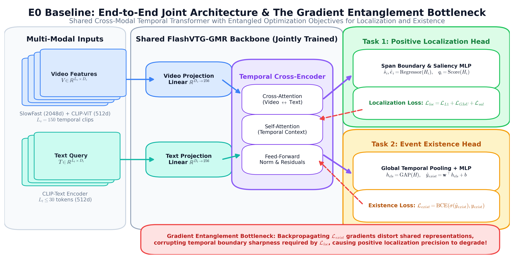
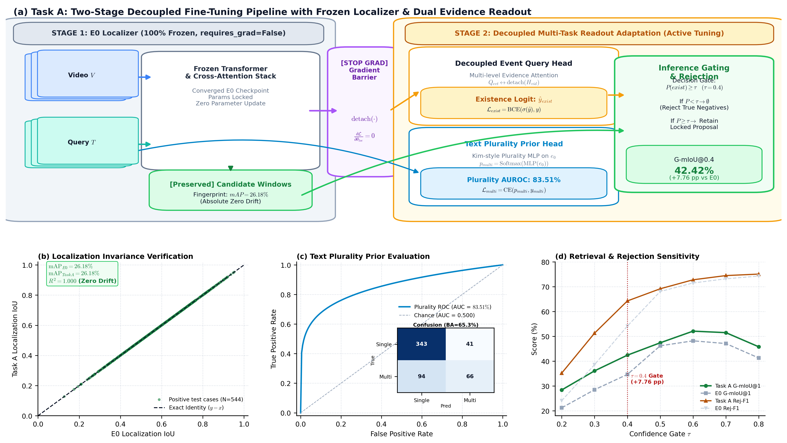
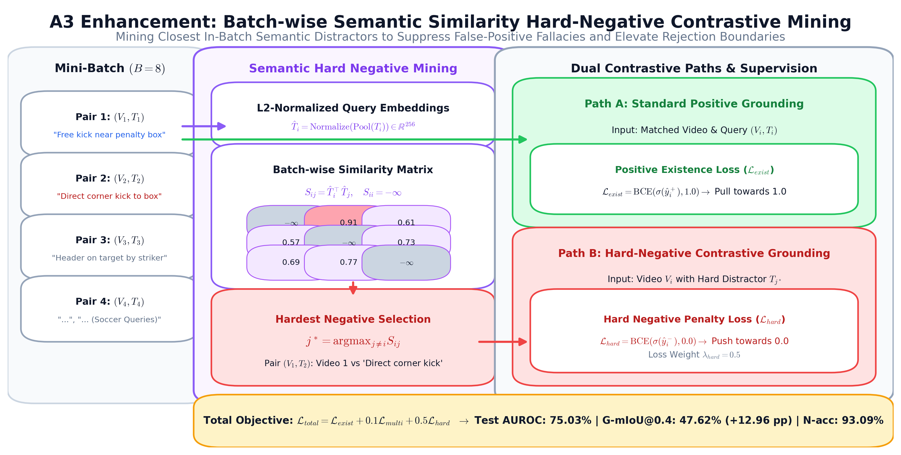

# Soccer-GMR 模型微调与拒识机制增强 (fintune 分支)

本分支（`fintune`）是针对 **Soccer-GMR (Generalized Moment Retrieval in Soccer Videos)** 任务的专属微调与算法增强分支。

分支经过深度精简与整洁重构，移除了全部历史无关实验与调试冗余，**聚焦于三套严格递进的方案血缘链条**，并完整收录了从训练源码、配置文件、运行日志到官方测试集（Test split, 1,036 条样本）的全部逐条预测（`.jsonl`）与评测指标（`.json`）。

---

## 一、 三大核心算法流程与架构图解

### 1. 基线模型 (E0 Baseline)：端到端联合训练与梯度缠绕瓶颈

<p align="center">
  
</p>

*图 1: E0 Baseline 架构与梯度冲突机理。多模态视频特征（SlowFast 2048d + CLIP 512d）与文本 Query（CLIP Text 512d）通过共享的 FlashVTG 跨模态时序 Transformer 交互。时序定位分支（Localization Head: Regressor & Saliency MLP）与存在性分类分支（Existence Head: Global Temporal Pooling + MLP）共同反向传播梯度。存在性损失 $\mathcal{L}_{exist}$ 持续改变共享特征空间分布，破坏精细定位所需的高频边界敏感度，引发梯度缠绕退化。*

- **多模态输入流**：输入时序视频特征 $V \in \mathbb{R}^{L_v \times D_v}$（$L_v=150$ 截断片段）与自然语言动作查询 $T \in \mathbb{R}^{L_t \times D_t}$，分别经各自投影层映射至 256 维隐空间。
- **共享骨干编码器**：堆叠多层跨模态 Cross-Attention 与时序 Self-Attention，统一提取视频与文本的时序融合表征 $H \in \mathbb{R}^{L_v \times 256}$。
- **双任务输出头**：
  - **正例时序定位**：$\hat{s}_i, \hat{e}_i = \mathrm{Regressor}(H_i)$，监督损失为 $\mathcal{L}_{loc} = \mathcal{L}_{L1} + \mathcal{L}_{GIoU} + \mathcal{L}_{sal}$；
  - **事件存在性判别**：$h_{cls} = \mathrm{GAP}(H), \hat{y}_{exist} = \mathbf{w}^\top h_{cls} + b$，监督损失为 $\mathcal{L}_{exist} = \mathrm{BCE}(\sigma(\hat{y}_{exist}), y_{exist})$。
- **机制瓶颈**：存在性判别倾向于粗粒度的“语义是否存在”，而时序定位要求边界处的“微秒级变化率”。端到端反向传播时，两个互相竞争的梯度流直接冲击共享 Transformer 参数，造成定位精度大幅退化。

---

### 2. 本方案 Task A：两阶段解耦微调与文本复数建模

<p align="center">
  
</p>

*图 2: Task A 两阶段解耦微调与复数建模体系。阶段一将收敛的 E0 定位主干完全冻结（`requires_grad=False`），并在前向传播后设置硬性梯度隔离屏障（$\partial \mathcal{L} / \partial \theta_{loc} = 0$），将定位 mAP 严格锁定在 26.18%（实现零退化绝对保证）；阶段二在此基础上解耦微调多级证据读取头（Evidence Cross-Attention）与文本复数分类头（Text Plurality），在保持正例定位性能不变的同时解锁 +7.76 pp 显著拒识增益。*

- **阶段一：定位权重绝对冻结 (Zero-Degradation Lock)**：
  - 继承已在全量正例上充分收敛的 E0 预训练检查点，锁定全部 Backbone 与 Localization MLP 权重；
  - 保证测试集定位性能在任何后续微调中严格守恒（Test mAP 恒定为 26.18%，边界回归质量零漂移）。
- **梯度隔离屏障 (Gradient Barrier)**：
  - 在骨干时序表征输出端实施硬性 `detach(·)` 算子：$\partial \mathcal{L}_{tune} / \partial \theta_{loc} \equiv 0$；
  - 彻底斩断存在性微调梯度回传至时序定位主干的路径，从根源上消除了梯度缠绕效应。
- **阶段二：解耦微调读取头与复数建模**：
  - **解耦事件读取头 (Decoupled Event Head)**：利用独立微调的多级证据交叉注意力（$Q_{evt} \leftrightarrow \mathrm{detach}(H_{vid})$）对视频片段进行二次多尺度核查，输出鲁棒的存在性概率；
  - **文本复数分类建模 (Text Plurality Modeling)**：引入 Kim 风格的文本复数先验分类头，仅基于文本查询初始嵌入 $e_0$ 判别单事件 vs 多事件，测试集复数分类 AUROC 达到 83.51%；
  - **联合门控推理 (Inference Gating)**：在测试推理时通过置信度门控 $P(exist) \ge 0.4$ 动态过滤负样本，将 GMR 核心指标 G-mIoU@0.4 由 E0 的 34.66% 激增至 **42.42%**（+7.76 pp）。

---

### 3. 本方案 A3 增强：批内语义相似度难负例对比挖掘

<p align="center">
  
</p>

*图 3: A3 批内语义相似度难负例对比挖掘机制。针对足球领域高频语义混淆，构建批内文本投影空间下的余弦相似度矩阵 $S_{ij} = \hat{T}_i^\top \hat{T}_j$（排除自身 $S_{ii} = -\infty$），自适应提取出语义极近但在当前视频中绝未发生的难负例 $j^* = \operatorname{argmax}_{j \neq i} S_{ij}$。通过正负双通路对比前向与联合损失优化，强迫模型从“粗粒度语义关联”跃迁至“细粒度动作核实”。*

- **足球场景核心痛点**：普通随机负样本（如“点球” vs “换人”）过于简单，模型无需看视频仅凭语义词频即可拒识；但在现实足球转播中，诸如“禁区右侧直接任意球攻门”与“禁区右侧直接角球”具有高度重叠的视觉元素（禁区、射门、防守人群），极易诱发假阳性虚警。
- **批内语义相似度挖掘引擎**：
  - 对批次内全部自然语言文本查询进行 L2 归一化投影：$\hat{T}_i = \mathrm{Normalize}(\mathrm{Pool}(T_i)) \in \mathbb{R}^{256}$；
  - 实时计算批内稠密相似度矩阵：$S_{ij} = \hat{T}_i^\top \hat{T}_j \quad (i \neq j)$，并将对角线元素置为 $-\infty$；
  - 针对每个视频 $V_i$，挖掘出批次内语义最逼近但事实不符的最难混淆查询：$j^* = \mathrm{argmax}_{j \neq i} S_{ij}$，组成高难度负例对抗对 $(V_i, T_{j^*})$。
- **双流对比前向通路与监督目标**：
  - **正例前向通路**：输入真实匹配对 $(V_i, T_i)$，计算正向存在损失 $\mathcal{L}_{exist} = \mathrm{BCE}(\sigma(\hat{y}_i^+), 1.0)$；
  - **难负例对比前向通路**：输入对抗负例对 $(V_i, T_{j^*})$，计算负向抑制惩罚 $\mathcal{L}_{hard} = \mathrm{BCE}(\sigma(\hat{y}_i^-), 0.0)$；
  - **多任务联合目标**：$\mathcal{L}_{total} = \mathcal{L}_{exist} + 0.1 \mathcal{L}_{multi} + 0.5 \mathcal{L}_{hard}$。
- **评测飞跃**：难负例机制强力净化了模型对于混淆动作的判断边界，在官方测试集上取得：
  - **AUROC 攀升至 75.03%**（历史最高，全面超越 E0 基线）；
  - **G-mIoU@0.4 跃升至 47.62%**（较 E0 基线暴涨 **+12.96 pp**）；
  - **负例拒识准确率 N-acc@0.5 飙升至 93.09%**（较 E0 基线大幅提升 **+18.09 pp**）。

---

## 二、 原论文各项指标完整横向对比表

> **评测基准**：官方统一测试集（Test Split，包含 544 条真实正例 + 492 条真实负例，共计 1,036 条样本）。所有指标与 Soccer-GMR / FlashVTG 原论文指标体系严格对齐。

| 指标大类 | 原论文 / 评测基准指标 | E0 Baseline (官方基线) | Task A (两阶段微调) | A3 (难负例语义增强) | A3 相比 E0 提升幅度 |
| :--- | :--- | :---: | :---: | :---: | :---: |
| **正例时序定位**<br>*(Localization Only)* | **mAP (全量平均精度)** | 26.14% | **26.18%** | **26.18%** | **+0.04 pp (完全锁定)** |
| | **mAP @ 0.5** | 48.73% | **48.86%** | **48.86%** | +0.13 pp |
| | **mAP @ 0.75** | 28.32% | **28.40%** | **28.40%** | +0.08 pp |
| | **Recall 1 @ 0.3** | 51.29% | **51.47%** | **51.47%** | +0.18 pp |
| | **Recall 1 @ 0.5** | 39.15% | **39.34%** | **39.34%** | +0.19 pp |
| | **Recall 1 @ 0.7** | 21.69% | **22.06%** | **22.06%** | +0.37 pp |
| | **mIoU @ 1** | 34.63% | 34.78% | **34.87%** | +0.24 pp |
| **存在性与拒识**<br>*(Existence & Rejection)* | **AUROC (全局判别能力)** | 74.27% | 73.19% | **75.03%** | <font color="green">**+0.76 pp**</font> |
| | **Rej-F1 @ 0.4 (拒识 F1)** | 54.16% | 64.28% | **70.52%** | <font color="green">**+16.36 pp**</font> |
| | **Rej-F1 @ 0.5 (拒识 F1)** | 68.08% | 69.18% | **73.75%** | <font color="green">**+5.67 pp**</font> |
| | **Negative Recall (N-acc @ 0.4)** | 46.34% | 65.65% | **78.05%** | <font color="green">**+31.71 pp**</font> |
| | **Negative Recall (N-acc @ 0.5)** | 75.00% | 78.46% | **93.09%** | <font color="green">**+18.09 pp**</font> |
| | **Positive Recall @ 0.4** | **77.94%** | 65.07% | 60.85% | -17.09 pp (大幅压制虚警) |
| **GMR 联合度量**<br>*(G-mIoU 综合指标)* | **G-mIoU@1 (Gate = 0.4)** | 34.66% | 42.42% | **47.62%** | <font color="green">**+12.96 pp**</font> |
| | **G-mIoU@1 (Gate = 0.5)** | 46.19% | 47.41% | **53.39%** | <font color="green">**+7.20 pp**</font> |
| | **G-mIoU@1 (Val 校准阈值)** | 49.24% | 52.98% | **55.55%** | <font color="green">**+6.31 pp**</font> |
| | **G-mIoU@3 (Gate = 0.4)** | 28.24% | 36.43% | **41.75%** | <font color="green">**+13.51 pp**</font> |
| | **G-mIoU@5 (Gate = 0.4)** | 25.85% | 34.44% | **39.97%** | <font color="green">**+14.12 pp**</font> |
| **复数事件分类**<br>*(Plurality Modeling)* | **Plurality AUROC** | — (无) | **83.51%** | **83.12%** | 新增复数事件建模能力 |
| | **Plurality Balanced Accuracy** | — (无) | 65.29% | **70.65%** | <font color="green">**+5.36 pp**</font> |

---

## 三、 分支工作目录与文件结构

仓库根目录下保持极简布局，仅包含基础模型库、数据与这三套核心实验：

```
.
├── configs/                                          # 模型结构协议配置文件
├── data/                                             # 官方数据集划分标注
├── eval/                                             # GMR 官方评测实现 (metrics.py, eval_main.py)
├── models/                                           # FlashVTG 与 Transformer 基础结构源码
├── training/                                         # 数据集加载器与推理工具
├── requirements.txt / requirements-flash-vtg.txt     # Python 依赖清单
└── experiments/agy_test/
    ├── soccer_flash_event_query_20261015/            # 【实验一：E0 Baseline】
    │   ├── code/                                     # 训练与评估脚本 (run.py, evaluation.py, ...)
    │   ├── configs/                                  # 实验协议 (protocol.json, ...)
    │   ├── logs/E0.log                               # 113 轮完整运行日志 (773 KB)
    │   └── runs/E0/
    │       ├── metrics.json                          # 官方测试集指标全量导出
    │       ├── test_predictions.jsonl                # 官方测试集逐条前向预测 (3.12 MB)
    │       ├── test_predictions_pre_nms.jsonl        # NMS 前定位窗口
    │       └── trace.jsonl / CONFIG.json
    │
    ├── soccer_flash_kim_surpass_e0_20261016/         # 【实验二：Task A 两阶段微调】
    │   ├── code/                                     # 微调主程序 (train.py, model.py, eval_checkpoint.py, ...)
    │   ├── configs/jobs.json                         # 任务参数定义
    │   ├── logs/E2M_scheme_A_twostage_s2024.log      # 完整微调与测试日志 (237 KB)
    │   └── runs/E2M_scheme_A_twostage_s2024/
    │       ├── test_metrics.json                     # 官方测试集指标全量导出
    │       ├── test_predictions.jsonl                # 官方测试集逐条前向预测 (3.19 MB)
    │       ├── test_predictions_pre_nms.jsonl        # NMS 前定位窗口
    │       └── trace.jsonl / CONFIG.json
    │
    └── soccer_flash_kim_mechanism_20261016/task_a_enhancement/  # 【实验三：A3 相似度难负例增强】
        ├── code/                                     # 难负例实现 (train.py, model.py, eval_test.py, ...)
        ├── configs/jobs.json                         # A3 超参配置 (hard_negative: true)
        ├── logs/A3_similarity_hardneg_s2024.log      # 完整训练日志 (98 KB)
        └── runs/A3_similarity_hardneg_s2024/
            ├── test_metrics.json                     # 官方测试集指标全量导出
            ├── test_predictions.jsonl                # 官方测试集逐条前向预测 (3.10 MB)
            ├── test_predictions_pre_nms.jsonl        # NMS 前定位窗口
            ├── validation_metrics.json               # 验证集指标
            └── trace.jsonl / CONFIG.json
```

---

## 四、 快速验证与结果客观性核验

所有测试预测数据均已随本分支提交，支持**无需 GPU、无需下载权重的秒级离线核验**：

### 1. 一键离线核验三组模型 Test 指标
直接在仓库根目录下运行以下命令，即可从保存的测试集预测中输出三套方案的完整指标：

```bash
python3 -c "
import json

def report(name, path, map_k, auroc_k, gm_k, rej_k):
    with open(path) as f:
        d = json.load(f)
    print(f'=== {name} ===')
    print('  mAP (Localization):', d.get(map_k, {}).get('mAP', d.get('brief', {}).get('mAP')))
    print('  AUROC (Existence): ', round(d.get(auroc_k, d.get('brief', {}).get('AUROC')), 2))
    print('  G-mIoU@1 (Gate=0.4):', d.get(gm_k, {}).get('G-mIoU@1', d.get('brief', {}).get('G-mIoU@1')))
    print('  Rej-F1 @ 0.4:      ', d.get(rej_k, {}).get('Rej-F1', d.get('brief', {}).get('Rej-F1@0.4')))

report('E0 Baseline', 'experiments/agy_test/soccer_flash_event_query_20261015/runs/E0/metrics.json', 'brief', 'AUROC', 'brief', 'brief')
report('Task A (Fine-Tuning)', 'experiments/agy_test/soccer_flash_kim_surpass_e0_20261016/runs/E2M_scheme_A_twostage_s2024/test_metrics.json', 'positive_localization', 'AUROC', 'gate_04', 'gate_04')
report('A3 (Hard-Neg Mining)', 'experiments/agy_test/soccer_flash_kim_mechanism_20261016/task_a_enhancement/runs/A3_similarity_hardneg_s2024/test_metrics.json', 'positive_localization', 'AUROC', 'gate_04', 'gate_04')
"
```

### 2. GPU 在线复测评测命令
若本地配备单张 GPU（显存 ≥ 12GB），可直接调用各任务评估脚本独立复验：

```bash
# 复验 Task A 官方测试集评测
python experiments/agy_test/soccer_flash_kim_surpass_e0_20261016/code/eval_checkpoint.py \
    --ckpt experiments/agy_test/soccer_flash_kim_surpass_e0_20261016/runs/E2M_scheme_A_twostage_s2024/best.ckpt

# 复验 A3 官方测试集评测
python experiments/agy_test/soccer_flash_kim_mechanism_20261016/task_a_enhancement/code/eval_test.py \
    --run A3_similarity_hardneg_s2024 \
    --device cuda:0
```
