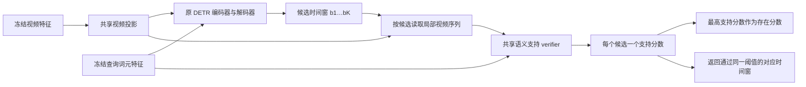

# Witness-DETR：历史候选方案（不再作为主方案）

> 2026-09-30 修订：本方案围绕候选区间与交叉负例监督，偏向拒绝器设计，未满足通用视频—文本对应关系学习的研究目标。保留用于追溯，不作为当前实施入口。当前方案见 [对应关系泛化研究方案](../EXPERIMENT_PLAN.md)。

日期：2026-09-30。状态：历史研究方案，未实现新模型，未开始新训练。依据见 [算法调研](../LITERATURE_REVIEW.md)。本方案不改变现有 v1/v2 发布包或历史结果。

## 1. 要解决的问题与成功标准

只用已见语义 S+/S− 训练，模型需要在未见动作或组合中同时接受存在事件、拒绝缺席事件，并返回正确时间窗。当前 seen→unseen AUROC 下降以及正确定位被硬拒绝的现象，是方法的动机；“语义熟悉度导致退化”尚未证实。

主目标是提高未见语义上的存在区分能力，并在保持 U− 拒绝的同时保留更多正确 U+ 定位。只降低 U+ FRR、只抬高全部存在分数、只提高总体 accuracy，均不算解决问题。

最小候选假设 H1：由同一个候选片段的语义支持分数决定存在与输出，比独立的 pooled existence head 更容易在语义变化下保持一致。

关键候选假设 H2：真实视频间的交叉标签监督，能抑制与视频无关的查询偏好，并比普通同视频编辑排序更好地迁移到 U+/U−。

H1/H2 分开检验。若只有 H1 有效，交付一个简洁基线与诊断结论；不能把无效的 H2 包装为核心贡献。二者都有效也不自动证明已达到顶刊方法贡献，仍须与近邻方法比较。

## 2. 冻结训练边界

| 项目 | 主实验规定 |
| --- | --- |
| 训练数据 | 每个 v2 划分原始 S+/S−；原有 query、exist_label、时间窗和来源关系 |
| 特征 | 与历史严格 GMR 相同的冻结 CLIP 文本/视频和 SlowFast 特征 |
| 初始化 | 与原 backbone 对齐；不使用全量 Charades-STA 任务微调 checkpoint |
| 新语义 | 不添加真实 U 文本、视频、held-out 正例、教师答案或合成目标语义 |
| 验证 | checkpoint、阈值、超参数只用 seen validation；不读 val U 来调参 |
| 测试 | 冻结实现与选择规则后一次正式提交；不依据 U test 挑 loss/结构 |
| 新标注 | 最小原型不需要；若进一步审核或扩域，单独版本、单独预算 |
| 对照公平性 | 相同训练步数、特征、数据访问、初始化和 checkpoint 选择规则 |

过去五组 test 已被研究者观察，后续结果存在研究选择偏差风险。训练内语义划分用于结构开发，正式 test 不用于选超参数；更强确认需要额外种子以及未用于开发的新语义或新视频域评测。不能把已有 test 当作从未接触的盲测。

## 3. 数据审计与交叉标签构建

### 3.1 可复算的现有资源

执行只读审计：

```bash
python scripts/audit_witness_training_pairs.py \
  --output docs/correspondence_generalization/archive/witness_training_pair_audit.json
```

该命令读取五组 train.jsonl，记录 SHA-256、冲突和计数，不读取 test、不改原发布包。

| 划分 | S+ | S− | 同视频来源对 | 可交叉的来源对 | 不同 query 对 | 去重交叉四元组 |
| --- | ---: | ---: | ---: | ---: | ---: | ---: |
| A1 | 7,108 | 1,500 | 1,499 | 433 | 75 | 969 |
| A2_alt | 8,823 | 1,500 | 1,499 | 433 | 75 | 969 |
| A3 | 8,852 | 1,500 | 1,499 | 433 | 75 | 969 |
| C1 | 9,016 | 1,500 | 1,499 | 317 | 49 | 765 |
| C2_alt | 9,112 | 1,500 | 1,499 | 317 | 49 | 765 |

这里的 969/765 按“无序视频对 × 无序查询对”去重；不是独立视频数或新增样本数。交叉查询可能集中于少量动作和编辑类型，实现前还应输出动作、对象、编辑类型、视频重复度。不能将共享负例池的各组计数累加。

### 3.2 四元组的严格条件

对两个不同训练视频 Va、Vb 以及两个完全相同字符串匹配的查询 qa、qb，要求四个已有标签齐全：

| | qa | qb |
| --- | --- | --- |
| Va | 存在，有真实时间窗 ba | 全视频缺席 |
| Vb | 全视频缺席 | 存在，有真实时间窗 bb |

Va 中 qa 与 qb 优先使用原 `source_qid` 相连的编辑对。Vb 的 qa 必须来自正式 S−，qb 必须来自正式 S+；不能仅凭同义词、相同 semantic_graph 或不在标注中就判定缺席。四个记录必须在本划分 train 中；qid、视频与查询标签冲突则整组排除。

四元组的语义真实性继承原发布标签与整批审核来源。代码查重和 SHA-256 不能替代视频审核。不要把这些自然样本称为随机化因果实验，它们仍可能存在场景差异。

### 3.3 防止窄子集主导训练

完整 S+/S− 监督仍是主体。交叉辅助批次先均匀抽 query 对，再抽视频组合，限制同一视频在一个批次重复出现。单独记录四元组样本的使用次数，不通过无限枚举把 75/49 个查询对伪装成大规模数据。普通同视频排序对照与交叉对照应使用同样的四条记录、相同前向次数和更新步数，以隔离目标函数收益。

## 4. 统一模型的最小实现

工作名 Witness-DETR 只表示候选设计，未核查名称唯一性。第一骨干使用已跑通的 QD-DETR；Moment-DETR 用于后续迁移验证。



### 4.1 候选与局部证据

保留原 DETR 的 K 个候选及 Hungarian 定位损失。设冻结视频特征为 x，投影后得到未注入文本的 z。候选 bj 内用 temporal ROIAlign/线性采样读取 M 个有序位置，保留相对位置；不能先对整段均值池化而丢失开/关等时序差异。

初始实现建议 M=8、hidden size 与 backbone 相同、verifier 为一层轻量词元—局部视频交互加共享标量输出。M 与容量属于开发候选，未验证最优性。verifier 的视觉输入必须能追溯到 bj；不要直接复用已混入整句文本的 decoder hidden state 作为唯一“视觉证据”。最终仍使用完整句子，不强制依赖语义解析器。

初版对 ROI 坐标 stop-gradient，边界由原定位损失更新，避免 verifier 通过扩大窗口轻易吸收全视频背景。可用一个预先固定的小外扩比例保留动作上下文；比例必须在开发验证中选择，并与普通局部 verifier 对照一致。不能同时加多尺度、MoE、evidential head，再把全部收益归于 witness。

### 4.2 存在与返回区间使用同一分数

令每个候选的支持 logit 为 sj=f(ROI(z,bj),q)，则：

\[
p_{exist}=\sigma(\max_j s_j),\qquad
\hat{\mathcal B}=\{b_j:\sigma(s_j)\ge t_S\}.
\]

在保留至少一个最高分候选的去重规则下，`输出非空 ⇔ 存在分数通过阈值`。R@1 使用支持分数最高的候选，不能用另一个 head 把未支持的候选重新排到首位。多时刻情形可以保留多个通过阈值的候选；不是只能输出一个位置或空集的单一 softmax。

原 foreground head 可继续用于 Hungarian 训练和辅助定位，不在最终输出时再乘一个全局 gate。需单独保留 raw proposals 以便诊断。支持分数不是边界 IoU，不应把边界不精确直接定义为事件缺席。固定 K；max 的极值效应仍可能造成误接受，需在 S− 长度/候选数分组上检查。

这个接口保证决策一致，不保证定位正确，也不保证未见语义 AUROC 提升。原生 max-foreground 是必须先比较的简单基线。

## 5. 训练目标

### 5.1 原定位目标

保留 `L_DETR` 的分类、L1/GIoU、原有 saliency 与辅助层监督，配置沿用对应原 baseline。原全局 existence BCE 在 witness 配置中移除，global-head 对照保留。

### 5.2 局部支持监督

S+ 中使用 GT ROI 和达到开发期固定 IoU 门槛的匹配候选作为 P；S− 中所有候选都无对应查询事件。定义：

\[
L_{wit}=\mathbb E_{S+}\frac1{|P|}\sum_{j\in P}\mathrm{softplus}(-s_j)
+\mathbb E_{S-}\frac1K\sum_j\mathrm{softplus}(s_j).
\]

两类分别归一化，防止负视频的 K 个 slot 压倒正监督。GT ROI 只在训练期额外采样，不输入推理。必须报告 GT ROI 与 predicted ROI 的验证差距，防止 teacher-forcing 式落差。每个 S+ 即使尚无高 IoU proposal，也有 GT ROI 支持学习。

S+ 未匹配候选不额外打 verifier 的 absence 标签：它们可能是重复预测、不同合理边界或未穷尽标注。原 DETR assignment 的 no-object 是集合训练标签，不等同于“全视频事件不存在”。代价是一些假阳性支持未被局部负监督覆盖，需要真实 S− 与正式空集指标来约束。

可增加袋级 `BCE(p_exist,y)`，但作为独立消融，不能默认与其他模块一起引入。

### 5.3 普通语义编辑排序：必要对照

来源 S+ 真值片段 ra 与同视频负查询 qb 构成：

\[
L_{edit}=\mathrm{softplus}(m-s(r_a,q_a)+s(r_a,q_b)).
\]

它约束同一事件与不同查询的关系，可抑制通用 eventness，但仍可能靠“原句像正例、编辑句像负例”完成，不能单独证明视觉推理。

### 5.4 交叉标签监督：待验证的核心

从四元组的两个 GT 区间得到 ra、rb，构造共享 scorer 的 2×2 logits：

\[
Z=\begin{bmatrix}s(r_a,q_a)&s(r_a,q_b)\\s(r_b,q_a)&s(r_b,q_b)\end{bmatrix},\quad
Y=\begin{bmatrix}1&0\\0&1\end{bmatrix}.
\]

四个单元均有既有标签支持。交叉绝对监督为四个 BCE 的均值 `L_cell`。另外比较两种相对目标，开发阶段择一，不能看到 test 后选择：

1. **普通双向对比（强对照）**：逐行区分正确查询、逐列区分正确视频；用相同 2×2 logits 实现，四个 margin 项取均值。
2. **交互差分（候选）**：

\[
\Delta=Z_{11}-Z_{12}-Z_{21}+Z_{22},\quad
L_{int}=\mathrm{softplus}(m_{int}-\Delta).
\]

保留 `L_cell`，因为只增大 Δ 可能靠单边极端分数满足。为使两个方向都成立，还应报告每行正负 margin；若候选依旧单边改善，则以普通双向目标替代，不保留无效“新模块”。

若 `s(r,q)=a(r)+b(q)`，则 Δ 恒为 0。这一代数性质说明纯视频强度和纯文本偏好相加不能独自满足正 margin，**不证明模型学到因果证据，也不证明交互差分是新损失**。已有图文对比学习同样鼓励交互；本项目需要检验局部 GT 支持、交叉标签和输出一致性的组合是否带来额外收益。

训练总目标初版写为：

\[
L=L_{DETR}+\lambda_wL_{wit}+\lambda_xL_{cell}+\lambda_iL_{int}.
\]

`λw=1` 可作为与原 existence coefficient 对齐的起点；`λx,λi` 的小范围候选为 `{0.1,0.3,1}`，仅在训练内开发或 seen validation 筛选，逐项添加，避免全网格。margin 初始 1，所有 logits 尺度监控与普通对比对照一致。具体冻结值进入 run manifest 后才开展正式多划分测试。

## 6. 最少但决定性的实验矩阵

| ID | 结构/目标 | 回答的问题 |
| --- | --- | --- |
| B0 | 历史严格 QD-GMR；必要时同环境重训 | 复用可比基线 |
| B1 | 原 DETR foreground 最大值作为存在与输出分数 | 单纯移除全局 gate 是否已经足够 |
| B2 | B0 + seen 温度/偏置校准 | operating point 改善与排序提升分开 |
| M0 | ROI verifier + Lwit，同分数输出 | 局部统一打分的贡献 |
| M1 | M0 + 同视频 Ledit | 普通语义负例排序的贡献 |
| M2 | M0 + 四元组 Lcell | 标签平衡/数据重组的贡献 |
| M3 | M2 + 普通双向对比 | 相同数据下的标准对比强基线 |
| M4 | M2 + Lint | 候选交互目标是否超过普通对比 |
| C0 | 参数和局部采样预算匹配的全局 verifier，使用 M4 同样四元组 | 排除只因数据/参数变多 |

首先做 B1、M0、M2、M3、M4；M1 与 C0 用于解释机制，B2 可直接对既有预测拟合而不用重训。所有目标对照尽量用相同采样和前向次数；统计实际 seen query exposures、steps、参数量、训练时间和推理时间。不能用 100 个不同含义的 epoch 掩盖额外数据访问。

外部方法的正式比较优先纳入 NA-VMR 的 QD/CG 适配、RaTSG、CausalVTG 和 SHINE；原文完整复现与“借鉴其模块”的适配必须分开命名。CausalVTG/RaTSG 在相同 train 与特征上训练；SHINE 若需额外 LLM 生成文本，受限数据版只能用现有已审核负例，并明确它是适配版。RE 若无法取得完整实现，可公开标注复现缺口，不能凭摘要伪造算法。

RA-RFT/HRVTG、FVE 与更强视频特征放在不同数据/计算预算的补充比较，不与主表混合。HRVTG 会测试时更新参数，不能当作固定模型协议的直接同预算结果。

## 7. 开发、训练与评估顺序

### 阶段 P0：现有模型诊断，无新训练

使用 seen validation 检查原 `max foreground`、global existence、最大 proposal IoU 的关系；计算“至少一个 proposal 正确但 existence 拒绝”的比例。已有 test 仅用于固定诊断复算，不据此挑模型。验证原适配器读取哪些张量、原官方 gate 与诊断硬 gate 的差异。

在训练内部单独按视频留出开发集，并从 S 语义中构造 pseudo-unseen action/composition。开发训练子集删除这些语义，开发验证四格仅用于方法开发，不触碰真实 U。对照 B0/M0 等必须使用同一开发划分；最后正式模型从头用完整 S 训练。此嵌套过程要单独记录，不能把 pseudo-unseen 指标冒充正式 unseen 结果。若规模不够，退回 seen validation 调参与明确泛化调参限制。

### 阶段 P1：最小结构筛选

在 A1 的训练内部开发划分，QD backbone、seed 3407、固定短训练步数比较 B1/M0/M2/M3/M4。短训练仅筛查实现和方向；原先 QD 晚期 checkpoint 曾有改善，因此短训练失败不能单独作最终机制否证。先选择结构，再扩大，不在五个 test 间挑最有利配置。

完成必要检查：S− 无窗口也能计算损失；GT ROI 没有进入推理；四元组仅来自 train；不存在 NaN；全局输出非空与最高支持分数决策一致；打乱四元组标签会削弱收益；模型读不到 qid/partition/verification 字段作为特征。

### 阶段 P2：正式重复验证

最终结构在五组分别从头训练，100 epochs，关闭早停，初始 seed 3407。模型选择沿用对应 backbone 的 seen validation 定位指标，存在阈值沿用 seen balanced accuracy；若改变选择目标，所有对照同步重跑并单列协议。正式主表至少保留 B0、最强简单基线、M0、最终方法。

主张跨 seed 稳定时，对最终方法与最强简单基线采用相同的三个种子；新增种子可预先固定为 42、2026，历史 3407 为第三个。种子选择不依赖表现。视频 bootstrap 与 seed 方差分别报告，不能用前者替代后者。

### 阶段 P3：泛化与投稿证据

在 Moment-DETR 上验证模块可迁移，保留同样特征与协议。若拟投顶刊，再建立第二视频域与更均衡的文本控制评测；额外数据审核与算力是新的工作包，不写成已具备。五组复用 Charades 视频域，不能替代跨域验证。

## 8. 评价指标与统计口径

主指标为 S/U 分组 AUROC、U+ FRR、U− RR、同分数输出的 U+ R@1@0.5/0.7；同时报告四格计数和 official full-test GMR 指标。辅助报告 AUPRC 时写清正例比例，跨 split 不直接比较其绝对值。

对每个模型预先从 S validation 选择两类阈值：原 balanced accuracy 阈值，以及满足 S− 误接受率 5%/10% 的阈值（若不可达如实报告）。将它们直接迁移到 U，报告 U+ 与 U− 的联合表现。这能区分“靠全部接受提高 U+”和真正的区分提升。

可以绘制完整 U ROC，并在匹配 U− 误报率处读取 U+ 接受率作为曲线诊断；这些读数使用 test labels，不能被包装为实际可部署阈值或用于选模。oracle-U 阈值同样只作事后诊断。

单独报告 `P(reject | U+, raw top1 IoU≥0.5)` 和 `P(reject | U+, any proposal IoU≥0.5)`；前者检查正确首选候选损失，后者区分 proposal recall 与最终决策损失。新方法的 proposal raw 指标与输出后的指标明确分别计算，不复用含原 global gate 的定义。

固定模型采用按测试视频聚类的 paired bootstrap，2,000 次，报告“新方法−对照”的差值区间。训练种子逐个报告，再给均值与标准差。动作轴和组合轴分开按组等权，不把共享视频的五组当独立域做显著性检验。PairAcc 保留但附配对覆盖与 text-only 对照。

## 9. 机制否证实验

| 干预/对照 | 预期支持证据 | 若失败如何解释 |
| --- | --- | --- |
| 同文本跨视频正负、四元组两行反转 | 分数跟随视频真值变化 | 仍可能主要依赖文本偏好 |
| 只有 Lcell vs 加标准对比 vs 加 Lint | 交互目标带来可重复的额外泛化收益 | 差分公式不是必要贡献 |
| 相同四元组喂给全局与局部 verifier | 局部支持尤其保留正确定位 | 收益可能主要来自数据重组 |
| GT ROI vs predicted ROI | 区分局部识别失败和候选定位失败 | 候选召回不足时应先修定位 |
| verifier 视频输入打乱、text-only、video-only | 正常图文配对显著优于单模态 | 双模态结构不等于使用视觉证据 |
| 词元层级/整句局部匹配 | 完整查询交互在难语义负例有用 | 不应增加无贡献的成分分支 |
| 同 K 同参数，max foreground vs witness | 支持分数超过原 slot 分类 | 仅统一接口已足够，方法应简化 |
| query pair/视频分组报告与重加权 | 收益不只集中于少数模板 | 需缩小泛化主张 |

目标片段删除、背景删除与仅保留证据的实验属于补充诊断：删除一个标注窗不保证事件在整个视频消失，重复事件、残余动作证据和拼接伪影都会误导。未经审核的删窗视频不能硬标 absent，也不加入主训练。若执行人工审核的目标删除对照，必须同时使用等量无关删除来控制操作伪影。

## 10. 风险、停止条件与结果解释

1. **最强简单基线已解释全部收益。** 若 B1/M0 与复杂方法相当，保留简洁方案，停止堆加模块；不能靠新命名制造贡献。
2. **只改善阈值不改善排序。** 若 AUROC 无提升，只能主张 calibration 改善；全局单调修正无法解释排序提升。
3. **接受增加伴随拒绝崩溃。** 若复现 E6 的全部接受，方法未解决目标；同时关注实际固定阈值与 ROC 诊断。
4. **交叉监督只改善文本子集。** 若新查询措辞或不同动作组失效，缩小主张并检查样本集中度。
5. **局部支持与定位都降分但彼此一致。** 这是共同错误，不支持“统一提高可靠性”；需绝对指标和正确定位保留率。
6. **冻结特征缺少动作证据。** 若 GT ROI 的图文区分已失败，头部结构可能不是主要瓶颈；更强特征可作后续独立预算实验，不能悄悄替换主实验。

正式推进判据：最终方法应优于最强简单基线，在动作轴与组合轴的存在排序和联合接受/拒绝上表现出可重复优势；同时不能通过大幅损伤 seen 或原始定位换取表面 U 指标。具体可接受 trade-off 在正式测试前用验证目标冻结，不事后设有利阈值。若差异在 seed 间反转或区间广泛包含零，应报告不确定结果并降低机制主张。

## 11. 实现位置、产物与预算

建议新建独立 `models/witness_detr/` 或显式可关闭的 verifier 模块，复用 QD-DETR 而不修改历史 checkpoint 行为。四元组 dataset sampler 输出训练所需 qid 索引和四格标签；新 `local_witness` 损失不得把 provenance 字段传入网络。

每次运行记录：release SHA、四元组 manifest SHA、git commit、seed、初始化、特征、参数量、步数/epoch、样本暴露数、loss 权重、选模规则、阈值来源、训练/推理耗时。预测保留原 proposals、slot support、最终输出、存在分数和 qid，方便复算。

结果建议存于 `results/semantic_existence/witness_detr/<version>/<split>/<backbone>/<seed>/`。发布文档只写已完成结果，计划状态与实测状态分开。

额外成本主要是每个候选的局部读取以及四元组共享 scorer 前向；可以复用冻结特征并缓存同视频投影，但不预估未经测量的加速比或 GPU 小时。先 profile 显存、每步耗时和四元组比例，再确定完整矩阵排期。现有训练记录证明基础模型可运行，不证明新增完整矩阵可在某期限完成。

## 12. 当前交付与下一步入口

已完成：文献调研、候选方法设计、原训练集交叉标签可行性核查、可复算审计脚本和本方案。

尚未完成：候选模型实现、训练内部开发划分、四元组语义集中度报告、所有新训练与性能验证。下一步从 P0 及 B1/M0 的最小实现开始；先建立相同数据预算下的简单基线，再验证交叉监督是否值得保留。
