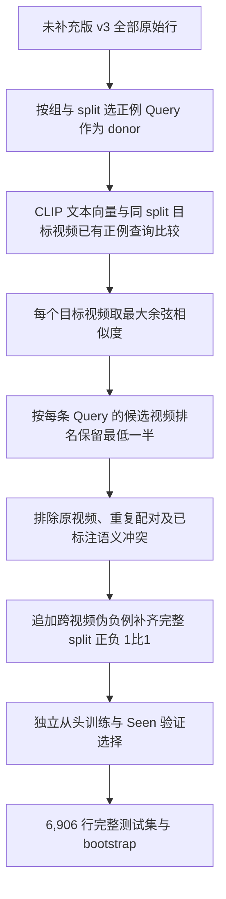

# Semantic Existence v3 两版本：实验归属与生成管线对照

本文用于区分未补充负样本的 clean release 与独立补充跨视频伪负例的 balanced release。记录日期：2026-10-10。

## 1. 先明确提交和数据的对应关系

**`4ea67e9` 整理的是未补充版，不是 balanced 版。** 证据是该提交的 `PROTOCOL.json` 指向 `data/release/semantic_existence_v3_release`，每组 test 为 4,611 条，实验数据快照与该目录 45 个划分文件的 SHA-256 一致。

| 项目 | 未补充版 | 补充负样本版 |
|---|---|---|
| 数据目录 | `data/release/semantic_existence_v3_release/` | `data/release/semantic_existence_v3_balanced/`（本地，尚未随本分支发布） |
| 独立实验 | `experiments/agy_test/v3_release_baselines_20261009/` | `experiments/agy_test/v3_balanced_baselines_20261010/` |
| 原始审核母池 | 15,034 正例 qid / 2,869 负例 qid | 原样保留；新增伪负例另存 |
| 追加负例 | 无 | 按组累计新增 58,844 个独立伪负例 qid |
| 每组 Val / Test | 1,514 / 4,611 | 2,238 / 6,906 |
| 类别比例 | 保留审核后的原始比例 | 每个完整 Train/Val/Test 正负 1:1；S/U 子集不保证各自 1:1 |
| 完成情况 | 15/15，正式五划分宏平均可用 | 当前记录仅 8/15 评估完成，没有正式五划分宏平均 |
| 结果入口 | [未补充版独立明白纸](../../data/release/semantic_existence_v3_release/README.md) | 下文为完成项的阶段性记录 |

## 2. 未补充版的管线

Charades-STA 原始正例与旧反事实候选 → 完整事件解析/归一化 → 逐 qid 文本语义审核及同视频已有正例冲突检查 → 排除同义、蕴含、重合、歧义和构造错误样本 → 干净正负母池 → 固定视频级划分 → 五组动作/组合留出 → Seen-only 训练与 Seen-validation 选择 → 完整测试与 bootstrap。没有再追加跨视频负例。

该版本的 15 个实验已完成。AUROC、Rej-F1、G-mIoU@1 的 Seen/Unseen、差值、区间、整体拒绝指标及样本数均见[独立明白纸](../../data/release/semantic_existence_v3_release/README.md)和[机器可读结果](semantic_existence_v3_clean_baselines_20261010/degradation_metrics.json)。

## 3. 补充版的独立生成管线

完整保留原始数据行、qid、事件元数据、四象限标签及视频划分；新增样本追加在文件末尾。新增记录使用 donor 的查询与事件、目标视频的 vid 与时长，设置空时间窗和缺席标签。训练 donor 仅来自 S+，因此新增训练负例仅为 S−；验证/测试新增配额按原始 S+/U+ 比例分配。

筛选是“每个 Query 的候选视频相似度排名最低 50%”，不是余弦相似度小于 0.5。全部目标视频原始正例查询可用于标注冲突排除，包括未放入训练样本的 held-out 标注；这些过滤参考不作为训练样本。新增训练负例按组构造，完整增强后的训练负例池不再保证同轴相同。原始 matched-U 文件保持不变，跨视频新增负例不能冒充同源视频匹配反事实对。

**新增标签全部是未逐视频核验的伪负例。** 低文本相似度和标注冲突检查不能证明视频中事件缺席。原始语义审核负例和新增伪负例须分别标识。未补充版也没有逐视频复核，但其负例依据是已有候选的文本语义审核，两种构造来源应区分。

| 组 | 原版 Train 行数 | 补充版 Train 行数 | Train 新增负例 | Val 新增负例 | Test 新增负例 |
|---|---:|---:|---:|---:|---:|
| A1_v3 | 9,819 | 17,602 | 7,783 | 724 | 2,295 |
| A2_v3 | 10,809 | 19,582 | 8,773 | 724 | 2,295 |
| A3_v3 | 10,765 | 19,494 | 8,729 | 724 | 2,295 |
| C1_v3 | 10,881 | 20,084 | 9,203 | 724 | 2,295 |
| C2_v3 | 10,939 | 20,200 | 9,261 | 724 | 2,295 |

## 4. 补充版阶段性实验记录（不是最终结果）

状态来源：本地 `QUEUE_STATUS.json`，更新时间 `2026-10-10T17:15:29.948754`（北京时间）；本次整理冻结了 8 个已完成评估的结果。其余设置不填数，不用未补充版补位，不报告不完整五划分的宏平均。

协议为独立从头训练，seed 3407、最多 100 epochs、Seen-only 训练、完整 Seen validation 选择模型和 BA 阈值、2,000 次视频聚类 bootstrap。三个 backbone 的原生特征与模型配方沿用未补充版；完整测试集改为补充版自身的 6,906 条。

| 划分 | Backbone | Seen / Unseen AUROC | AUROC Gap（pp） | Seen / Unseen Rej-F1 | Rej-F1 Gap（pp） | Seen / Unseen G-mIoU@1 | G-mIoU Gap（pp） |
|---|---|---:|---:|---:|---:|---:|---:|
| A1_v3 | FlashVTG-GMR | 0.7813 / 0.6814 | +9.99 | 71.17% / 65.48% | +5.69 | 54.43% / 45.18% | +9.25 |
| A1_v3 | Moment-DETR-GMR | 0.7278 / 0.6487 | +7.91 | 67.98% / 63.52% | +4.46 | 48.12% / 42.01% | +6.10 |
| A1_v3 | QD-DETR-GMR | 0.5352 / 0.5186 | +1.66 | 63.65% / 60.94% | +2.71 | 44.19% / 40.79% | +3.41 |
| A2_v3 | Moment-DETR-GMR | 0.7349 / 0.6665 | +6.84 | 67.23% / 65.12% | +2.11 | 47.45% / 42.09% | +5.36 |
| A2_v3 | QD-DETR-GMR | 0.5684 / 0.5127 | +5.57 | 51.63% / 60.43% | -8.80 | 32.15% / 39.57% | -7.42 |
| A3_v3 | Moment-DETR-GMR | 0.7265 / 0.6421 | +8.44 | 64.33% / 57.14% | +7.19 | 44.37% / 41.01% | +3.36 |
| A3_v3 | QD-DETR-GMR | 0.5351 / 0.5585 | -2.34 | 40.39% / 28.96% | +11.43 | 28.84% / 26.14% | +2.71 |
| C1_v3 | Moment-DETR-GMR | 0.7308 / 0.6264 | +10.45 | 65.88% / 57.19% | +8.68 | 46.35% / 42.99% | +3.35 |

对应完整阶段性表包含三项 Gap 95% CI、整体 Rej-F1/RR/G-mIoU、S+/U+ FRR 和子集数量，见[阶段性结果](semantic_existence_v3_balanced_partial_20261010/GENERALIZATION_DROP_COMPARISON.md)。机器可读指标见 [CSV](semantic_existence_v3_balanced_partial_20261010/degradation_metrics.csv)、[JSON](semantic_existence_v3_balanced_partial_20261010/degradation_metrics.json)；区间见[bootstrap JSON](semantic_existence_v3_balanced_partial_20261010/degradation_bootstrap.json)。

## 5. 如何比较两版本？

它们的 Train、Val、Test 都不同，不能把两版本的完整测试指标差值直接当作“新增负例带来的净增益”，也不能把它当作同测试集方法对照的 Gap Reduction。若要评估补负例的训练作用，应冻结同一测试集、同一 backbone，并独立用各自合法 Seen validation 选择，再进行共享视频成对比较。当前文档分别报告各版本自身测试集结果，不宣称补充版已经带来性能改善。

未来更新补充版必须在其自己的结果目录进行；未补充版完整结果与数据规模保持独立标识。
