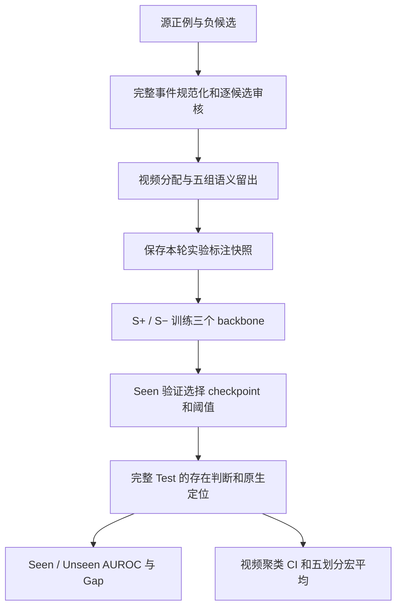

# Semantic Existence v3：Baseline 的 Seen → Unseen 退化

整理日期：2026-10-09。本报告仅汇总原生 baseline。五个划分 × 三个 backbone，共 15 次训练，seed=3407。

## 1. 数据版本

**已有 baseline 使用初始 v3 实验快照，每组 Test=4,999；当前负例审核版每组 Test=4,622。二者不能视为同一数据版本。** 当前修订未找到对应重新训练结果。

- [当前审核版标注](../../data/release/semantic_existence_v3/)：`negative-full-audit-20261009-1`；负例重审已应用，正例全量审核仍在进行。
- [对应已有 baseline 的原始标注快照](../../data/release/semantic_existence_v3_baseline_snapshot_20261009/)：15,076 正例、3,585 负例，共 18,661 个去重 qid。
- [Baseline 指标与 95% CI](../semantic_existence_v3_metrics/)：仅包含 baseline，保留每组和五划分宏平均。

## 2. 五划分宏平均退化

MACRO 为五组指标等权平均，不是合并重复样本后计算。AUROC 为 0–1，Gap 为百分点（pp）。

| Backbone Model | Seen AUROC | Unseen AUROC | Performance Gap |
|---|---:|---:|---:|
| Moment-DETR-GMR | 0.7699 | 0.5854 | 18.46 pp |
| QD-DETR-GMR | 0.7916 | 0.5498 | 24.18 pp |
| FlashVTG-GMR | 0.7921 | 0.5313 | 26.07 pp |

Moment 的平均差距为 18.46 pp，QD 为 24.18 pp，Flash 为 26.07 pp。A3 的 QD/Flash Unseen AUROC 为 0.4665/0.4660；其 95% CI 包含 0.5，不能仅凭点估计认定显著低于随机排序。C2 的 U+ 误拒率为 94.20%–97.10%，表明 Seen 验证阈值在该初始快照上拒绝了绝大多数 unseen 正例。

## 3. 各划分存在性排序与退化

Gap=`100×(Seen AUROC−Unseen AUROC)`。CI 为绝对 Unseen AUROC 的 95% 区间，使用已有 500 次测试视频聚类 bootstrap，seed=3407。Net Gain、Seen Change、Gap Reduction 没有对照方法，记为 `—`。

| Evaluation Variant | Seen AUROC | Unseen AUROC | Performance Gap | Unseen Net Gain | 95% CI (Bootstrap) | Seen Change | Gap Reduction |
|---|---:|---:|---:|---:|---|---:|---:|
| A1_v3 / Moment-DETR-GMR / Baseline | 0.7838 | 0.5745 | 20.93 | — | [0.5401, 0.6080] | — | — |
| A1_v3 / QD-DETR-GMR / Baseline | 0.8029 | 0.5761 | 22.67 | — | [0.5383, 0.6138] | — | — |
| A1_v3 / FlashVTG-GMR / Baseline | 0.8034 | 0.5629 | 24.06 | — | [0.5229, 0.5955] | — | — |
| A2_v3 / Moment-DETR-GMR / Baseline | 0.7704 | 0.6135 | 15.69 | — | [0.5582, 0.6729] | — | — |
| A2_v3 / QD-DETR-GMR / Baseline | 0.7922 | 0.5270 | 26.52 | — | [0.4700, 0.5781] | — | — |
| A2_v3 / FlashVTG-GMR / Baseline | 0.7898 | 0.5360 | 25.39 | — | [0.4871, 0.5873] | — | — |
| A3_v3 / Moment-DETR-GMR / Baseline | 0.7917 | 0.5162 | 27.55 | — | [0.4573, 0.5833] | — | — |
| A3_v3 / QD-DETR-GMR / Baseline | 0.8036 | 0.4665 | 33.71 | — | [0.4105, 0.5291] | — | — |
| A3_v3 / FlashVTG-GMR / Baseline | 0.8140 | 0.4660 | 34.80 | — | [0.4105, 0.5251] | — | — |
| C1_v3 / Moment-DETR-GMR / Baseline | 0.7412 | 0.6378 | 10.34 | — | [0.5761, 0.6956] | — | — |
| C1_v3 / QD-DETR-GMR / Baseline | 0.7786 | 0.6215 | 15.72 | — | [0.5591, 0.6745] | — | — |
| C1_v3 / FlashVTG-GMR / Baseline | 0.7590 | 0.5531 | 20.59 | — | [0.5158, 0.5953] | — | — |
| C2_v3 / Moment-DETR-GMR / Baseline | 0.7626 | 0.5849 | 17.77 | — | [0.5104, 0.6575] | — | — |
| C2_v3 / QD-DETR-GMR / Baseline | 0.7809 | 0.5581 | 22.28 | — | [0.4816, 0.6287] | — | — |
| C2_v3 / FlashVTG-GMR / Baseline | 0.7940 | 0.5386 | 25.53 | — | [0.4596, 0.6214] | — | — |
| MACRO / Moment-DETR-GMR / Baseline | 0.7699 | 0.5854 | 18.46 | — | [0.5584, 0.6120] | — | — |
| MACRO / QD-DETR-GMR / Baseline | 0.7916 | 0.5498 | 24.18 | — | [0.5251, 0.5751] | — | — |
| MACRO / FlashVTG-GMR / Baseline | 0.7921 | 0.5313 | 26.07 | — | [0.5073, 0.5563] | — | — |

## 4. 拒绝与端到端定位

以下指标均为 %。Rej-F1、RR、G-mIoU 在完整 Test 上计算；S+ FRR、U+ FRR 分别在对应正例分区上计算。定位采用保存评估结果中的第一个有效原生 submission 窗口，不因其 end 超过 duration 而替换为后续候选。

| Backbone Model | Evaluation Branch | Actual Rejection F1 (Rej-F1) | Overall Rejection Rate (RR) | S+ False Rejection Rate (S+ FRR) | U+ False Rejection Rate (U+ FRR) | End-to-end Localization (G-mIoU@1) |
|---|---|---:|---:|---:|---:|---:|
| Moment-DETR-GMR | A1_v3 / Baseline | 55.72% | 43.11% | 33.31% | 28.99% | 36.33% |
| QD-DETR-GMR | A1_v3 / Baseline | 55.96% | 41.29% | 32.82% | 19.97% | 36.19% |
| FlashVTG-GMR | A1_v3 / Baseline | 57.63% | 37.05% | 23.92% | 31.56% | 43.23% |
| Moment-DETR-GMR | A2_v3 / Baseline | 55.91% | 55.87% | 46.36% | 36.16% | 36.78% |
| QD-DETR-GMR | A2_v3 / Baseline | 57.92% | 43.55% | 33.70% | 4.46% | 37.20% |
| FlashVTG-GMR | A2_v3 / Baseline | 57.25% | 36.11% | 25.77% | 6.25% | 42.76% |
| Moment-DETR-GMR | A3_v3 / Baseline | 58.50% | 45.21% | 34.24% | 18.99% | 38.94% |
| QD-DETR-GMR | A3_v3 / Baseline | 59.19% | 43.85% | 32.32% | 19.41% | 37.97% |
| FlashVTG-GMR | A3_v3 / Baseline | 58.70% | 48.29% | 36.07% | 38.40% | 43.57% |
| Moment-DETR-GMR | C1_v3 / Baseline | 53.40% | 46.09% | 37.91% | 18.02% | 36.05% |
| QD-DETR-GMR | C1_v3 / Baseline | 56.20% | 46.03% | 35.94% | 23.26% | 36.90% |
| FlashVTG-GMR | C1_v3 / Baseline | 56.89% | 40.61% | 28.10% | 52.91% | 42.47% |
| Moment-DETR-GMR | C2_v3 / Baseline | 58.66% | 49.03% | 34.64% | 94.20% | 38.50% |
| QD-DETR-GMR | C2_v3 / Baseline | 58.97% | 48.87% | 34.16% | 97.10% | 37.56% |
| FlashVTG-GMR | C2_v3 / Baseline | 60.42% | 45.91% | 30.28% | 94.93% | 44.39% |
| Moment-DETR-GMR | MACRO / Baseline | 56.44% | 47.86% | 37.29% | 39.27% | 37.32% |
| QD-DETR-GMR | MACRO / Baseline | 57.65% | 44.72% | 33.79% | 32.84% | 37.17% |
| FlashVTG-GMR | MACRO / Baseline | 58.18% | 41.59% | 28.83% | 44.81% | 43.29% |

## 5. 实验数据规模与当前发布的区别

### 5.1 Baseline 实際训练与测试快照

| 划分 | Train S+ | Train S− | Train 合计 | Val 合计 | Seen Val | Test S+ | Test S− | Test U+ | Test U− | Test 合计 |
|---|---:|---:|---:|---:|---:|---:|---:|---:|---:|---:|
| A1_v3 | 8,783 | 1,236 | 10,019 | 1,615 | 1,312 | 2,843 | 1,171 | 621 | 364 | 4,999 |
| A2_v3 | 9,811 | 1,463 | 11,274 | 1,615 | 1,492 | 3,240 | 1,369 | 224 | 166 | 4,999 |
| A3_v3 | 9,767 | 1,542 | 11,309 | 1,615 | 1,514 | 3,227 | 1,395 | 237 | 140 | 4,999 |
| C1_v3 | 10,009 | 1,239 | 11,248 | 1,615 | 1,455 | 3,292 | 1,271 | 172 | 264 | 4,999 |
| C2_v3 | 10,115 | 1,438 | 11,553 | 1,615 | 1,546 | 3,326 | 1,448 | 138 | 87 | 4,999 |

五组复用相同样本，行数不能相加当作独立样本量。每组快照 Test 覆盖 1,304 个视频。

### 5.2 当前审核版

| 划分 | Train | Val | Seen Val | Test |
|---|---:|---:|---:|---:|
| A1_v3 | 9,791 | 1,516 | 1,246 | 4,622 |
| A2_v3 | 10,827 | 1,516 | 1,419 | 4,622 |
| A3_v3 | 10,783 | 1,516 | 1,418 | 4,622 |
| C1_v3 | 10,845 | 1,516 | 1,358 | 4,622 |
| C2_v3 | 10,951 | 1,516 | 1,445 | 4,622 |

当前母池含 15,076 正例、2,869 负例。原先发布的 3,585 个负例在重审后移除 exclude 57 条、quarantine 659 条；动作轴 S− 训练共享池为 1,016 条，组合轴为 836 条。现有 baseline 没有采用这些修订后的训练池。

## 6. 数据管线与实验原理

### 6.1 标注与语义划分

1. 从 Charades-STA 原始正例保留 `qid/query/vid/duration/relevant_windows`；从旧五划分负查询按 qid 去重，建立源正例与候选关联。
2. 规范化完整事件列表，区分动作词义、对象和 theme/source/goal/location；处理 sofa/couch 同义、take a drink 等词义，保留原查询与正例时间窗。
3. 逐候选比较同义、蕴含、事件重合、歧义和事件差异，检查同视频其他原始正例 GT 冲突。仅 `keep/distinct` 进入负例母池；exclude/quarantine 不进入正式训练和测试。
4. 采用 Charades 短视频的构造假设：语义不同且无已有正例冲突的事件候选标为缺席，`relevant_windows=[]`。这不等于逐视频证明缺席；没有声称完成逐条视频复核。缺席判断范围是整个视频，源窗口用于追溯。
5. 源正例及派生负例共用视频 split，保留原始 test 视频，各组共用固定分配；Train/Val/Test 视频互斥。
6. 按下表留出语义，将训练中命中 held 的完整查询移除；训练只用 S+/S−，模型和阈值只使用 `val_seen`。U+/U− 保留在评估记录中。

| 划分 | 留出定义 |
|---|---|
| A1_v3 | `physical_place`、`physical_take` |
| A2_v3 | `drink`、`pour` |
| A3_v3 | `run`、`walk` |
| C1_v3 | `sit × {bed, chair, couch}`，sofa 归 couch |
| C2_v3 | `{open, close} × {box, cabinet}` |

Unseen 指下游任务训练未见的目标语义，不指 CLIP/SlowFast 预训练未见这些概念。初始快照后续审核发现完整事件遗漏、误分区及问题负例，因此本轮指标反映初始标注，不能代替最终语义审核版的结果。初始构建也未逐项强制实际训练 seen inventory，且同轴 S− 池不相同；当前负例修订已应用共享池，正例审核仍在继续。

### 6.2 特征、监督与模型选择

- 使用已有 CLIP 文本、CLIP 视频与 SlowFast 视频特征；文本仅在 qid 和查询文本一致时复用。
- 三个 backbone 的原生事件存在 head 以 `exist_label` 接受 BCE-with-logits 正负监督；正例保留定位 GT，负例为空窗。
- 每组独立训练 Moment-DETR-GMR、QD-DETR-GMR、FlashVTG-GMR，seed=3407，最多 100 epochs；batch size 为 Moment/QD 16、Flash 8。
- Moment/QD 按完整 Seen 验证的 MR-full-mAP 选择最佳 checkpoint；QD 在该项非数值时回退至 MR-full-mIoU。Flash 按 `(R1@0.7+R1@0.5)/2` 选择。
- `max_es_cnt=26`：实际 Moment 连续 26 次无改善停止，QD/Flash 连续 27 次无改善停止；未用 Test 或 Unseen AUROC 选择 checkpoint。

### 6.3 阈值与指标

每组、每个 backbone 使用原生存在分数，在完整 Seen 验证的第 5–95 百分位共 91 个候选阈值中最大化 Balanced Accuracy；平局取最先遇到的候选，`score>=threshold` 接受。Moment/QD 使用保存的存在概率，Flash 使用保存的存在 logit；阈值刻度不同。训练缓存为 float32，保存的测试读数保留原提交精度（Moment/QD 概率 4 位，Flash logit 6 位）。

| 划分 | Moment 概率阈值 | QD 概率阈值 | Flash logit 阈值 |
|---|---:|---:|---:|
| A1_v3 | 0.887356 | 0.890700 | 7.253478 |
| A2_v3 | 0.996500 | 0.868046 | 6.978242 |
| A3_v3 | 0.916711 | 0.905170 | 7.053561 |
| C1_v3 | 0.927436 | 0.925542 | 9.531502 |
| C2_v3 | 0.934930 | 0.903115 | 2.910705 |

Seen AUROC 在 S+/S− 上计算，Unseen AUROC 在 U+/U− 上计算。`Rej-F1=2TN/(2TN+FP+FN)`，其中 TN 是负例被拒绝、FP 是负例被接受、FN 是正例被拒绝。RR 是完整测试集拒绝比例，FRR 是指定正例分区的误拒比例。

G-mIoU@1：接受时保留一个原生定位窗口，拒绝时返回空集合；预测/GT 均空得 1，仅一方空得 0，单预测对非空 GT 得 `max_j IoU(pred,GT_j)/GT窗口数`，最终对全 Test 求均值。正确拒绝负例计入得分，因此它不是仅正例的平均时间 IoU。

Bootstrap 按测试 vid 有放回重采样，保留每个被抽视频的全部查询。500 次抽样全部有效，取 2.5%/97.5% 分位；五组宏平均共享视频抽样。训练、阈值及模型不重新拟合，CI 不包含训练随机性。这里只整理已有结果，没有重新训练、重新校准或重新抽样。

## 7. 交付文件

| 内容 | 路径 |
|---|---|
| 当前审核版数据 | `data/release/semantic_existence_v3/` |
| 对应已有 baseline 的数据快照 | `data/release/semantic_existence_v3_baseline_snapshot_20261009/` |
| 所有 baseline 指标 | `docs/semantic_existence_v3_metrics/baseline_metrics.json`、`baseline_metrics.csv` |
| 每组每模型指标 | `docs/semantic_existence_v3_metrics/<group>/<moment|qd|flash>/metrics.json` |
| 置信区间 | `docs/semantic_existence_v3_metrics/baseline_bootstrap_ci.json` |
| 数据版本说明 | `docs/semantic_existence_v3_metrics/publication_info.json` |

视频、特征、模型权重、token 和逐查询模型预测均未包含在本次上传中。当前审核版对应的重新训练结果尚不可用；旧实验数值保持其真实数据版本标记。
