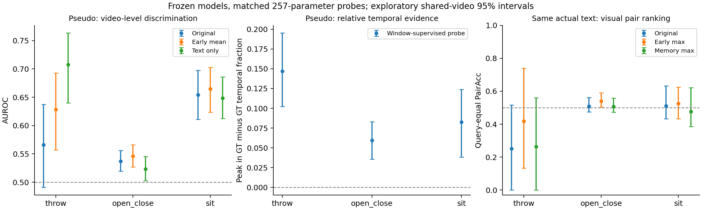

# 存在与定位共同泛化：完整实验与发现记录

整理日期：2026-10-01T10:29:24.509827+08:00

本文件汇总2026年9月30日阶段及随后授权的全部诊断，关联前序六组正式实验。它是已执行事实的归档，不是新训练指令。主文保留各轮完整解释；[DETAILS](DETAILS/README.md)包含全部汇总指标、冻结定义、超参和逐epoch账本，原JSON、源码和日志随文发布。原checkpoint、特征和大型逐query张量不放入Git，路径/来源/hash与未上传范围均在发布清单列明；不能把文档包称为包含原视频或全部模型资产。

## 阅读导航

1. 研究问题、最终发现和总目标。
2. 实验全集、数据与训练账本。
3. 第一阶段六组正式参照。
4. 三族D0/D3/D1/D2机制诊断。
5. 固定模型定位与存在读出。
6. 候选rank、foreground与时间窗几何。
7. 候选支持桥接与普通控制。
8. 早期时序表示、容量一致探针与池化敏感性。
9. 失败、完整性、未运行项与贡献边界。
10. 详细指标、定义、源码与原资产入口。

## 1. 问题真正收缩到了什么

冻结总体目标是未见存在AUROC与raw R1@0.5共同改善，官方gated为关键最终指标，seen小幅不劣、FRR/RR无明显恶化；独立正例VTG用于界定迁移范围。没有任何后续诊断改变这些成功标准。

本阶段的证据链：普通adapter在独立VTG有定位收益、GMR未获共同收益 → raw错误与候选缺失/排序并存 → 原存在分数不是候选质量 → foreground同query排序不等于跨query存在 → 保存候选几何一致性的冻结支持公式被拒绝 → 早期时序表示还需区分GT条件局部证据与无GT绝对支持。

最新问题是：**怎样在无GT条件下选出局部视频—文本证据，再聚合成跨查询、跨未见语义可比较的绝对支持？** 小读出器未证明只修原存在头即可恢复，线性失败也未证明表示完全无信息。GT已知时window probe在三个pseudo族的条件均值AUROC为.6241/.6078/.6726；固定实际文本后只有open_close保留有限局部证据（query等权PairAcc=.5646 [.5339,.6263]）。相同读出的无GT全视频mean/max等权AUROC仅.5686/.5402。时间归一化的相对最高和跨query绝对存在必须分开。

既有候选一致性公式失败不否定全部局部支持机制。新的绝对支持场只是待设计训练候选：原S+要求GT窗内存在高支持、原S−要求整段低支持，不把S+窗外全标负。这里没有训练该目标，没有新算法共同成功；损失冲突、纯标尺问题、确定表示缺失均未获因果证明。

## 2. 实验全集与记账

|编号|实际工作|模型训练/拟合|结果状态与解释|
|---|---|---|---|
|H0|前序A1/QD三方法×GMR/VTG六组|六组各100轮，seed3407|正式已完成；VTG adapter收益没有成为GMR共同收益|
|T1|严格throw开发baseline/adapter|复用各100轮原模型|非本阶段新训练，best索引99/13|
|T2|open_close留族baseline|本阶段100轮，29000更新|best49/latest99，完成|
|T3|sit留族baseline|77轮账本，33649更新后用户停止|best11/latest76；补评测不等于补训练|
|D0/D3|来源/覆盖、错误分解、best/latest、gate审计|原模型更新0|三baseline与throw adapter完成|
|D1|固定实际文本、跨/同视频排序、遮蔽/乱序/分支屏蔽|原模型更新0，冻结前向|输入敏感性不能当反事实正确率|
|D2|exist/loc局部梯度，交集/full-block审计|autograd.grad，optimizer.step=0|稳定跨族冲突进入线未达到|
|R1|固定读出精度和定位质量关系|原模型更新0，冻结前向|原生logit无一致恢复；存在不是定位质量|
|C1|候选rank/topK、分数与IoU、几何|训练/新增前向0|4878 S+；排序与缺失并存|
|B1|foreground/几何/乘积/标量控制|训练/新增前向0|7345 query；冻结primary共同退化|
|P1|early/memory/decoder/text/video/window六种仿射probe×三族|原模型更新0；18次257参数拟合|拟合系数4626，冻结前向28370条query呈现|
|P2|GT均值敏感性与同句条件证据|新增拟合0/前向0|主结果后追加探索，独立记录冻结与核验范围|

模型epoch在checkpoint/selection里0起始，账本epoch是1起始。Sit停止时旧交接记seen评测完成76轮，后来status字段记77；二者均保留，不据字段差异伪造完成。本记录确认的是77条训练epoch账本、best11/latest76及独立补评测产物，不补训练、不改旧账本。

### 2.1 训练来源、配置、选择、运行成本

#### throw/baseline

来源：`runs/autonomous_queue_20260930_strict/jobs/dev_A1_qd_gmr_baseline_s3407_attempt1`。配置/来源：[TRAINING_CONFIGS](DETAILS/TRAINING_CONFIGS.md)；原逐轮记录：[EPOCHS](DETAILS/EPOCHS.md)。

状态=completed；训练账本=100轮，更新=47300；best=99（0-based），选择指标=MR-full-mAP，score=28.81。

#### throw/adapter

来源：`runs/autonomous_queue_20260930_strict/jobs/dev_A1_qd_gmr_adapter_s3407_attempt1`。配置/来源：[TRAINING_CONFIGS](DETAILS/TRAINING_CONFIGS.md)；原逐轮记录：[EPOCHS](DETAILS/EPOCHS.md)。

状态=completed；训练账本=100轮，更新=47300；best=13（0-based），选择指标=MR-full-mAP，score=25.0。

#### open_close/baseline

来源：`2026年9月30日_存在与定位共同泛化的机制诊断/runs/open_close_qd_gmr_baseline_s3407_attempt1`。配置/来源：[TRAINING_CONFIGS](DETAILS/TRAINING_CONFIGS.md)；原逐轮记录：[EPOCHS](DETAILS/EPOCHS.md)。

状态=completed；训练账本=100轮，更新=29000；best=49（0-based），选择指标=MR-full-mAP，score=27.18。

#### sit/baseline

来源：`2026年9月30日_存在与定位共同泛化的机制诊断/runs/sit_qd_gmr_baseline_s3407_attempt1`。配置/来源：[TRAINING_CONFIGS](DETAILS/TRAINING_CONFIGS.md)；原逐轮记录：[EPOCHS](DETAILS/EPOCHS.md)。

状态=stopped_by_user；训练账本=77轮，更新=33649；best=11（0-based），选择指标=MR-full-mAP，score=25.25。

### 2.2 数据隔离与覆盖

原A1 S训练行、原标签和已有特征只读。Throw严格词形throw/toss/hurl/fling/lob审计排除5个额外视频、8条原训练行；strict train7559、pseudo570、seen1185。Open_close按open/close/shut及词形，sit按sit/seat及词形，排除包含该族标注或词形的整个训练视频。保留原行字节，不新增query/absence，不声称预训练未见语义或完整概念隔离。Seen可能与训练共享原视频；train与pseudo视频隔离。三个pseudo族共享原视频（throw–open_close62、throw–sit24、open_close–sit81），不能当独立重复试验。

|族/split|行|S+|S−|视频|
|---|---:|---:|---:|---:|
|throw/train|7559|6252|1307|3324|
|throw/seen|1185|709|476|376|
|throw/pseudo|570|464|106|389|
|open_close/train|4625|4188|437|2442|
|open_close/seen|722|516|206|299|
|open_close/pseudo|2827|1888|939|1236|
|sit/train|6978|5920|1058|3253|
|sit/seen|1065|676|389|370|
|sit/pseudo|976|625|351|452|

## 3. 前序六组正式实验（历史证据，不在本轮重跑）

原完整历史记录：[第一阶段EXPERIMENT_RECORD](https://github.com/chinagalaxy2002/GMR_Unseen/blob/main/experiments/correspondence_generalization/2026年9月30日_正则化与残差适配的未见动作泛化实验/EXPERIMENT_RECORD.md)。以下保留正文；其evidence链接以该原记录目录为基准。

### 2026-09-30 A1/QD 双轨简单对照实验记录

整理时间：2026-09-30T21:43:41+08:00。阶段状态：六组训练完成、六组评测完成、最终报告完成。本文根据本次正式运行产物整理，不以历史基线或开发结果替代正式结果。

#### 1. 本阶段问题与实验意义

本阶段检验：在固定已有数据与特征、保留原任务输出规则的条件下，普通正则或增加适配容量能否改善下游未见语义的存在判断与定位？研究目标是从已见语义学习可迁移的视频—文本对应关系；目前还没有确定新算法，也没有证实表示受损、语义捷径或输入动作证据不足中的任一解释。

六组对照提供同一 A1/QD 设置下的正式参照，并通过 GMR 与独立正例 VTG 两条轨道检验收益是否一致。它可以判断本次两种简单改动是否足以产生共同收益，不能单独定位失效原因或证明通用机制。

#### 2. 执行范围与协议

- 唯一划分 A1（动作留出 put/take），唯一骨干 QD，唯一 seed=3407，每组100 epochs。
- GMR：原 S+/S−，8608行（7108正例、1500负例），同时学习存在与定位。
- 正例 VTG：仅原 S+，7108行，无存在头，不使用 S−。两条轨道各自训练，不能跨轨道作为同数据的因果消融。
- 六组均从头训练；旧 checkpoint 仅提供配置模板，不加载其训练权重。使用已有冻结 CLIP/SlowFast 特征，原发布数据不修改。
- batch=16，workers=0，AdamW，lr=0.0001。Baseline/adapter 的 weight decay=0.0001、dropout=0.1；regularized 分别为0.001、0.2。
- Adapter 在视频和文本输入投影后分别加入残差瓶颈层：256→64→256，ReLU，输出线性层零初始化。没有教师保持或额外 window 损失。实现快照见 [methods.py](https://github.com/chinagalaxy2002/GMR_Unseen/blob/main/experiments/correspondence_generalization/2026年9月30日_正则化与残差适配的未见动作泛化实验/evidence/code/methods.py)。
- 每组按 seen validation 的 MR-full-mAP 选择 best checkpoint；GMR 诊断硬阈值由 seen validation 的 Youden J 选择并在 test 前冻结。真实 U 不用于本次方法、checkpoint 或阈值选择。
- 按最新用户范围，不进行同预算成对核验，不声明初始化、batch顺序或逐行曝光已经通过成对核验。旧任务已有日志保留。
- 每卡最多两个并发任务。其他划分、骨干、教师、window、多 seed 与75组矩阵均不在本次执行范围。

完整运行配置及选择记录见 [run_configs.json](https://github.com/chinagalaxy2002/GMR_Unseen/blob/main/experiments/correspondence_generalization/2026年9月30日_正则化与残差适配的未见动作泛化实验/evidence/run_configs.json)。配置说明以运行时 provenance 为准，代码快照用于追溯，不替代运行记录。

#### 3. 完成状态

队列于2026-09-30 17:58:04（Asia/Shanghai）正常结束，状态 completed，汇总返回码0。21:31复核各组 status/result、连续1–100 epoch账本、test报告和 checkpoint哈希。六组无失败或阻塞，当前本实验调度、训练、评测进程及 tmux 会话均已退出。

| 轨道 | 方法 | 完成 epoch | 训练 | 评测 | seen-selected best epoch（1起始） |
| --- | --- | ---: | --- | --- | ---: |
| GMR | baseline | 100/100 | 完成 | 完成 | 70 |
| GMR | regularized | 100/100 | 完成 | 完成 | 19 |
| GMR | adapter | 100/100 | 完成 | 完成 | 79 |
| VTG | baseline | 100/100 | 完成 | 完成 | 90 |
| VTG | regularized | 100/100 | 完成 | 完成 | 68 |
| VTG | adapter | 100/100 | 完成 | 完成 | 100 |

运行文件中的 best_epoch/selection epoch 为0起始索引，上表统一加1；训练账本的 epoch 为1起始。GMR adapter 沿用原调度器已启动的任务，其队列 attempts=[]，不表示没有训练，完成证据是该运行实际产物。

报告 failed_or_skipped.json 中3个节点是历史 window开发、teacher L2、teacher KL 的条件跳过，不是本次六组失败。范围外节点的取消记录保留。[完成核验快照](https://github.com/chinagalaxy2002/GMR_Unseen/blob/main/experiments/correspondence_generalization/2026年9月30日_正则化与残差适配的未见动作泛化实验/evidence/report/COMPLETION_VERIFIED.json)

#### 4. 正式结果

##### 4.1 GMR 四象限轨道

AUROC 为0–1，其余数值为百分比。FRR越低越好，RR及定位越高越好。FRR/RR和“硬拒绝”使用seen选择的诊断阈值；官方gate与诊断硬拒绝分别列出，不能混用。

| 方法 | S AUROC | U AUROC | U+ FRR↓ | U− RR↑ | raw U R1@0.5↑ | 官方gate U R1@0.5↑ | 硬拒绝 U R1@0.5↑ | raw正确U+误拒率↓ |
| --- | ---: | ---: | ---: | ---: | ---: | ---: | ---: | ---: |
| baseline | 0.7966 | 0.5309 | 15.05 | 17.07 | 26.02 | 26.24 | 21.08 | 19.01 |
| regularized | 0.8316 | 0.4954 | 12.69 | 14.66 | 21.08 | 20.86 | 18.28 | 13.27 |
| adapter | 0.7933 | 0.4771 | 24.30 | 21.27 | 21.29 | 21.51 | 15.05 | 29.29 |

常规正则提高seen AUROC，但unseen AUROC下降；降低U+误拒的同时U−拒绝率也下降。Adapter的unseen AUROC和raw定位低于baseline，U−拒绝率增加同时U+误拒率增加。本次没有观察到存在排序、接受/拒绝和定位的共同改善。

##### 4.2 独立正例 VTG

数值为百分比；本轨道不评测不存在事件的拒绝能力。Test包含2218条S+与465条U+。

| 方法 | Seen R1@0.5 | Seen R1@0.7 | Unseen R1@0.5 | Unseen R1@0.7 |
| --- | ---: | ---: | ---: | ---: |
| baseline | 38.73 | 21.24 | 20.65 | 8.39 |
| regularized | 39.81 | 22.99 | 18.71 | 7.53 |
| adapter | 43.46 | 24.57 | 26.24 | 10.97 |

Adapter相对baseline的unseen R1@0.5提高5.59个百分点，R1@0.7提高2.58个百分点；regularized的两个unseen定位点估计均下降。跨轨道不能直接比较绝对值来推断负例或存在头的因果作用。

##### 4.3 相对同轨道 baseline 的统计区间

使用已有1000次视频paired bootstrap，随机种子3407。同一次抽样中方法与baseline共享视频抽样；这是视频抽样不确定性，不是多训练种子稳定性。

| 轨道 | 方法 | 指标 | 增益95%区间下界 | 上界 |
| --- | --- | --- | ---: | ---: |
| GMR | regularized | U AUROC | -0.0682 | -0.0075 |
| GMR | adapter | U AUROC | -0.0831 | -0.0250 |
| VTG | regularized | U R1@0.5（百分点） | -7.6144 | 2.4125 |
| VTG | adapter | U R1@0.5（百分点） | 0.2164 | 10.0630 |

GMR两种改动的AUROC增益区间均低于零；VTG adapter的R1@0.5区间高于零，但下界接近零。其R1@0.7增益95%区间约为[0.00, 7.05]个百分点，不能表述为所有定位指标均获得稳健提升。完整区间见 [report快照](https://github.com/chinagalaxy2002/GMR_Unseen/blob/main/experiments/correspondence_generalization/2026年9月30日_正则化与残差适配的未见动作泛化实验/evidence/report)。

#### 5. 分析：已支持的判断与未解决问题

##### 5.1 已支持的阶段判断

本次配置的常规正则与适配容量增加不足以修复GMR存在泛化，不能把更高seen性能当作unseen成功。Adapter在正例VTG上的收益没有迁移为GMR的共同收益。因此双轨对照对限制结论是必要的：当前只能报告A1/QD单seed下的定位适配收益，不能宣称通用对应关系机制成立。

这也说明简单对照仍然重要。未来候选若只在VTG上超过原baseline，还需与已取得收益的普通adapter比较；仅有“超过baseline”不足以证明新增机制有价值。

##### 5.2 机制仍未确定

“同一种adapter为何在VTG有效、在GMR未获共同收益”是本阶段值得追查的现象。但两轨同时改变了训练行组成、负例监督及存在任务，不能直接归因为存在损失损坏表示。

负例训练引起表示变化、存在与定位监督冲突、seen checkpoint选择带来不同取舍，是待检验解释，不是本次结论。也没有证据证明CLIP本体被训练遗忘：输入特征是冻结的，变化只可能发生在其下游使用方式中。

##### 5.3 先前开发证据如何影响解释

此前训练侧strict pseudo-unseen诊断和canonical开发对照属于方法开发记录，不是本次真实U正式结果。联合探针未通过胜过单模态控制的机制门槛；window候选未启用。教师参考的来源、共同空间和信息条件未充分验证，L2/KL分支保持暂停。

探针失败不证明输入无动作信息；文本读出较强也不证明原模型实际依赖文本捷径。开发阶段冻结strongest_simple=adapter表示控制选择，不表示adapter的GMR有效性已经成立。冻结记录见 [SELECTION_FROZEN.json](https://github.com/chinagalaxy2002/GMR_Unseen/blob/main/experiments/correspondence_generalization/2026年9月30日_正则化与残差适配的未见动作泛化实验/evidence/SELECTION_FROZEN.json) 与 [MECHANISM_GATE.json](https://github.com/chinagalaxy2002/GMR_Unseen/blob/main/experiments/correspondence_generalization/2026年9月30日_正则化与残差适配的未见动作泛化实验/evidence/MECHANISM_GATE.json)。

#### 6. Plan如何决定下一阶段方向

当前推荐保留科学问题，先定位瓶颈，再决定候选方法。以下为方向建议，没有创建新任务或恢复被取消实验。

| 待区分的瓶颈 | 支持判断所需证据 | 方向决策 |
| --- | --- | --- |
| 表示可区分，输出映射失配 | 固定表示的受控读出在训练侧pseudo-unseen有效，并优于单模态控制 | 研究存在读出或决策映射；若只有阈值收益则限定为校准 |
| 下游交互未利用可迁移信息 | 输入侧具有可用语义证据，投影/交互后诊断变差；联合收益确实依赖视觉 | 研究投影/交互层对应学习 |
| 固定输入缺关键动作证据 | 可靠的语义辨别、真值窗和时间诊断支持输入受限 | 缩小当前特征条件下目标，不承诺保持项可修复 |
| 有可靠输入对应参考 | 来源、图文共同空间和动作辨别能力通过核查 | 才讨论普通保持与选择性保持；不可靠则暂停教师路线 |

优先利用已有checkpoint、预测和阶段诊断，区分raw定位错误、正确候选被拒绝、存在排序不足与checkpoint选择的表现取舍。单调校准和阈值调整不能修复AUROC排序。

未来若恢复实验，应先在训练侧冻结一个可证伪假设，再选择能区分解释的最小设计；真实U不用于反复挑结构、超参或解释。机制支持后再设计方法：只有GMR存在排序、接受/拒绝、定位及正例VTG共同改善，才支持进一步讨论通用对应学习。只有一条轨道有效则缩小主张。

文献调研为贡献表述提供边界；本记录不新增或重新核验论文主张。原始研究依据：[LITERATURE_REVIEW.md](../../../docs/correspondence_generalization/LITERATURE_REVIEW.md)、[HANDOFF.md](../../../docs/correspondence_generalization/HANDOFF.md)、[EXPERIMENT_PLAN.md](../../../docs/correspondence_generalization/EXPERIMENT_PLAN.md)。其中旧多seed、扩骨干等执行要求已被当前用户范围覆盖。

#### 7. 局限与停止边界

仅A1/QD、单seed、同一视频域，不能推断其他语义划分、架构或种子稳定性。两个轨道不是仅开关存在损失的因果对照。未完成同预算成对核验，不能声称排除了全部优化或计算差异。精确总FLOPs与GPU活跃时间未测量。现有真实U结果已被阅读，不能再称盲测。

本阶段没有产生已验证新方法；简单控制失效不等于所有对应学习无效。下一方向仍需机制证据，不自动恢复75组、教师/window、多seed或其他已取消训练。

#### 8. 产物与追溯

- [RESULTS.csv](https://github.com/chinagalaxy2002/GMR_Unseen/blob/main/experiments/correspondence_generalization/2026年9月30日_正则化与残差适配的未见动作泛化实验/RESULTS.csv)：六组机器可读结果，AUROC与比率保存原始0–1值。
- [原自动最终报告快照](https://github.com/chinagalaxy2002/GMR_Unseen/blob/main/experiments/correspondence_generalization/2026年9月30日_正则化与残差适配的未见动作泛化实验/evidence/report/FINAL_REPORT.md)：保留自动流程输出及完成复核。
- [records.json](https://github.com/chinagalaxy2002/GMR_Unseen/blob/main/experiments/correspondence_generalization/2026年9月30日_正则化与残差适配的未见动作泛化实验/evidence/report/records.json)：六组正式评测原始数值。
- [evidence/](https://github.com/chinagalaxy2002/GMR_Unseen/blob/main/experiments/correspondence_generalization/2026年9月30日_正则化与残差适配的未见动作泛化实验/evidence)：状态、开发门槛、冻结选择、配置、epoch日志、统计区间及代码/plan快照。
- [ARTIFACT_INDEX.md](https://github.com/chinagalaxy2002/GMR_Unseen/blob/main/experiments/correspondence_generalization/2026年9月30日_正则化与残差适配的未见动作泛化实验/ARTIFACT_INDEX.md)：运行目录、checkpoint、预测与日志索引。
- [MANIFEST.json](https://github.com/chinagalaxy2002/GMR_Unseen/blob/main/experiments/correspondence_generalization/2026年9月30日_正则化与残差适配的未见动作泛化实验/MANIFEST.json)：归档来源与SHA-256，用于识别快照。

原始训练目录保留在 ../runs/；未移动checkpoint、预测或训练日志，原恢复路径与失败记录不变。

## 4. 多语义族机制诊断

### 第二阶段多族机制诊断报告

生成时间：2026-10-01T00:41:22.859386+08:00。

本报告仅用 A1/QD、seed3407 的训练侧留族视图。Throw/open_close完成100epochs；sit训练按用户要求停止，保留77轮账本，以原seen-only best（编号11）补评测，latest为编号76。本次新增训练为零，原停止状态与checkpoint不变；跨族均值描述保存模型，不代表三个族都完成100轮。没有新候选训练、正式U确认、多seed或种子稳定性结论。决策见 DECISION.md。

#### 来源与覆盖

| 族 | 伪未见行 | 正/负 | 视频 | query字符串 | 混合标签视频 | 同句控制组/行/对 |
|---|---:|---:|---:|---:|---:|---:|
| throw | 570 | 464/106 | 389 | 459 | 32 | 10/36/37 |
| open_close | 2827 | 1888/939 | 1236 | 1093 | 664 | 158/1598/7367 |
| sit | 976 | 625/351 | 452 | 576 | 229 | 45/229/359 |

跨族伪未见视频交集：{'throw:open_close': 62, 'throw:sit': 24, 'open_close:sit': 81}。视图保留原行字节，训练/开发视频无重叠，冻结词形规则在训练行上无命中（ASSET_REVALIDATION.json）。隔离基于主动作标注和词形，不声称完整概念隔离。共享视频与负例构造使三个族不能视作独立域或独立重复试验。

#### Baseline指标与不确定性

比率使用0–1单位。AUROC、raw R1@.5为97.5%原视频bootstrap区间，其他指标为95%区间；1000次、seed3407。跨族使用共同视频权重并等权汇总。这些是baseline绝对区间，不能当作候选改善或paired增益区间。

##### 伪未见

| 族 | AUROC | raw R1@.5 | 官方gated R1@.5 | FRR | RR |
|---|---|---|---|---|---|
| throw | 0.5731 [0.5015, 0.6426] | 0.2672 [0.2155, 0.3193] | 0.2694 [0.2242, 0.3165] | 0.0884 [0.0593, 0.1203] | 0.1321 [0.0568, 0.2232] |
| open_close | 0.5346 [0.5136, 0.5573] | 0.2632 [0.2353, 0.2924] | 0.2664 [0.2432, 0.2912] | 0.1457 [0.1278, 0.1651] | 0.1683 [0.1415, 0.1949] |
| sit | 0.6540 [0.6074, 0.6993] | 0.3504 [0.2972, 0.4053] | 0.3536 [0.3053, 0.3981] | 0.0640 [0.0445, 0.0859] | 0.2308 [0.1836, 0.2788] |
| 等权族均值 | 0.5873 [0.5573, 0.6146] | 0.2936 [0.2669, 0.3192] | 0.2965 [0.2732, 0.3205] | 0.0993 [0.0859, 0.1136] | 0.1770 [0.1472, 0.2113] |

##### Seen

| 族 | AUROC | raw R1@.5 | 官方gated R1@.5 | FRR | RR |
|---|---|---|---|---|---|
| throw | 0.7996 [0.7589, 0.8356] | 0.4401 [0.3880, 0.4899] | 0.4415 [0.3974, 0.4840] | 0.2073 [0.1725, 0.2443] | 0.7038 [0.6525, 0.7465] |
| open_close | 0.8561 [0.8095, 0.8922] | 0.3295 [0.2819, 0.3816] | 0.3411 [0.2980, 0.3885] | 0.1899 [0.1518, 0.2287] | 0.7961 [0.7243, 0.8527] |
| sit | 0.8432 [0.8166, 0.8691] | 0.3254 [0.2800, 0.3685] | 0.3225 [0.2807, 0.3590] | 0.3669 [0.3182, 0.4116] | 0.9126 [0.8811, 0.9382] |
| 等权族均值 | 0.8330 [0.8055, 0.8565] | 0.3650 [0.3286, 0.4008] | 0.3683 [0.3359, 0.4003] | 0.2547 [0.2243, 0.2820] | 0.8042 [0.7632, 0.8370] |

主要指标显著为正、gated收益与不劣及seen/拒绝护栏只适用于同族候选对baseline的比较；本轮没有候选，不能宣称通过或未通过候选的冻结改善门槛。区间跨界应记不确定；界限未调整。

#### D3：失败分解与best/latest

| 族 | raw错 | raw对且接受 | raw对且硬拒 | 负例错误接受 | raw错/hard失败 | raw对中硬拒率 |
|---|---:|---:|---:|---:|---:|---:|
| throw | 340 | 109 | 15 | 92/106 | 0.9577 | 0.1210 (n=124) |
| open_close | 1391 | 434 | 63 | 781/939 | 0.9567 | 0.1268 (n=497) |
| sit | 406 | 201 | 18 | 270/351 | 0.9575 | 0.0822 (n=219) |

诊断硬拒绝使用各模型seen-only Youden阈值；官方soft gate与此不同。最新checkpoint阈值另用其seen预测拟合，仅作描述；未用伪未见重新挑checkpoint或阈值。

| 族/模型 | best epoch（1-based） | latest epoch | latest权重等同best | best→latest伪未见AUROC | raw R1@.5 | gated R1@.5 |
|---|---:|---:|---|---:|---:|---:|
| throw/baseline | 100 | 100 | True | 0.5731→0.5731 | 0.2672→0.2672 | 0.2694→0.2694 |
| open_close/baseline | 50 | 100 | False | 0.5346→0.5512 | 0.2632→0.2590 | 0.2664→0.2617 |
| sit/baseline | 12 | 77 | False | 0.6540→0.6209 | 0.3504→0.3264 | 0.3536→0.3216 |
| throw/adapter | 14 | 100 | False | 0.6000→0.6127 | 0.2349→0.2306 | 0.2328→0.2392 |

##### 官方gate与后处理归因

QD官方soft gate对每条query的全部候选分数乘同一个非负标量，正标量本身保持候选排序。源码只对gated保存窗应用clip_ts/round_multiple，raw保存窗没有这一步。以下是原冻结raw与gated的命中变化，以及对齐后剩余坐标差异；对齐raw仅作辅助，未替换raw主指标。

| 族/模型 | raw命中→gated不命中 | raw不命中→gated命中 | 对齐后全部排序窗坐标不一致行 |
|---|---:|---:|---:|
| throw/baseline | 6 | 7 | 0 |
| open_close/baseline | 12 | 18 | 0 |
| sit/baseline | 4 | 6 | 0 |
| throw/adapter | 4 | 3 | 0 |

当对齐坐标全部一致时，命中差异由时间后处理解释，不能写成gate否决或重排。

#### D1：相同文本的跨视频控制与分数可比性

同句输入统一为canonical缓存特征及mask。只比较原标签已确认的正/负视频；ties记.5。下面区间使用跨族共同原视频权重、配对端点乘积权重。

| 族 | 同句控制PairAcc及95%区间 | 同视频PairAcc（原输入） | 跨视频PairAcc（原输入） | 同视频对数 |
|---|---|---:|---:|---:|
| throw | 0.2568 [0.0232, 0.5335] | 0.8154 | 0.5728 | 65 |
| open_close | 0.5470 [0.5046, 0.5864] | 0.5904 | 0.5346 | 1659 |
| sit | 0.5682 [0.4586, 0.6692] | 0.6943 | 0.6539 | 584 |
| 等权族均值 | 0.4573 [0.3706, 0.5578] | — | — | — |

输入响应与有助于正确排序是两个不同问题。同视频/跨视频统计受query和视频构成影响，差异不能直接证明视频偏置。Throw覆盖稀疏，不能将全部配对组合视作独立样本；各族覆盖及有效bootstrap次数在CONTROLLED_QUERY_SUMMARY.json中。

##### 辅助敏感性

所有伪未见行都参与。冻结原视频特征；全遮蔽或屏蔽单分支保留text、mask和TEF，乱序只打乱有效visual行，同视频共享固定排列。恒等复算须通过。这里只报告变化，无扰动后的AUROC/R1/FRR/RR或反事实准确率。

| 族/模型 | 恒等最大误差 | 全遮蔽Δ存在分数 | 乱序Δ存在分数 | CLIP屏蔽Δ存在分数 | SlowFast屏蔽Δ存在分数 |
|---|---:|---:|---:|---:|---:|
| throw/baseline | 0 | 0.0469 | 0.0159 | 0.0530 | 0.0368 |
| open_close/baseline | 0 | 0.0316 | 0.0074 | 0.0239 | 0.0278 |
| sit/baseline | 0 | 0.0136 | 0.0028 | 0.0084 | 0.0129 |
| throw/adapter | 0 | 0.1421 | 0.0066 | 0.0286 | 0.0201 |

表中Δ为原视频内行均值再按视频等权的绝对变化；区间、top-slot变化、归一化时间端点变化与逐行产物见INPUT_SENSITIVITY.json及sensitivity_*.jsonl。遮蔽是分布外输入；输入敏感性不构成视觉必要性或泛化因果证明。

#### D2：局部梯度关系

沿用各checkpoint已冻结的同一S+诊断批次，eval关闭dropout，不做参数更新。Loc严格包含实际加权分类/span/gIoU及aux项；saliency权重0、无有效目标，因此不推断saliency冲突或一致。Full-block cosine将未使用参数视为0，并在范数中包含每任务实际有梯度的全部参数；原GRADIENT_RELATIONS使用共同有梯度的张量交集，其幅值不同但符号规则需核对。

| 族/模型/ckpt | epoch | batches | input投影 median/负比 | interaction median/负比 | decoder median/负比 | 符合规则的共享块数 |
|---|---:|---:|---|---|---|---:|
| throw/baseline/best | 100 | 16 | -0.0012/0.5000 | 0.0870/0.0000 | -0.0070/0.6875 | 1 |
| throw/baseline/latest | 100 | 16 | -0.0012/0.5000 | 0.0870/0.0000 | -0.0070/0.6875 | 1 |
| open_close/baseline/best | 50 | 16 | 0.0145/0.3750 | -0.0034/0.5625 | 0.0048/0.1875 | 1 |
| open_close/baseline/latest | 100 | 16 | 0.0308/0.3125 | -0.0008/0.5000 | 0.0020/0.4375 | 0 |
| sit/baseline/best | 12 | 16 | 0.0880/0.1875 | 0.0852/0.1875 | 0.0066/0.2500 | 0 |
| sit/baseline/latest | 77 | 16 | 0.0310/0.3125 | 0.0429/0.3125 | 0.0013/0.4375 | 0 |
| throw/adapter/best | 14 | 16 | 0.0903/0.1250 | 0.0002/0.5000 | -0.0013/0.6250 | 1 |
| throw/adapter/latest | 100 | 16 | -0.0313/0.6875 | 0.0828/0.1875 | 0.0722/0.0625 | 1 |

预登记线索要求至少两个共享块median<0且负比>.5，并跨best/latest及至少两个族稳定。相同模型权重不能计作两个独立训练阶段。局部梯度结果本身不证明因果；可修复性必须由后续普通干预的联合目标改善检验。未使用/零/非有限梯度比例、范数、loss keys及固定qids见GRADIENT_DETAIL.json。

#### 执行边界与产物

三个保存模型的训练侧pseudo评测、D0/D3/D1/D2及补充审计完成；sit训练仍为用户主动停止，不能记作100轮完成。报告的机制判断由DECISION.md给出。模型、原数据、特征和第一阶段六组未覆盖；全部新增代码、日志和结果写在本阶段。

执行来源：EXECUTION_FREEZE.json、EXECUTION_CODE_REVISION.json、SUPPLEMENT_FREEZE.json、SUPPLEMENT_CODE_REVISION.json、GRADIENT_DETAIL_FREEZE.json、CLOSEOUT_FREEZE.json。停止的旧队列状态保留；本次任务返回码见closeout_state.json。冻结界限仍为seen 1个百分点、FRR/RR 3个百分点、raw-correct硬拒5个百分点；低分母和跨界区间分别标注。

## 5. 固定模型定位与存在读出

### 固定模型定位输出与存在读出关系分析

完成时间：2026-10-01T01:08:15.371159+08:00。新增训练轮数、参数更新均为0。

本次使用三个baseline原seen-only best，对相同训练侧pseudo/seen数据复算原生logit和FP32 sigmoid。六组数据保存为四位小数后与旧预测逐条完全一致。原指标、阈值、gate和checkpoint未改变。81个受保护文件hash未变。Sit仍是训练停止后的保存模型，不是100轮训练完成。

全部新统计为探索性95%共同原视频bootstrap区间，1000次、seed3407，未作多重比较校正。不能当作候选的冻结共同主要终点检验。正式U未读取。

#### 1. 正确候选已出现但未排第一，与候选缺失并存

| 族 | 原raw R1@.5 | 已有任一候选与GT的IoU≥.5 | 排序错误/全部正例 | 候选缺失/全部正例 | 排序错误/raw错误及95%区间 |
|---|---:|---:|---:|---:|---|
| throw | 26.72% | 65.30% | 38.58% | 34.70% | 0.5265 [0.4590, 0.5906] |
| open_close | 26.32% | 64.57% | 38.24% | 35.43% | 0.5191 [0.4891, 0.5519] |
| sit | 35.04% | 81.92% | 46.88% | 18.08% | 0.7217 [0.6701, 0.7758] |

等权已有候选覆盖=0.7060 [0.6822, 0.7285]，原raw=0.2936 [0.2703, 0.3159]。全部正例中，排序错误占0.4123 [0.3878, 0.4373]，候选缺失占0.2940 [0.2715, 0.3178]。

这里的oracle依赖S+已有GT，只问10个预测候选中是否存在正确窗。它不是实际检索性能、可实现方法收益或视觉证据证明；没有把GT用于真实排序。排序错误和候选缺失均有明显覆盖，不能只靠一个视频级标量或阈值修复。

#### 2. 存在分数不能作为定位质量代理

| 族 | 存在logit区分定位正确/错误S+的AUC | 最大foreground分数区分定位质量的AUC | 同视频定位质量PairAcc | 同视频混合质量视频/对 |
|---|---|---|---|---|
| throw | 0.4509 [0.3769, 0.5248] | 0.5739 [0.5058, 0.6478] | 0.6562 [0.4827, 0.8261] | 27/32 |
| open_close | 0.4528 [0.4203, 0.4848] | 0.6554 [0.6208, 0.6872] | 0.3989 [0.3182, 0.4910] | 119/178 |
| sit | 0.4470 [0.3932, 0.4982] | 0.6639 [0.6128, 0.7141] | 0.4815 [0.2758, 0.7059] | 21/27 |

等权存在定位质量AUC=0.4502 [0.4166, 0.4828]。Open_close的同视频控制低于.5；throw/sit同视频覆盖少、区间跨.5，不能宣称跨族同视频反向关系已成立。

存在头的监督是事件存在，而不是定位质量。因此定位错误S+也应被接受；不能把质量AUC<.5直接判为存在头失败或任务损失冲突。这里的可用结论是：存在分数不适合替代候选级定位质量分数。Foreground分数在这一S+分组上更有关联，仍不等于它能区分S+与S−，也不意味着当前候选排序已足够。

##### 正例分层的存在AUROC

| 族 | 定位正确正例 vs 全部负例 | 定位错误正例 vs 全部负例 |
|---|---|---|
| throw | 0.5329 [0.4511, 0.6087] | 0.5878 [0.5232, 0.6510] |
| open_close | 0.5024 [0.4734, 0.5316] | 0.5461 [0.5243, 0.5668] |
| sit | 0.6266 [0.5711, 0.6762] | 0.6688 [0.6254, 0.7109] |

整体存在AUROC按定位正确正例占比，可以精确重构为以上两部分加权和；所有六组数据已核验。定位正确组没有呈现更好的存在排序点估计，但这是根据模型输出分组的观察，包含query、语义难度等混杂。Bootstrap只处理聚类相关性；同视频控制也没有固定query，不构成因果证明。不能推论修复定位会自动修复存在。

#### 3. 读出精度不是主要修复方向

| 族 | 原四位小数存在AUROC | 原生logit AUROC | 配对差值及95%区间 | 原分数正负比较tie比例 |
|---|---:|---|---|
| throw | 0.5731 | 0.5662 | -0.0069 [-0.0409, 0.0317] | 0.4436 |
| open_close | 0.5346 | 0.5371 | 0.0025 [-0.0019, 0.0070] | 0.1386 |
| sit | 0.6540 | 0.6543 | 0.0003 [-0.0003, 0.0009] | 0.0073 |

等权原生logit减原AUROC=-0.0014 [-0.0134, 0.0116]。FP32 sigmoid转原生logit的差值仅0.0000 [-0.0001, 0.0001]。所有六组都没有sigmoid恰等于1的条目；四位小数并列确实存在，但取消并列没有一致改善。

数学上严格单调映射不改AUROC；有限精度和序列化可形成ties，因此这里单独诊断数值差异。不将原生logit作为新算法，不替换冻结主指标，不修改官方gate或seen阈值。

#### 4. 决定

继续维持不进入复杂训练和正式确认。数值精度路线未显示一致收益；局部梯度冲突仍未达到旧规则。现在有更具体的输出诊断：候选排序损失和候选缺失并存，且视频级存在分数不能代表候选质量。它支持下一项研究围绕候选级时序排序可靠性明确假设，而不是直接把存在标量用于重排或启动PCGrad。

若未来继续，最小下一项应先在已有候选上分析正确窗的rank分布、候选分类置信度与IoU关系、长度/位置偏移，区分分类排序和时间窗几何问题；只用原标签作诊断，不把oracle用于实际方法。具体干预、预算与METHOD_SPEC尚未定义，本次没有自动启动训练。

可复核产物：FREEZE.json、state.json、RESULTS.json、INTEGRITY.json、*_native.jsonl及*_rows.jsonl；代码为../code/readout_collect.py与readout_analyze.py。Weighted AUC和weighted Spearman已分别对照sklearn/scipy检验，错误分解和AUROC分层重构通过，所有新指标1000次有效bootstrap。

## 6. 候选rank、foreground与窗几何

### 零训练候选排序、置信度与时间窗几何诊断

完成：2026-10-01T01:33:10.709845+08:00。六组（three baseline seen-only best × seen/pseudo），4878条S+，原视频联合集2302个。新增训练、参数更新、模型前向均为0；正式真实U/test未读取。Throw/open_close完成100轮；sit保持用户停止、77轮账本、best 11/latest 76，不视作同预算100轮证据。

证据支持**分类排序缺口与窗几何缺失并存**，但两者与存在判别的共同机制仍未决。同query的二元正确/错误候选有可辨排序信号，不能据此把现有foreground称为连续定位质量分数，也不能承诺可学出oracle。GT依赖覆盖不是实际reranker性能或共同成功。没有方法比较，没有通过AUROC/raw联合门槛的声明。

#### 冻结、聚合与复现

FREEZE.json在结果计算前保存输入路径、SHA256、qid/vid覆盖、指标与实现hash。该分析是在看过前轮结果后选择的探索分析。原raw列表顺序定义rank，四位小数score ties不重排；仅使用窗附带score，native decoder-slot概率未读取或拼接。GT最大IoU并列取原GT列表第一项；最高IoU候选并列取原rank第一项。最大IoU=0时几何匹配仍遵循同一规则，不能解释为语义对应的证据。

主要诊断聚合为每query摘要→视频内可用query均值→可用视频等权；同时保存query等权统计以复现旧指标。三族汇总等权，不按query数、视频数或pair数加权。以下区间均为共同原视频联合bootstrap 1000次、seed3407、探索性95%百分位区间，所有六组复用同一组乘数。零分母replicate为NA，并列在PairAcc中计.5；Spearman采用平均ties秩，score/IoU零方差不可用。分位数描述query分布，没有后验切点；连续均值区间使用视频聚合。候选/pair不是独立抽样单位。

六组K=1与原raw、K=10与旧任一候选oracle逐组精确复现，top1/oracle IoU还逐query匹配前轮。两个IoU阈值的rank质量守恒、三类错误分解、候选顺序/坐标、qid/vid均通过核验。独立验证器用显式pair枚举、平均秩Pearson重算Spearman、另写IoU公式、边界代数和共享bootstrap复核，4878条全部通过。117个原保护资产hash未变。冻结输入没有修改原指标、阈值、gate、checkpoint、账本、停止队列和旧结果。

#### 1. 覆盖与正确候选rank

所有输入query均有10个候选；不足10或空候选为0。GT非正长度、非正视频duration均为0。统计只在原S+ GT上进行，不创建任何新absence标签。

| 组 | S+ query/video | 混合正误候选 query/video | 组合pair数（非独立） | 相关不可用query |
| --- | --- | --- | --- | --- |
| throw/seen | 709/375 | 566/322 | 8715 | 5 |
| throw/pseudo | 464/324 | 303/211 | 4595 | 3 |
| open_close/seen | 516/299 | 411/237 | 6378 | 2 |
| open_close/pseudo | 1888/1236 | 1219/855 | 17730 | 19 |
| sit/seen | 676/370 | 578/332 | 9863 | 0 |
| sit/pseudo | 625/452 | 512/376 | 9317 | 0 |

原query等权覆盖，用于与旧raw/oracle对照；数值为百分比，非实际无GT方法性能。

| 组 | IoU | K1 | K2 | K3 | K5 | K10 |
| --- | --- | --- | --- | --- | --- | --- |
| throw/seen | 0.5 | 44.01 | 58.53 | 65.59 | 73.62 | 79.83 |
| throw/seen | 0.7 | 25.11 | 33.29 | 36.39 | 42.74 | 49.37 |
| throw/pseudo | 0.5 | 26.72 | 43.32 | 51.51 | 62.72 | 65.30 |
| throw/pseudo | 0.7 | 10.78 | 18.53 | 22.20 | 29.09 | 31.90 |
| open_close/seen | 0.5 | 32.95 | 53.68 | 67.83 | 75.00 | 79.65 |
| open_close/seen | 0.7 | 20.35 | 29.46 | 34.69 | 42.83 | 49.03 |
| open_close/pseudo | 0.5 | 26.32 | 41.15 | 54.93 | 61.23 | 64.57 |
| open_close/pseudo | 0.7 | 11.97 | 16.68 | 22.83 | 25.32 | 28.55 |
| sit/seen | 0.5 | 32.54 | 49.11 | 64.79 | 74.85 | 85.50 |
| sit/seen | 0.7 | 18.79 | 25.15 | 31.95 | 40.83 | 53.40 |
| sit/pseudo | 0.5 | 35.04 | 55.52 | 65.92 | 72.64 | 81.92 |
| sit/pseudo | 0.7 | 16.64 | 28.16 | 33.28 | 43.84 | 51.68 |

主要视频等权覆盖及探索性95%区间：

| 组 | IoU | K1 | K2 | K3 | K5 | K10 |
| --- | --- | --- | --- | --- | --- | --- |
| throw/seen | 0.5 | 0.4295 [0.3843, 0.4742] | 0.5727 [0.5272, 0.6144] | 0.6535 [0.6086, 0.6953] | 0.7255 [0.6815, 0.7621] | 0.7906 [0.7542, 0.8239] |
| throw/seen | 0.7 | 0.2416 [0.2046, 0.2815] | 0.3237 [0.2818, 0.3676] | 0.3607 [0.3183, 0.4046] | 0.4214 [0.3774, 0.4692] | 0.4950 [0.4519, 0.5398] |
| throw/pseudo | 0.5 | 0.2603 [0.2174, 0.3051] | 0.4162 [0.3630, 0.4680] | 0.4969 [0.4411, 0.5477] | 0.6085 [0.5564, 0.6569] | 0.6307 [0.5778, 0.6802] |
| throw/pseudo | 0.7 | 0.1085 [0.0772, 0.1396] | 0.1728 [0.1345, 0.2115] | 0.2073 [0.1656, 0.2508] | 0.2654 [0.2189, 0.3093] | 0.2937 [0.2444, 0.3388] |
| open_close/seen | 0.5 | 0.3266 [0.2781, 0.3718] | 0.5214 [0.4630, 0.5678] | 0.6610 [0.6081, 0.7102] | 0.7229 [0.6729, 0.7691] | 0.7640 [0.7157, 0.8090] |
| open_close/seen | 0.7 | 0.1948 [0.1562, 0.2349] | 0.2755 [0.2316, 0.3223] | 0.3277 [0.2813, 0.3782] | 0.4141 [0.3639, 0.4680] | 0.4780 [0.4222, 0.5323] |
| open_close/pseudo | 0.5 | 0.2620 [0.2400, 0.2847] | 0.4120 [0.3889, 0.4376] | 0.5501 [0.5254, 0.5761] | 0.6146 [0.5905, 0.6400] | 0.6461 [0.6230, 0.6710] |
| open_close/pseudo | 0.7 | 0.1169 [0.1018, 0.1335] | 0.1603 [0.1429, 0.1782] | 0.2233 [0.2019, 0.2460] | 0.2503 [0.2283, 0.2740] | 0.2823 [0.2590, 0.3070] |
| sit/seen | 0.5 | 0.3346 [0.2926, 0.3750] | 0.5038 [0.4569, 0.5550] | 0.6475 [0.6035, 0.6930] | 0.7505 [0.7100, 0.7896] | 0.8532 [0.8204, 0.8837] |
| sit/seen | 0.7 | 0.1915 [0.1556, 0.2291] | 0.2601 [0.2214, 0.3014] | 0.3214 [0.2780, 0.3653] | 0.4180 [0.3737, 0.4636] | 0.5494 [0.5063, 0.5958] |
| sit/pseudo | 0.5 | 0.3743 [0.3273, 0.4169] | 0.5678 [0.5222, 0.6147] | 0.6667 [0.6236, 0.7094] | 0.7426 [0.7023, 0.7818] | 0.8226 [0.7872, 0.8574] |
| sit/pseudo | 0.7 | 0.1814 [0.1484, 0.2159] | 0.2887 [0.2493, 0.3317] | 0.3344 [0.2924, 0.3772] | 0.4417 [0.3987, 0.4880] | 0.5313 [0.4864, 0.5779] |

K=1→K=2/3/5的新增覆盖（视频等权，百分点换算请乘100）：

| 组 | IoU | ΔK2 | ΔK3 | ΔK5 |
| --- | --- | --- | --- | --- |
| throw/seen | 0.5 | 0.1432 [0.1142, 0.1740] | 0.2240 [0.1883, 0.2608] | 0.2960 [0.2574, 0.3383] |
| throw/seen | 0.7 | 0.0821 [0.0592, 0.1084] | 0.1190 [0.0905, 0.1492] | 0.1798 [0.1454, 0.2153] |
| throw/pseudo | 0.5 | 0.1559 [0.1199, 0.1949] | 0.2366 [0.1921, 0.2811] | 0.3483 [0.3005, 0.3990] |
| throw/pseudo | 0.7 | 0.0643 [0.0408, 0.0890] | 0.0988 [0.0707, 0.1303] | 0.1569 [0.1198, 0.1955] |
| open_close/seen | 0.5 | 0.1948 [0.1592, 0.2317] | 0.3344 [0.2883, 0.3822] | 0.3963 [0.3503, 0.4446] |
| open_close/seen | 0.7 | 0.0807 [0.0544, 0.1089] | 0.1329 [0.1012, 0.1694] | 0.2193 [0.1795, 0.2651] |
| open_close/pseudo | 0.5 | 0.1500 [0.1319, 0.1683] | 0.2881 [0.2641, 0.3118] | 0.3526 [0.3273, 0.3782] |
| open_close/pseudo | 0.7 | 0.0434 [0.0342, 0.0539] | 0.1064 [0.0910, 0.1232] | 0.1334 [0.1162, 0.1513] |
| sit/seen | 0.5 | 0.1691 [0.1342, 0.2044] | 0.3129 [0.2717, 0.3554] | 0.4158 [0.3739, 0.4581] |
| sit/seen | 0.7 | 0.0686 [0.0460, 0.0931] | 0.1299 [0.1000, 0.1614] | 0.2264 [0.1886, 0.2653] |
| sit/pseudo | 0.5 | 0.1936 [0.1620, 0.2288] | 0.2924 [0.2555, 0.3378] | 0.3684 [0.3280, 0.4150] |
| sit/pseudo | 0.7 | 0.1073 [0.0809, 0.1368] | 0.1530 [0.1229, 0.1880] | 0.2603 [0.2236, 0.3024] |

第一正确rank原始query计数；无正确候选单列，分母是上表S+数。视频等权rank质量与区间完整保存在RESULTS.json。

| 组 | IoU | 1 | 2 | 3 | 4 | 5 | 6 | 7 | 8 | 9 | 10 | 无正确 |
| --- | --- | --- | --- | --- | --- | --- | --- | --- | --- | --- | --- | --- |
| throw/seen | 0.5 | 312 | 103 | 50 | 35 | 22 | 22 | 13 | 5 | 4 | 0 | 143 |
| throw/seen | 0.7 | 178 | 58 | 22 | 25 | 20 | 23 | 12 | 6 | 6 | 0 | 359 |
| throw/pseudo | 0.5 | 124 | 77 | 38 | 33 | 19 | 4 | 4 | 2 | 2 | 0 | 161 |
| throw/pseudo | 0.7 | 50 | 36 | 17 | 13 | 19 | 8 | 2 | 2 | 0 | 1 | 316 |
| open_close/seen | 0.5 | 170 | 107 | 73 | 26 | 11 | 12 | 10 | 1 | 1 | 0 | 105 |
| open_close/seen | 0.7 | 105 | 47 | 27 | 22 | 20 | 8 | 17 | 2 | 3 | 2 | 263 |
| open_close/pseudo | 0.5 | 497 | 280 | 260 | 74 | 45 | 17 | 27 | 11 | 7 | 1 | 669 |
| open_close/pseudo | 0.7 | 226 | 89 | 116 | 28 | 19 | 25 | 10 | 15 | 7 | 4 | 1349 |
| sit/seen | 0.5 | 220 | 112 | 106 | 48 | 20 | 21 | 16 | 15 | 12 | 8 | 98 |
| sit/seen | 0.7 | 127 | 43 | 46 | 45 | 15 | 13 | 18 | 24 | 15 | 15 | 315 |
| sit/pseudo | 0.5 | 219 | 128 | 65 | 32 | 10 | 24 | 12 | 10 | 6 | 6 | 113 |
| sit/pseudo | 0.7 | 104 | 72 | 32 | 55 | 11 | 13 | 16 | 5 | 4 | 11 | 302 |

等权族pseudo汇总（video等权）：

| 指标 | 点与95%区间 |
| --- | --- |
| R_at_1_iou_0.5 | 0.2989 [0.2768, 0.3211] |
| R_at_2_iou_0.5 | 0.4653 [0.4407, 0.4905] |
| R_at_3_iou_0.5 | 0.5712 [0.5465, 0.5968] |
| R_at_5_iou_0.5 | 0.6553 [0.6308, 0.6778] |
| R_at_10_iou_0.5 | 0.6998 [0.6761, 0.7206] |
| category_ranking_error | 0.4009 [0.3765, 0.4260] |
| category_candidate_miss | 0.3002 [0.2794, 0.3239] |

旧口径query等权族pseudo K1=29.36%、K10=70.60%、排序错误=41.23%、候选缺失=29.40%，本次精确复现。主要视频等权口径不同，不能用新口径替换原raw主要终点。三族排序缺口均明显，前5候选已覆盖大部分任一候选覆盖，但余下候选缺失仍无法靠现有集合重排消除。

#### 2. 同query内分类分数与IoU

| 组 | PairAcc（混合query） | Spearman（可用S+） | Spearman（混合） | 混合正误pair score tie率 | top1−最高IoU score |
| --- | --- | --- | --- | --- | --- |
| throw/seen | 0.6840 [0.6547, 0.7115] | 0.1689 [0.1262, 0.2074] | 0.1657 [0.1215, 0.2077] | 0.0339 [0.0255, 0.0427] | 0.4376 [0.3970, 0.4782] |
| throw/pseudo | 0.6645 [0.6265, 0.7020] | 0.0983 [0.0543, 0.1401] | 0.0850 [0.0294, 0.1403] | 0.0260 [0.0193, 0.0334] | 0.5533 [0.5035, 0.6005] |
| open_close/seen | 0.6569 [0.6244, 0.6886] | 0.0156 [-0.0201, 0.0506] | -0.0122 [-0.0517, 0.0272] | 0.1001 [0.0851, 0.1174] | 0.4343 [0.3900, 0.4845] |
| open_close/pseudo | 0.6984 [0.6830, 0.7161] | -0.0081 [-0.0258, 0.0086] | -0.0335 [-0.0536, -0.0131] | 0.0825 [0.0743, 0.0910] | 0.4236 [0.4035, 0.4449] |
| sit/seen | 0.5790 [0.5542, 0.6037] | 0.0091 [-0.0204, 0.0391] | -0.0009 [-0.0340, 0.0347] | 0.0444 [0.0377, 0.0507] | 0.5208 [0.4861, 0.5559] |
| sit/pseudo | 0.5821 [0.5588, 0.6045] | 0.0303 [0.0019, 0.0555] | 0.0255 [-0.0059, 0.0531] | 0.0361 [0.0303, 0.0422] | 0.5687 [0.5305, 0.6057] |

| 组 | score零方差query | IoU零方差query | 有score ties query | 相关不可用比例 | gap p25/50/75 |
| --- | --- | --- | --- | --- | --- |
| throw/seen | 0 | 5 | 618 | 0.0071 | 0.0000/0.0834/0.9719 |
| throw/pseudo | 0 | 3 | 410 | 0.0065 | 0.0000/0.8538/0.9890 |
| open_close/seen | 0 | 2 | 468 | 0.0039 | 0.0000/0.2254/0.9309 |
| open_close/pseudo | 0 | 19 | 1753 | 0.0101 | 0.0000/0.2832/0.9186 |
| sit/seen | 0 | 0 | 548 | 0.0000 | 0.0384/0.8091/0.8751 |
| sit/pseudo | 0 | 0 | 512 | 0.0000 | 0.0586/0.8578/0.9427 |

Pseudo等权族PairAcc=0.6483 [0.6319, 0.6635]。三个族seen/pseudo的PairAcc区间均高于.5，支持当前混合候选集合内有限的二元排序信号；它是每query正确候选与错误候选比较的均值，不是top1命中率，也不代表所有IoU取值都单调对应分数。连续相关性跨族不一致，open_close pseudo混合query Spearman略负，sit接近0，throw小正；不能把三族二元PairAcc支持扩写为稳定的连续质量排序。四位小数并列比例已显式计入，不补native映射，不用存在分数充当候选质量。

#### 3. 窗几何：三类错误、长度、位置和边界

分类固定：top1正确（IoU≥.5）；排序错误（top1<.5且任一≥.5）；候选缺失（全部<.5）。每个窗匹配自身最大IoU的原GT；最高IoU窗是诊断oracle，不能用于无GT排序。GT匹配并列候选共0，oracle候选并列仅来自IoU完全相同的query（逐组见COVERAGE）；规则保持第一rank。

以下表是视频等权均值。中心绝对误差、起止误差以GT长度归一化；起止误差为pred−GT，负值为偏早，正值为偏晚。GT位置为中心/视频duration。完整秒误差、预测窗长度/位置、均值区间及p05/p25/p50/p75/p95在RESULTS的geometry_query_distributions与GEOMETRY_CONTRASTS中；不存在仅报告被挑选切点的问题。

| 组 | 类 | 窗 | GT秒 | GT位置 | |中心误差|/GT长 | pred/GT长 | 起误差/GT长 | 止误差/GT长 | IoU |
| --- | --- | --- | --- | --- | --- | --- | --- | --- | --- |
| throw/seen | top1_correct | top1 | 8.657 | 0.397 | 0.150 | 1.094 | -0.029 | 0.065 | 0.727 |
| throw/seen | top1_correct | oracle | 8.657 | 0.397 | 0.133 | 1.154 | -0.067 | 0.086 | 0.759 |
| throw/seen | ranking_error | top1 | 8.991 | 0.532 | 1.195 | 1.063 | -0.252 | -0.189 | 0.133 |
| throw/seen | ranking_error | oracle | 8.991 | 0.532 | 0.150 | 1.227 | -0.061 | 0.166 | 0.725 |
| throw/seen | candidate_miss | top1 | 5.549 | 0.350 | 1.755 | 1.982 | -0.122 | 0.859 | 0.171 |
| throw/seen | candidate_miss | oracle | 5.549 | 0.350 | 0.968 | 2.357 | -0.216 | 1.140 | 0.314 |
| throw/pseudo | top1_correct | top1 | 7.545 | 0.453 | 0.189 | 1.309 | -0.123 | 0.186 | 0.663 |
| throw/pseudo | top1_correct | oracle | 7.545 | 0.453 | 0.155 | 1.347 | -0.146 | 0.200 | 0.711 |
| throw/pseudo | ranking_error | top1 | 7.288 | 0.555 | 1.369 | 1.367 | -0.443 | -0.075 | 0.113 |
| throw/pseudo | ranking_error | oracle | 7.288 | 0.555 | 0.166 | 1.421 | -0.184 | 0.237 | 0.684 |
| throw/pseudo | candidate_miss | top1 | 5.305 | 0.405 | 1.829 | 2.314 | -0.404 | 0.909 | 0.165 |
| throw/pseudo | candidate_miss | oracle | 5.305 | 0.405 | 0.672 | 2.484 | -0.494 | 0.990 | 0.371 |
| open_close/seen | top1_correct | top1 | 9.162 | 0.403 | 0.137 | 1.048 | -0.010 | 0.038 | 0.744 |
| open_close/seen | top1_correct | oracle | 9.162 | 0.403 | 0.131 | 1.133 | -0.040 | 0.093 | 0.774 |
| open_close/seen | ranking_error | top1 | 9.707 | 0.510 | 1.396 | 0.997 | 0.040 | 0.037 | 0.080 |
| open_close/seen | ranking_error | oracle | 9.707 | 0.510 | 0.143 | 1.249 | -0.104 | 0.145 | 0.736 |
| open_close/seen | candidate_miss | top1 | 5.977 | 0.354 | 1.890 | 1.937 | 0.113 | 1.050 | 0.197 |
| open_close/seen | candidate_miss | oracle | 5.977 | 0.354 | 0.798 | 2.318 | -0.341 | 0.977 | 0.348 |
| open_close/pseudo | top1_correct | top1 | 7.186 | 0.454 | 0.184 | 1.282 | -0.124 | 0.158 | 0.701 |
| open_close/pseudo | top1_correct | oracle | 7.186 | 0.454 | 0.176 | 1.320 | -0.152 | 0.168 | 0.716 |
| open_close/pseudo | ranking_error | top1 | 7.839 | 0.469 | 1.644 | 1.264 | 0.556 | 0.820 | 0.072 |
| open_close/pseudo | ranking_error | oracle | 7.839 | 0.469 | 0.184 | 1.389 | -0.180 | 0.209 | 0.679 |
| open_close/pseudo | candidate_miss | top1 | 5.838 | 0.437 | 1.884 | 2.038 | 0.172 | 1.211 | 0.183 |
| open_close/pseudo | candidate_miss | oracle | 5.838 | 0.437 | 0.745 | 2.334 | -0.441 | 0.892 | 0.380 |
| sit/seen | top1_correct | top1 | 8.234 | 0.436 | 0.155 | 1.118 | -0.053 | 0.064 | 0.731 |
| sit/seen | top1_correct | oracle | 8.234 | 0.436 | 0.119 | 1.185 | -0.090 | 0.095 | 0.793 |
| sit/seen | ranking_error | top1 | 8.432 | 0.482 | 1.458 | 1.070 | 0.334 | 0.403 | 0.094 |
| sit/seen | ranking_error | oracle | 8.432 | 0.482 | 0.142 | 1.200 | -0.086 | 0.115 | 0.722 |
| sit/seen | candidate_miss | top1 | 5.512 | 0.327 | 3.080 | 2.017 | 0.721 | 1.738 | 0.145 |
| sit/seen | candidate_miss | oracle | 5.512 | 0.327 | 0.716 | 2.318 | -0.382 | 0.936 | 0.388 |
| sit/pseudo | top1_correct | top1 | 9.760 | 0.225 | 0.169 | 1.105 | -0.060 | 0.045 | 0.704 |
| sit/pseudo | top1_correct | oracle | 9.760 | 0.225 | 0.124 | 1.191 | -0.053 | 0.138 | 0.789 |
| sit/pseudo | ranking_error | top1 | 9.875 | 0.562 | 1.479 | 1.104 | -1.015 | -0.911 | 0.093 |
| sit/pseudo | ranking_error | oracle | 9.875 | 0.562 | 0.154 | 1.251 | -0.144 | 0.107 | 0.730 |
| sit/pseudo | candidate_miss | top1 | 5.020 | 0.471 | 3.331 | 2.599 | -2.815 | -1.216 | 0.156 |
| sit/pseudo | candidate_miss | oracle | 5.020 | 0.471 | 0.936 | 3.060 | -1.185 | 0.875 | 0.354 |

候选缺失−排序错误的主要几何描述差值（video等权；两类为不同输出分组，不能作因果差值）：

| 组 | GT秒差 | oracle长度比差 | oracle中心误差比差 | GT位置差 |
| --- | --- | --- | --- | --- |
| throw/seen | -3.4418 [-4.1001, -2.8262] | 1.1296 [0.9358, 1.3622] | 0.8172 [0.6729, 1.0137] | -0.1815 [-0.2506, -0.1175] |
| throw/pseudo | -1.9824 [-2.4620, -1.4551] | 1.0636 [0.8939, 1.2489] | 0.5061 [0.4022, 0.6160] | -0.1508 [-0.2125, -0.0944] |
| open_close/seen | -3.7292 [-4.5928, -2.8840] | 1.0687 [0.8306, 1.3094] | 0.6545 [0.5415, 0.7865] | -0.1558 [-0.2214, -0.0848] |
| open_close/pseudo | -2.0009 [-2.2262, -1.7520] | 0.9449 [0.8729, 1.0126] | 0.5612 [0.4951, 0.6387] | -0.0319 [-0.0637, -0.0007] |
| sit/seen | -2.9208 [-3.5830, -2.3069] | 1.1180 [0.8638, 1.4510] | 0.5736 [0.4500, 0.7317] | -0.1559 [-0.2255, -0.0775] |
| sit/pseudo | -4.8549 [-5.5481, -4.2112] | 1.8090 [1.4819, 2.1740] | 0.7813 [0.6143, 0.9690] | -0.0910 [-0.1708, -0.0093] |

三族seen/pseudo都呈现候选缺失组GT更短、最高IoU窗更长且偏移更大的描述性趋势。Pseudo缺失组oracle长度比2.48/2.33/3.06，排序错误组1.42/1.39/1.25；相对GT过宽、中心偏离共同出现，现有集合内仅重排不能修复缺失组。与排序错误组相比，pseudo缺失组GT中心更早，但seen与三族的具体早晚边界方向并不一致，不能拟定一个通用边界平移或时长缩放。GT长度分母会放大短窗归一化误差，短窗、语义、数据构成混杂尚未排除。最高IoU的选择本身条件化了几何表现，这些差异支持覆盖内几何缺口的描述，不能证明回归训练因果失效。

连续分布核查：以下为query p25 / p50 / p75（绝非视频均值）；含三类及两种窗。其余分位数与每项最小/最大值见RESULTS.json。

| 组 | 类 | 窗 | GT秒 | |中心误差|/GT长 | pred/GT长 | 起误差/GT长 | 止误差/GT长 |
| --- | --- | --- | --- | --- | --- | --- | --- |
| throw/seen | top1_correct | top1 | 6.275 / 7.750 / 10.525 | 0.071 / 0.134 / 0.211 | 0.854 / 1.046 / 1.299 | -0.127 / 0.000 / 0.066 | -0.123 / 0.007 / 0.198 |
| throw/seen | top1_correct | oracle | 6.275 / 7.750 / 10.525 | 0.056 / 0.112 / 0.187 | 0.914 / 1.127 / 1.356 | -0.145 / 0.000 / 0.021 | -0.070 / 0.015 / 0.249 |
| throw/seen | ranking_error | top1 | 6.418 / 8.150 / 11.200 | 0.601 / 0.998 / 1.543 | 0.722 / 0.994 / 1.299 | -1.159 / -0.464 / 0.702 | -1.173 / -0.531 / 0.805 |
| throw/seen | ranking_error | oracle | 6.418 / 8.150 / 11.200 | 0.052 / 0.123 / 0.220 | 0.966 / 1.173 / 1.437 | -0.171 / -0.030 / 0.090 | -0.007 / 0.094 / 0.316 |
| throw/seen | candidate_miss | top1 | 4.250 / 5.200 / 6.750 | 0.657 / 1.060 / 2.064 | 1.304 / 1.749 / 2.344 | -0.775 / 0.213 / 1.052 | -0.314 / 1.133 / 1.855 |
| throw/seen | candidate_miss | oracle | 4.250 / 5.200 / 6.750 | 0.479 / 0.688 / 1.000 | 1.684 / 2.250 / 2.570 | -0.665 / 0.044 / 0.390 | 0.371 / 0.932 / 1.445 |
| throw/pseudo | top1_correct | top1 | 5.300 / 6.700 / 8.041 | 0.098 / 0.178 / 0.274 | 0.978 / 1.317 / 1.668 | -0.337 / -0.051 / 0.076 | -0.006 / 0.170 / 0.362 |
| throw/pseudo | top1_correct | oracle | 5.300 / 6.700 / 8.041 | 0.073 / 0.124 / 0.209 | 1.089 / 1.324 / 1.660 | -0.276 / -0.068 / 0.020 | 0.000 / 0.170 / 0.349 |
| throw/pseudo | ranking_error | top1 | 5.250 / 6.500 / 8.200 | 0.742 / 1.161 / 1.686 | 1.057 / 1.361 / 1.656 | -1.548 / -0.612 / 0.821 | -1.282 / -0.413 / 1.164 |
| throw/pseudo | ranking_error | oracle | 5.250 / 6.500 / 8.200 | 0.075 / 0.143 / 0.237 | 1.137 / 1.356 / 1.733 | -0.334 / -0.085 / 0.009 | 0.023 / 0.179 / 0.381 |
| throw/pseudo | candidate_miss | top1 | 4.600 / 5.093 / 5.700 | 0.764 / 1.301 / 2.477 | 1.855 / 2.203 / 2.744 | -1.467 / 0.104 / 1.021 | -0.284 / 1.234 / 2.221 |
| throw/pseudo | candidate_miss | oracle | 4.600 / 5.093 / 5.700 | 0.327 / 0.564 / 0.846 | 2.084 / 2.342 / 2.763 | -1.001 / -0.359 / 0.117 | 0.322 / 0.827 / 1.417 |
| open_close/seen | top1_correct | top1 | 6.200 / 8.300 / 11.499 | 0.053 / 0.117 / 0.188 | 0.824 / 0.961 / 1.256 | -0.061 / 0.016 / 0.050 | -0.145 / -0.000 / 0.181 |
| open_close/seen | top1_correct | oracle | 6.200 / 8.300 / 11.499 | 0.045 / 0.110 / 0.187 | 0.924 / 1.073 / 1.315 | -0.081 / 0.011 / 0.034 | -0.069 / 0.000 / 0.238 |
| open_close/seen | ranking_error | top1 | 6.600 / 8.500 / 11.800 | 0.823 / 1.169 / 1.768 | 0.638 / 0.911 / 1.188 | -1.011 / 0.583 / 1.398 | -1.049 / 0.414 / 1.316 |
| open_close/seen | ranking_error | oracle | 6.600 / 8.500 / 11.800 | 0.049 / 0.126 / 0.209 | 1.020 / 1.191 / 1.463 | -0.238 / -0.041 / 0.035 | -0.026 / 0.076 / 0.313 |
| open_close/seen | candidate_miss | top1 | 4.900 / 5.800 / 7.200 | 0.601 / 1.089 / 2.452 | 1.318 / 1.727 / 2.100 | -1.069 / 0.000 / 0.987 | -0.506 / 0.670 / 2.206 |
| open_close/seen | candidate_miss | oracle | 4.900 / 5.800 / 7.200 | 0.478 / 0.591 / 0.888 | 1.583 / 2.096 / 2.709 | -0.918 / -0.034 / 0.229 | 0.000 / 0.887 / 1.279 |
| open_close/pseudo | top1_correct | top1 | 5.700 / 7.000 / 8.300 | 0.054 / 0.158 / 0.272 | 0.986 / 1.234 / 1.576 | -0.239 / -0.018 / 0.032 | -0.026 / 0.049 / 0.331 |
| open_close/pseudo | top1_correct | oracle | 5.700 / 7.000 / 8.300 | 0.047 / 0.145 / 0.258 | 1.027 / 1.281 / 1.578 | -0.262 / -0.041 / 0.021 | -0.009 / 0.058 / 0.333 |
| open_close/pseudo | ranking_error | top1 | 6.200 / 7.381 / 9.000 | 0.847 / 1.420 / 2.142 | 0.911 / 1.198 / 1.525 | -0.482 / 0.932 / 1.698 | -0.559 / 1.012 / 2.014 |
| open_close/pseudo | ranking_error | oracle | 6.200 / 7.381 / 9.000 | 0.080 / 0.165 / 0.269 | 1.128 / 1.375 / 1.644 | -0.337 / -0.114 / 0.015 | 0.000 / 0.134 / 0.373 |
| open_close/pseudo | candidate_miss | top1 | 4.900 / 5.800 / 6.600 | 0.683 / 1.292 / 2.709 | 1.501 / 2.023 / 2.423 | -1.030 / 0.106 / 1.815 | -0.007 / 1.188 / 2.654 |
| open_close/pseudo | candidate_miss | oracle | 4.900 / 5.800 / 6.600 | 0.430 / 0.567 / 0.802 | 1.944 / 2.233 / 2.656 | -0.963 / -0.233 / 0.081 | 0.101 / 0.855 / 1.247 |
| sit/seen | top1_correct | top1 | 6.000 / 7.250 / 9.900 | 0.073 / 0.132 / 0.225 | 0.868 / 1.084 / 1.349 | -0.154 / 0.004 / 0.039 | -0.104 / 0.000 / 0.216 |
| sit/seen | top1_correct | oracle | 6.000 / 7.250 / 9.900 | 0.044 / 0.087 / 0.164 | 0.985 / 1.120 / 1.341 | -0.160 / 0.000 / 0.015 | -0.035 / 0.031 / 0.176 |
| sit/seen | ranking_error | top1 | 6.100 / 7.600 / 10.232 | 0.749 / 1.300 / 1.969 | 0.774 / 0.998 / 1.245 | -0.960 / 0.647 / 1.728 | -0.911 / 0.547 / 1.591 |
| sit/seen | ranking_error | oracle | 6.100 / 7.600 / 10.232 | 0.056 / 0.119 / 0.207 | 0.904 / 1.138 / 1.395 | -0.212 / -0.036 / 0.079 | -0.077 / 0.039 / 0.224 |
| sit/seen | candidate_miss | top1 | 4.111 / 5.000 / 6.625 | 0.718 / 2.351 / 4.342 | 1.360 / 1.901 / 2.447 | -0.897 / 0.098 / 3.371 | -0.299 / 1.606 / 3.978 |
| sit/seen | candidate_miss | oracle | 4.111 / 5.000 / 6.625 | 0.366 / 0.524 / 0.824 | 1.777 / 2.066 / 2.591 | -0.590 / 0.000 / 0.165 | 0.324 / 0.784 / 1.272 |
| sit/pseudo | top1_correct | top1 | 6.600 / 9.400 / 12.650 | 0.077 / 0.163 / 0.241 | 0.781 / 1.020 / 1.372 | -0.080 / 0.011 / 0.025 | -0.218 / -0.054 / 0.291 |
| sit/pseudo | top1_correct | oracle | 6.600 / 9.400 / 12.650 | 0.041 / 0.095 / 0.190 | 0.968 / 1.132 / 1.383 | -0.051 / 0.000 / 0.019 | -0.034 / 0.084 / 0.273 |
| sit/pseudo | ranking_error | top1 | 6.800 / 9.065 / 11.597 | 0.848 / 1.457 / 1.980 | 0.779 / 1.054 / 1.348 | -1.954 / -1.379 / -0.439 | -1.852 / -1.271 / -0.560 |
| sit/pseudo | ranking_error | oracle | 6.800 / 9.065 / 11.597 | 0.051 / 0.120 / 0.237 | 1.024 / 1.216 / 1.481 | -0.276 / -0.092 / 0.009 | -0.063 / 0.015 / 0.236 |
| sit/pseudo | candidate_miss | top1 | 3.800 / 4.931 / 5.900 | 0.882 / 2.071 / 4.418 | 1.962 / 2.462 / 3.041 | -4.377 / -1.513 / 0.031 | -3.208 / -0.551 / 1.766 |
| sit/pseudo | candidate_miss | oracle | 3.800 / 4.931 / 5.900 | 0.443 / 0.730 / 1.065 | 2.147 / 2.555 / 3.220 | -1.261 / -0.593 / 0.000 | 0.000 / 0.793 / 1.514 |

#### 4. Seen/pseudo、跨族一致性与不确定性

Seen与pseudo query不相同，以下共同视频乘数只处理数据复用的统计依赖，不构成同样本paired因果变化。

| 族 | pseudo−seen K1 | pseudo−seen K10 | pseudo−seen PairAcc | pseudo−seen Spearman |
| --- | --- | --- | --- | --- |
| throw | -0.1692 [-0.2281, -0.1044] | -0.1600 [-0.2212, -0.1013] | -0.0195 [-0.0664, 0.0284] | -0.0707 [-0.1277, -0.0080] |
| open_close | -0.0646 [-0.1150, -0.0114] | -0.1179 [-0.1701, -0.0623] | 0.0415 [0.0073, 0.0792] | -0.0237 [-0.0646, 0.0154] |
| sit | 0.0396 [-0.0228, 0.0979] | -0.0306 [-0.0793, 0.0171] | 0.0031 [-0.0321, 0.0369] | 0.0211 [-0.0185, 0.0608] |
| equal_family | -0.0647 [-0.1045, -0.0251] | -0.1028 [-0.1394, -0.0666] | 0.0084 [-0.0182, 0.0352] | -0.0244 [-0.0539, 0.0063] |

Throw/open_close的pseudo K1、K10更低，sit K1方向相反且区间跨0；二元PairAcc在open_close pseudo反而更高，另两族差异不明确。不存在一致的“pseudo分类排序全面退化”证据。候选几何缺失与排序缺口在seen/pseudo均存在，具体泛化差值仍受族和query构成影响。Sit训练截断单列，不据三族比较宣称同预算稳健性。

所有逐组主/辅助均值指标有效bootstrap次数均为1000至1000；零分母replicate没有出现。不可用query相关性为throw seen/pseudo 5/3、open_close 2/19、sit 0/0，均如实排除并报告覆盖；未填.5。共同原视频全集包含全部输入（S+及S−）视频，指标只使用各自可用S+视频，乘数仍共同。视频交集、每项query/video分母与不可用数见COVERAGE和RESULTS。组合pair仅用于query摘要计算，未作独立样本。

#### 5. 决定与共同机制缺口

本次支持分类排序缺口与候选几何缺失并存；连续候选质量排序跨族可靠性有限。现有正确候选经常落在top2/top3，缺失组在短GT、过宽预测与偏移上有一致描述线索。尚不能识别二者各自的训练原因、可修复比例或与存在判别共享的支持机制，不预设存在损失冲突。

与总目标之间仍缺：无GT候选质量是否同时能区分S+与原S−；它是否提供超出语义/query难度的视觉条件证据；一个具体机制对AUROC和raw定位共同影响的路径及普通控制。当前S+内部候选诊断没有回答存在AUROC，也没有独立VTG迁移新证据。前轮存在分数与定位质量弱关联不能补上这些缺口。

原共同门槛保持：AUROC与raw主要增益使用97.5%共同视频paired区间，gated关键最终指标及seen/FRR/RR护栏不变；本次探索95%区间不作确认通过判定。决定维持不启动复杂干预、正式U确认或其他训练；本任务完成于诊断与决策。下一步训练范围、METHOD_SPEC和普通控制均未授权/未形成，不自动启动PCGrad、loss重权、质量头、教师/window、多seed、同预算核验、旧75组或补sit。

可复核：FREEZE.json、COVERAGE.json、CANDIDATE_ROWS.jsonl、RESULTS.json、GEOMETRY_CONTRASTS.json、BOOTSTRAP_WEIGHTS.npz、VALIDATION.json、INTEGRITY.json、state.json及EXECUTION.log。实现：../code/candidate_geometry_analyze.py；独立复核：../code/candidate_geometry_verify.py。原三族评测和readout分析没有重跑。

## 7. 候选支持桥接与全部普通控制

### 下一步研究：候选支持是否连接存在与定位

完成：2026-10-01T01:57:22.358463+08:00。这是用户在候选诊断后授权继续研究、并在证据充分时新建实验阶段的下一步；原零训练候选任务没有被重跑。本次六组已有输出共7345 query（4878 S+、2467原S−），新增训练、参数更新、前向均0；正式U/test未读取。

**新发现：同query内foreground能排序正误窗，不代表跨query的事件存在证据。固定候选几何一致性也不能补上共同机制。** Primary的等权pseudo诊断AUROC较原存在读出下降.0558，raw R1@.5下降2.51个百分点；seen也退化。该具体共同支持假设被普通控制和现有数据否定，不进入新训练阶段。结论限于保存候选上的冻结公式，不宣布所有局部支持模型不可能、输入无信息或存在损失冲突成立。

#### 1. 为什么选择这一步

前轮候选分析已证明排序缺口与候选缺失并存，但只分析S+，无法判断候选分数能否帮助存在AUROC。本次补上原S−，检验一个无新增参数、无需GT推理的具体共同路径，并以原foreground、纯几何及query标量几何控制区分信号来源。没有从oracle直接跳到训练，也没有后看结果搜索公式或系数。

原输入、原模型、原阈值和官方gate保留。诊断最大候选分数没有替换pred_exist_score，反事实rank仅作用于报告计算，不写回旧预测。因此没有新的官方gated、FRR/RR结果，更没有通过完整共同门槛的候选。原存在接受/拒绝与官方gated历史值仍原样有效，不能把raw选择变化解释为gate改进。

#### 2. 计算前冻结的假设、普通控制与统计

窗口i的保存foreground为p_i；c_i为它与另外9个预测窗的平均temporal IoU（对角线排除，非GT IoU）。固定primary为s_i=p_i*c_i；存在诊断取max_i s_i，定位诊断取最高s_i的原窗。精确ties选择原列表第一rank。三项控制：p_i（原rank）、c_i（几何自身）、p_i*mean(c)（共享同一几何摘要，仅query标量，不改原候选rank）。总共4个事先冻结公式，没有拟合、重权扫描、阈值选择或新窗口。

共有2302原视频。1000次seed3407联合视频bootstrap的同一乘数用于所有族/split/readout，族汇总等权。全局AUROC和raw使用旧query等权目标并按视频聚类，S+候选PairAcc先query均值后video均值；同视频S+/S− PairAcc先每video汇总；同句跨video统计要求实际文本输入一致，按query组等权，端点乘数相乘。候选、pair和query组不作为独立抽样单位。基本区间是探索95%，另列共同主要读出差的97.5%辅助区间，不假装未见确认或种子稳健性。

单独冻结的“新研究进入证据”检查要求primary同时支持存在和raw、seen不劣、跨族与同文本视觉支持、优于纯几何普通控制；它是必要研究证据清单，不替换历史gated/FRR/RR完整成功门槛。条目失败则停止这个假设，不由更有利的族或后处理挽救。

首次计算在JSON序列化NumPy布尔值时失败，冻结/源码/日志完整保存在../support_bridge_analysis_failures/attempt_001；仅修正输出序列化后重算。独立核验确认两次冻结定义完全一致，没有修改公式或研究检查。执行源码内一个AUC检查字段历史命名误写30，实际是5读出×5权重=25/组；VALIDATION明确纠正且另按每组5读出全部1000权重独立复核。

#### 3. Foreground的“相对排序”和“存在”证据分离

以下S+内部候选PairAcc为视频等权；存在AUROC为全部原S+/S−的query等权。它们是不同目标与不同覆盖，不将数值直接作为因果对比。

| 组 | 原存在AUROC | max foreground存在AUROC | 差值95% | S+内部foreground PairAcc |
| --- | --- | --- | --- | --- |
| throw/seen | 0.7996 [0.7677, 0.8314] | 0.7476 [0.7099, 0.7833] | -0.0521 [-0.0773, -0.0251] | 0.6840 [0.6547, 0.7115] |
| throw/pseudo | 0.5731 [0.5106, 0.6387] | 0.4963 [0.4305, 0.5634] | -0.0768 [-0.1499, -0.0039] | 0.6645 [0.6265, 0.7020] |
| open_close/seen | 0.8561 [0.8208, 0.8885] | 0.7291 [0.6710, 0.7793] | -0.1270 [-0.1760, -0.0829] | 0.6569 [0.6244, 0.6886] |
| open_close/pseudo | 0.5346 [0.5169, 0.5536] | 0.4967 [0.4768, 0.5140] | -0.0380 [-0.0680, -0.0103] | 0.6984 [0.6830, 0.7161] |
| sit/seen | 0.8432 [0.8195, 0.8654] | 0.7758 [0.7430, 0.8068] | -0.0674 [-0.0913, -0.0440] | 0.5790 [0.5542, 0.6037] |
| sit/pseudo | 0.6540 [0.6105, 0.6974] | 0.5181 [0.4873, 0.5484] | -0.1359 [-0.1962, -0.0792] | 0.5821 [0.5588, 0.6045] |

Pseudo等权foreground存在AUROC=.5037 [.4785,.5270]，相对原存在读出差−.0836 [−.1192,−.0552]；原等权存在AUROC=.5873。其S+内部候选PairAcc=.6483 [.6319,.6635]。因此已有候选foreground不能直接替代存在头或据此证明共用候选质量读出。它仍可能作为某个未来学习机制的一部分，但本次没有这一证据。

#### 4. 固定primary与全部普通控制

| 组 | 读出 | 存在诊断AUROC 95% | raw R1@.5 95% | 同视频S+/S− PairAcc 95% | 混合候选PairAcc 95% |
| --- | --- | --- | --- | --- | --- |
| throw/seen | foreground | 0.7476 [0.7099, 0.7833] | 0.4401 [0.3939, 0.4813] | 0.6869 [0.6340, 0.7391] | 0.6840 [0.6547, 0.7115] |
| throw/seen | agreement | 0.5374 [0.5018, 0.5796] | 0.1693 [0.1368, 0.2031] | 0.5413 [0.4882, 0.5967] | 0.3213 [0.2872, 0.3543] |
| throw/seen | foreground_agreement | 0.6974 [0.6526, 0.7418] | 0.3879 [0.3430, 0.4267] | 0.6598 [0.6058, 0.7093] | 0.6489 [0.6221, 0.6767] |
| throw/seen | scalar_geometry_control | 0.7344 [0.6914, 0.7796] | 0.4401 [0.3939, 0.4813] | 0.6910 [0.6369, 0.7424] | 0.6840 [0.6547, 0.7115] |
| throw/pseudo | foreground | 0.4963 [0.4305, 0.5634] | 0.2672 [0.2227, 0.3140] | 0.6068 [0.4706, 0.7443] | 0.6645 [0.6265, 0.7020] |
| throw/pseudo | agreement | 0.5684 [0.5080, 0.6295] | 0.1336 [0.0959, 0.1753] | 0.7656 [0.6250, 0.9038] | 0.3558 [0.3090, 0.4061] |
| throw/pseudo | foreground_agreement | 0.5794 [0.5165, 0.6416] | 0.2759 [0.2281, 0.3230] | 0.6797 [0.5166, 0.8182] | 0.6597 [0.6260, 0.6927] |
| throw/pseudo | scalar_geometry_control | 0.5900 [0.5280, 0.6512] | 0.2672 [0.2227, 0.3140] | 0.8464 [0.7250, 0.9584] | 0.6645 [0.6265, 0.7020] |
| open_close/seen | foreground | 0.7291 [0.6710, 0.7793] | 0.3295 [0.2808, 0.3731] | 0.6597 [0.5859, 0.7337] | 0.6569 [0.6244, 0.6886] |
| open_close/seen | agreement | 0.6905 [0.6367, 0.7461] | 0.1357 [0.1031, 0.1720] | 0.6890 [0.6184, 0.7590] | 0.3285 [0.2880, 0.3655] |
| open_close/seen | foreground_agreement | 0.7345 [0.6857, 0.7881] | 0.2674 [0.2262, 0.3089] | 0.6506 [0.5673, 0.7264] | 0.6193 [0.5894, 0.6485] |
| open_close/seen | scalar_geometry_control | 0.7455 [0.6924, 0.7972] | 0.3295 [0.2808, 0.3731] | 0.6638 [0.5841, 0.7364] | 0.6569 [0.6244, 0.6886] |
| open_close/pseudo | foreground | 0.4967 [0.4768, 0.5140] | 0.2632 [0.2409, 0.2851] | 0.4673 [0.4364, 0.4989] | 0.6984 [0.6830, 0.7161] |
| open_close/pseudo | agreement | 0.4998 [0.4819, 0.5195] | 0.0742 [0.0608, 0.0881] | 0.4424 [0.4119, 0.4749] | 0.3017 [0.2820, 0.3213] |
| open_close/pseudo | foreground_agreement | 0.4972 [0.4789, 0.5153] | 0.2336 [0.2134, 0.2556] | 0.4045 [0.3758, 0.4350] | 0.6798 [0.6635, 0.6967] |
| open_close/pseudo | scalar_geometry_control | 0.4927 [0.4742, 0.5126] | 0.2632 [0.2409, 0.2851] | 0.4010 [0.3686, 0.4338] | 0.6984 [0.6830, 0.7161] |
| sit/seen | foreground | 0.7758 [0.7430, 0.8068] | 0.3254 [0.2848, 0.3642] | 0.7134 [0.6602, 0.7624] | 0.5790 [0.5542, 0.6037] |
| sit/seen | agreement | 0.6657 [0.6335, 0.6970] | 0.2219 [0.1869, 0.2574] | 0.5199 [0.4662, 0.5778] | 0.5039 [0.4732, 0.5346] |
| sit/seen | foreground_agreement | 0.7375 [0.7025, 0.7687] | 0.2811 [0.2419, 0.3203] | 0.6693 [0.6147, 0.7202] | 0.5597 [0.5379, 0.5813] |
| sit/seen | scalar_geometry_control | 0.7880 [0.7592, 0.8130] | 0.3254 [0.2848, 0.3642] | 0.7111 [0.6591, 0.7582] | 0.5790 [0.5542, 0.6037] |
| sit/pseudo | foreground | 0.5181 [0.4873, 0.5484] | 0.3504 [0.3053, 0.3933] | 0.5681 [0.5096, 0.6238] | 0.5821 [0.5588, 0.6045] |
| sit/pseudo | agreement | 0.5633 [0.5270, 0.5993] | 0.2304 [0.1907, 0.2676] | 0.5811 [0.5254, 0.6378] | 0.5232 [0.4867, 0.5596] |
| sit/pseudo | foreground_agreement | 0.5178 [0.4870, 0.5491] | 0.2960 [0.2529, 0.3363] | 0.5127 [0.4543, 0.5711] | 0.5713 [0.5471, 0.5931] |
| sit/pseudo | scalar_geometry_control | 0.5706 [0.5371, 0.6061] | 0.3504 [0.3053, 0.3933] | 0.5742 [0.5189, 0.6267] | 0.5821 [0.5588, 0.6045] |

Primary对原读出的共同主要差值，辅助97.5%区间（探索、不作正式方法通过）：

| 组 | Δ存在AUROC | Δraw R1@.5 |
| --- | --- | --- |
| throw/seen | -0.1022 [-0.1395, -0.0664] | -0.0522 [-0.0878, -0.0171] |
| throw/pseudo | 0.0063 [-0.0788, 0.0892] | 0.0086 [-0.0251, 0.0468] |
| open_close/seen | -0.1216 [-0.1756, -0.0642] | -0.0620 [-0.1082, -0.0120] |
| open_close/pseudo | -0.0374 [-0.0659, -0.0089] | -0.0297 [-0.0479, -0.0117] |
| sit/seen | -0.1058 [-0.1426, -0.0722] | -0.0444 [-0.0971, 0.0075] |
| sit/pseudo | -0.1363 [-0.1994, -0.0732] | -0.0544 [-0.0904, -0.0213] |
| 等权pseudo | -0.0558 [-0.0934, -0.0214] | -0.0251 [-0.0420, -0.0069] |
| 等权seen | -0.1099 [-0.1384, -0.0796] | -0.0529 [-0.0810, -0.0249] |

Pseudo等权primary AUROC=.5315、raw=26.85%；两项差值的97.5%区间均低于0。Throw pseudo小幅点升且两个区间均跨0，open_close/sit同时下降，不能挑throw宣布共同改善。Seen三族AUROC均下降，raw均下降，亦不支持seen小幅不劣。

| 等权pseudo对照 | Δ存在AUROC95% | Δraw95% |
| --- | --- | --- |
| foreground | 0.0278 [-0.0104, 0.0658] | -0.0251 [-0.0405, -0.0098] |
| agreement | -0.0124 [-0.0329, 0.0070] | 0.1224 [0.0987, 0.1457] |
| scalar_geometry_control | -0.0196 [-0.0378, -0.0020] | -0.0251 [-0.0405, -0.0098] |

Primary虽然比纯geometry的raw更好，但不及原foreground；存在AUROC还不及query标量geometry控制。这不足以证明candidate-specific几何支持提供了所需共同信息。几何候选一致性可能反映重复/长度，而不是事实正确性；本次没有以这种可能解释代替实验证据。

#### 5. 排序改变的收益与损害归因

| 组 | 读出 | 修复原raw错 | 破坏原raw对 | 净正确数 | 修复候选缺失 |
| --- | --- | --- | --- | --- | --- |
| throw/seen | agreement | 76 | 268 | -192 | 0 |
| throw/seen | foreground_agreement | 32 | 69 | -37 | 0 |
| throw/pseudo | agreement | 33 | 95 | -62 | 0 |
| throw/pseudo | foreground_agreement | 21 | 17 | 4 | 0 |
| open_close/seen | agreement | 55 | 155 | -100 | 0 |
| open_close/seen | foreground_agreement | 34 | 66 | -32 | 0 |
| open_close/pseudo | agreement | 101 | 458 | -357 | 0 |
| open_close/pseudo | foreground_agreement | 64 | 120 | -56 | 0 |
| sit/seen | agreement | 77 | 147 | -70 | 0 |
| sit/seen | foreground_agreement | 69 | 99 | -30 | 0 |
| sit/pseudo | agreement | 45 | 120 | -75 | 0 |
| sit/pseudo | foreground_agreement | 17 | 51 | -34 | 0 |

“修复−破坏”精确重构raw差值。原全部候选缺失的query无一能被这类集合内重排修复，候选几何缺失没有被隐藏。若以后研究更换候选生成/回归，只能形成新的假设和控制，本次不把该oracle差距认作可以实现的收益。分母、修复率/破坏率共同视频95%区间见ATTRIBUTION.json。

#### 6. 文本输入一致性、覆盖及未决项

| 组 | 原S+/S− | 原video数 | 同video混合数/pairs | 同句混合组 | 实际文本完全一致组 | 同形状组 | 不同形状组 |
| --- | --- | --- | --- | --- | --- | --- | --- |
| throw/seen | 709/476 | 376 | 199/1108 | 52 | 0 | 52 | 0 |
| throw/pseudo | 464/106 | 389 | 32/65 | 10 | 0 | 10 | 0 |
| open_close/seen | 516/206 | 299 | 104/484 | 9 | 0 | 9 | 0 |
| open_close/pseudo | 1888/939 | 1236 | 664/1659 | 158 | 0 | 158 | 0 |
| sit/seen | 676/389 | 370 | 185/882 | 45 | 0 | 45 | 0 |
| sit/pseudo | 625/351 | 452 | 229/584 | 45 | 0 | 45 | 0 |

所有同句混合组均未满足缓存文本输入完全一致（float32 last_hidden_state前32 token，norm+1e−5，与vendor相同，shape和数值均核对）。因此这次候选读出的同句视觉控制全部NA，有效bootstrap=0/1000，而不是填.5或标作视觉失败。原canonical存在头控制仍独立有效，本次不沿其存在分数拼接原窗口/slot score；它没有保存相同canonical输入下的完整候选，不能替代本项控制。原始同句特征不一致也不能证明视觉无信息或标签错误。

同形状输入的最大绝对归一化差值p0/p25/p50/p75/p100及每组shape核查见TEXT_INPUT_DIFFERENCES；不以容差放宽冻结的一致性条件。若一种未来候选出现共同改善，仍应保存新的canonical候选输出去补控制；本次primary已在共同读出和seen上失败，不追加无更新前向挽救它。

其余AUROC/raw/候选PairAcc/同视频统计均1000次有效；同句NA明确单列。低覆盖throw pseudo同视频只有32个混合视频、65pairs，组合数不当独立样本。跨族共享原视频、sit77轮截断及seen/pseudo构成差异，均限制推广性；不称为独立三次重复或同预算验证。

#### 7. 是否足以新建训练实验阶段

| 事先冻结的必要研究证据 | 结果 |
| --- | --- |
| equal_pseudo_AUROC_lower975_positive | 未支持/无覆盖 |
| equal_pseudo_raw_lower975_positive | 未支持/无覆盖 |
| at_least_two_families_joint_positive | 未支持/无覆盖 |
| seen_AUROC_lower95_not_worse_than_minus_01 | 未支持/无覆盖 |
| seen_raw_lower95_not_worse_than_minus_01 | 未支持/无覆盖 |
| candidate_specific_stronger_than_geometry_only_raw | 支持 |
| two_families_exact_text_visual_support | 未支持/无覆盖 |

结论：这一次共同候选支持假设证据不够，且primary在已观察数据上退化；**不新建训练阶段，不改旧训练代码，不恢复任何旧队列**。新增独立分析代码已经实际运行并核验，绝非只提方案。冻结结果仍支持“排序+几何问题并存”，但不支持简单的“slot预测一致就是真实证据”。

逐路径复核：

| 路径 | 当前证据 | 决定 |
| --- | --- | --- |
| 直接把max foreground当存在分数 | pseudo近随机且劣于原存在读出；raw不变 | 此直接读出拒绝 |
| 候选几何一致性/foreground×一致性 | 有普通控制；共同读出和seen退化 | 此冻结公式拒绝，不扫系数 |
| IoU质量头或边界模型 | 已有近邻；S+定位质量证据不能说明原存在头如何共同受益 | 尚未形成可训练共同机制 |
| PCGrad/固定损失重权 | 旧稳定共享块冲突未出现；本项没有新增因果证据 | 不恢复 |
| 保持预训练对应关系/教师 | 同维度不是共同空间；缓存仅token hidden，参考空间来源/可靠性未验证 | 不启用教师或旧window |
| 共享的局部视觉支持 | 尚需无GT支持分数同时区分原S+/S−与定位，排除文本/长度偏置，并说明如何作用于原双头 | 保留研究问题，当前不因未决自动训练 |

没有声称不存在其他可行方法。用户条件授权的“证据充分后新建目录并改代码做实验”在本次研究尚未触发；本次研究执行、独立核验与结果决策已完成。继续为总目标寻找机制需要一个不同于被拒绝公式的具体新问题，不能把追加训练作为默认下一步。

#### 8. 近邻文献核查与方法定位

候选质量排序、边界修正、query相互关系都已有先例，不能将它们或局部一致性本身写成创新。以下为本次核验的原始论文/作者仓库，不移用公开性能数字或把异任务结果当本项目证据。

| 工作与作者/年份 | 已核验范围 | 与本次的区别 |
| --- | --- | --- |
| [BAM-DETR](https://arxiv.org/abs/2312.00083)，Pilhyeon Lee、Hyeran Byun，ECCV2024 | 摘要：boundary-oriented formulation、双路径边界解码、质量排序 | 本次不改边界/网络；检验原S+/S−共同读出，不能以其正例TSG证明存在泛化 |
| [RGTR](https://arxiv.org/abs/2406.00143)，Xiaolong Sun、Liushuai Shi、Le Wang等，AAAI2025（预印本2024） | 摘要：region-guided anchors、多样性、IoU-aware scoring | 本次只有已保存候选，无anchors/训练质量头；仅几何重复不等于真实支持 |
| [Sim-DETR](https://arxiv.org/abs/2509.23867)，Jiajin Tang、Zhengxuan Wei等，ICCV2025 | 摘要：query关系注意力、query-to-frame alignment | 本次非注意力/帧对齐；不能把该论文query冲突解释套成我方存在loss冲突 |
| [Retrieving Any Relevant Moments](https://arxiv.org/abs/2605.02623)，Yiming Ding、Siyu Cao等，2026；[作者代码](https://github.com/dymm9977/generalized-moment-retrieval) | 摘要：包含多/零相关窗的GMR、adapter及GRPO基线 | 本项目冻结Charades semantic开发族与原双头；异数据/异协议不能替代共同机制验证 |

可复核产物：FREEZE、RESULTS、ROWS、COVERAGE、ATTRIBUTION、TEXT_FEATURE_AUDIT、TEXT_INPUT_DIFFERENCES、BOOTSTRAP_WEIGHTS、VALIDATION、INTEGRITY、state及执行日志。代码在../code/support_bridge_analyze.py、support_bridge_verify.py。输入SHA256保护2219个路径（包括缓存文本与原候选分析产物）；最终核验全部不变。

## 8. 早期时序表示、容量一致读出与条件证据

### 冻结早期时序表示：绝对支持可读性诊断

#### 决策

研究问题已经收缩为：**已见语义训练后的时序表示，是否含有可由固定小读出器迁移读出的、跨查询可比较的视频—文本支持？** 本次没有证明“信息可靠存在、只是原存在头没有读出”；也不能证明“任何读出都不可能、表示完全没有信息”。目前支持的较窄结论是：相对时间位置的信息仍可读，但受控线性读出未获得跨族稳定的无GT绝对视觉支持。追加均值敏感性显示，给定原GT位置后仍有条件支持，固定实际文本后open_close保留有限局部证据；因此缺口进一步落在无GT的局部证据选取、聚合标尺及其跨语义迁移，而非确定的表示信息消失。保持表示可读性/语义迁移未决，不继续候选几何变体，不启动全模型训练或正式U确认。

#### 实际执行、冻结与成本

使用原throw/open_close/sit的seen-only best，原模型全部eval、requires_grad=False、inference_mode，无反向、无原模型参数更新。Throw/open_close原100轮；sit仍77轮账本、best11/latest76，不补训练。读取原train、seen和training-side pseudo，未读正式U/test。新增冻结前向28370条query呈现：train19162、原评估7345、固定文本canonical1863；不是重跑旧三族评测队列，未改原评测文件。

提取256维的文本交互后/时序编码前early，以及decoder前memory；另提取原存在头使用的decoder pooling、文本投影平均、视频投影（含TEF）平均和native saliency。模型saliency loss权重为0，故其失败不能解释为一个已训练相关性头失败。原时间有效位置按原mask取，原clip_length=1，保留原max_v_l=200与截断限制。

每族拟合六个相同容量的257参数仿射logistic读出器：early_global、memory_global、decoder_global、text_global、video_global、memory_window。前五者使用原视频存在标签、全时序平均；memory_window正例仅使用原GT窗内平均，负例全视频平均，额外使用原时间监督，单独解释。未把S+窗外标为负例。标准化只fit原train，C=1、L2、balanced、lbfgs、seed3407，无超参扫描、seen/pseudo选择。18次拟合全部收敛，拟合系数总数4626。**零新骨干/零原模型更新；并非所有参数都零更新，小读出器确实拟合了。** 标准化可折叠进仿射系数，不增加表示函数容量。

逐时间绝对logit a_t=w·h_t+b不作时间归一化；mean与max均冻结展示，不后选其中一个当方法。logit数值不是已验证的校准概率，不同族独立读出尺度不直接比较。原阈值、gate、checkpoint、raw/gated/FRR/RR与旧结果保持不变，没有新方法共同成功或独立VTG迁移声明。

共同原视频bootstrap，2302视频联合抽样，1000次seed3407，探索性95%区间，所有族/split使用共同乘数。AUROC为query加权、抽样单位视频；相对位置先query摘要再video等权；族等权汇总。seen与pseudo不同query，不称同样本因果变化。canonical相同实际文本输入的跨视频PairAcc先query组等权，端点视频权重相乘；与旧pair等权统计口径不同。非时序控制的GT指标NA，不能把有效bootstrap次数写成1000。全部覆盖与有效次数见RESULTS。

#### 覆盖

|族/split|query|S+|S−|原视频|
|---|---:|---:|---:|---:|
|throw/train|7559|6252|1307|3324|
|throw/seen|1185|709|476|376|
|throw/pseudo|570|464|106|389|
|open_close/train|4625|4188|437|2442|
|open_close/seen|722|516|206|299|
|open_close/pseudo|2827|1888|939|1236|
|sit/train|6978|5920|1058|3253|
|sit/seen|1065|676|389|370|
|sit/pseudo|976|625|351|452|

train与pseudo原视频无重叠，train与seen qid无重叠；seen仍可能共享训练侧原视频，不把seen读出表现称作未见视频泛化。原时间mask/GT覆盖有效，无当前样本GT-center fallback、无丢弃正例。固定文本使用每混合标签query组字典序最小qid的实际特征和mask，重新冻结前向，不拼接旧候选或slot数组。

#### 问题2：整段支持能区分S+/S−吗？

|组|原存在|early mean|memory mean|纯文本|纯视频+TEF|
|---|---|---|---|---|---|
|throw/seen|0.8048 [0.7726, 0.8360]|0.8204 [0.7913, 0.8487]|0.7746 [0.7369, 0.8098]|0.8505 [0.8276, 0.8728]|0.4982 [0.4591, 0.5364]|
|throw/pseudo|0.5662 [0.4910, 0.6376]|0.6283 [0.5569, 0.6927]|0.5691 [0.5035, 0.6324]|0.7077 [0.6402, 0.7634]|0.4854 [0.4185, 0.5456]|
|open_close/seen|0.8575 [0.8212, 0.8900]|0.8853 [0.8539, 0.9141]|0.8857 [0.8550, 0.9149]|0.8817 [0.8480, 0.9115]|0.4976 [0.4410, 0.5550]|
|open_close/pseudo|0.5371 [0.5197, 0.5562]|0.5459 [0.5271, 0.5660]|0.5384 [0.5190, 0.5579]|0.5233 [0.5027, 0.5455]|0.4983 [0.4802, 0.5164]|
|sit/seen|0.8432 [0.8194, 0.8652]|0.8313 [0.8095, 0.8525]|0.8371 [0.8156, 0.8588]|0.8415 [0.8176, 0.8648]|0.5498 [0.5134, 0.5870]|
|sit/pseudo|0.6543 [0.6110, 0.6977]|0.6648 [0.6237, 0.7031]|0.6498 [0.6058, 0.6933]|0.6483 [0.6125, 0.6857]|0.5080 [0.4798, 0.5363]|

|组|原存在|early mean|memory mean|纯文本|纯视频+TEF|
|---|---|---|---|---|---|
|seen族等权|0.8352 [0.8139, 0.8564]|0.8457 [0.8246, 0.8664]|0.8325 [0.8114, 0.8526]|0.8579 [0.8358, 0.8797]|0.5152 [0.4872, 0.5421]|
|pseudo族等权|0.5859 [0.5556, 0.6156]|0.6130 [0.5855, 0.6404]|0.5858 [0.5597, 0.6151]|0.6264 [0.6005, 0.6505]|0.4973 [0.4719, 0.5202]|

early mean的pseudo等权AUROC相对native原存在增益为0.0271 [0.0094, 0.0438]，但主要由throw贡献，open_close与sit差值区间包含0；纯文本等权AUROC更高。因此这点收益不能归为可靠的新增绝对视觉支持。memory mean与原头几乎相同，delta=-0.0001 [-0.0165, 0.0176]；没有简单换线性映射即可恢复的跨族证据。max池化不是补救：memory_global/max pseudo delta=-0.0252 [-0.0439, -0.0055]。固定mean/max全结果均保留，不挑选有利族/池化。

#### 问题1：S+窗口内有绝对支持，还是只有相对峰值？

|组|window峰入GT|峰入GT−时长机会|GTmax vs S−全视频max AUC|
|---|---|---|---|
|throw/pseudo|0.3879 [0.3387, 0.4379]|0.1469 [0.1022, 0.1953]|0.3742 [0.3125, 0.4388]|
|open_close/pseudo|0.3024 [0.2770, 0.3276]|0.0594 [0.0357, 0.0830]|0.3402 [0.3194, 0.3594]|
|sit/pseudo|0.3680 [0.3195, 0.4091]|0.0825 [0.0382, 0.1237]|0.4529 [0.4125, 0.4921]|

memory_window的pseudo峰入GT族等权为0.3528 [0.3279, 0.3770]，超过GT所占有效时间质量的机会率；三族峰入GT−机会率区间均高于0，等权差为0.0962 [0.0725, 0.1188]。这表明在额外原时间监督下，相对时间位置仍可读。纯视频+TEF控制的pseudo峰入GT=.3090、超过机会率=.0524 [ .0269, .0770 ]，也有信号：高于均匀机会率不是严格的文本条件定位证明，动作/时间偏置可以解释部分表现。window相对纯视频的点差=.0438只是描述，尚无配对控制的因果结论。它不是窗口R1@.5，不能替代raw定位或共同收益。

相对高峰没有转化为绝对支持：memory_window的GT窗max对原S−全视频max pseudo AUC等权=0.3891 [0.3628, 0.4143]，memory_global同指标=0.3918 [0.3658, 0.4204]。**这个条件诊断的两类最大值搜索范围不等，负例有更大搜索机会；小于.5不能单独证明语义支持缺失。** GT仅用于诊断，实际mean/max推理不读取GT。所有GT均值、峰值、分位与范围效应保留。

#### 固定实际文本的视觉控制

|组|原头PairAcc|early max|memory max|window max|纯文本|
|---|---|---|---|---|---|
|throw/canonical|0.2522 [0.0000, 0.5164]|0.4189 [0.1333, 0.7388]|0.2639 [0.0000, 0.5601]|0.2756 [0.0499, 0.6200]|0.5000 [0.5000, 0.5000]|
|open_close/canonical|0.5094 [0.4742, 0.5614]|0.5395 [0.5035, 0.5901]|0.5079 [0.4726, 0.5584]|0.5110 [0.4767, 0.5673]|0.5000 [0.5000, 0.5000]|
|sit/canonical|0.5115 [0.4322, 0.6318]|0.5251 [0.4321, 0.6252]|0.4765 [0.3849, 0.6210]|0.4647 [0.3876, 0.6027]|0.5000 [0.5000, 0.5000]|

throw覆盖：{'same_query_pairs': 37, 'early_global/GTmax_eligible_Splus': 15, 'memory_global/GTmax_eligible_Splus': 15, 'decoder_global/GTmax_eligible_Splus': 0, 'text_global/GTmax_eligible_Splus': 0, 'video_global/GTmax_eligible_Splus': 15, 'memory_window/GTmax_eligible_Splus': 15, 'native_saliency/GTmax_eligible_Splus': 15, 'original_native/GTmax_eligible_Splus': 0, 'rows': 36, 'positive': 15, 'negative': 21, 'videos': 34, 'mixed_label_videos': 1, 'same_query_groups': 10, 'GT_fallback_Splus': 0, 'GT_no_valid_positions_Splus': 0}。

open_close覆盖：{'same_query_pairs': 7367, 'early_global/GTmax_eligible_Splus': 985, 'memory_global/GTmax_eligible_Splus': 985, 'decoder_global/GTmax_eligible_Splus': 0, 'text_global/GTmax_eligible_Splus': 0, 'video_global/GTmax_eligible_Splus': 985, 'memory_window/GTmax_eligible_Splus': 985, 'native_saliency/GTmax_eligible_Splus': 985, 'original_native/GTmax_eligible_Splus': 0, 'rows': 1598, 'positive': 985, 'negative': 613, 'videos': 814, 'mixed_label_videos': 423, 'same_query_groups': 158, 'GT_fallback_Splus': 0, 'GT_no_valid_positions_Splus': 0}。

sit覆盖：{'same_query_pairs': 359, 'early_global/GTmax_eligible_Splus': 131, 'memory_global/GTmax_eligible_Splus': 131, 'decoder_global/GTmax_eligible_Splus': 0, 'text_global/GTmax_eligible_Splus': 0, 'video_global/GTmax_eligible_Splus': 131, 'memory_window/GTmax_eligible_Splus': 131, 'native_saliency/GTmax_eligible_Splus': 131, 'original_native/GTmax_eligible_Splus': 0, 'rows': 229, 'positive': 131, 'negative': 98, 'videos': 122, 'mixed_label_videos': 69, 'same_query_groups': 45, 'GT_fallback_Splus': 0, 'GT_no_valid_positions_Splus': 0}。

纯文本控制各组准确为.5，说明相同实际文本控制成立；GPU浮点微小批次差异<1e−5按同组精确tie处理，未改变视觉分数。canonical各小读出器没有跨三族稳定的视觉判别支持；throw仅36行/10query组/37正负对，sit亦有限，区间宽，不能把控制不显著解释为表示绝对无信息。与普通pseudo全query的文本可区分性相比，这一控制更限制“只修存在标尺”的解释。

#### 问题3与研究分支

- “可靠绝对支持可由同容量小读出器恢复，只是原头丢失”：本次未支持。early mean的小增益没有通过文本/固定文本控制形成跨族视觉证据。
- “任意读出均无信息，表示确定只学相对匹配”：本次不能证明。检查范围仅仿射读出、固定训练目标与池化，有容量/监督/优化及canonical覆盖限制。
- 当前可支持：相对时间位置可读，跨查询绝对视觉支持的可迁移可读性尚未证实。瓶颈范围从候选一致性收缩到**时序支持形成与跨语义迁移，及其无GT聚合标尺**；尚不能在表示信息缺失与更合适读出之间作因果二选一。

若未来明确进入训练，最小候选是用原S+窗口的存在性高支持和原S−整段缺席低支持学习未作时间归一化的支持场；不把S+窗外全标负，不依赖decoder候选槽。**本次未执行该训练，probe不是该新目标的训练验证。** 仍需具体METHOD_SPEC、容量/普通控制、共同AUROC+raw作用路径、gated与seen/FRR/RR护栏及独立VTG范围。不能用一次线性失败自动授权复杂表示重做。

#### 近邻与创新边界

RaTSG已经使用帧/视频相关性反馈与多粒度相关性判别器：[NeurIPS 2024原论文](https://proceedings.neurips.cc/paper_files/paper/2024/hash/4b96695d9885f038110b8b16ef50e882-Abstract-Conference.html)。Learning to Refuse研究hard-irrelevant查询拒绝，采用refusal-aware强化微调与HI-VTG：[CVPR 2026原论文](https://openaccess.thecvf.com/content/CVPR2026/html/Lee_Learning_to_Refuse_Refusal-Aware_Reinforcement_Fine-Tuning_for_Hard-Irrelevant_Queries_in_CVPR_2026_paper.html)。不能宣称首次用局部相关性判断存在；潜在贡献须限定为原已见语义训练后、下游未见动作/组合上的同一绝对支持表示如何共同服务存在与定位。本次仅提供可读性诊断，没有新算法效果与新颖性通过声明。

#### 复现与完整性

入口定义[FREEZE](temporal_representation_analysis/FREEZE.json)、[probe代码冻结](temporal_representation_analysis/PROBE_CODE_FREEZE.json)，已保存特征、系数、逐时间分数、[RESULTS](temporal_representation_analysis/RESULTS.json)、共同bootstrap与日志。独立验证见[VALIDATION](temporal_representation_analysis/VALIDATION.json)，原资产完整性见[INTEGRITY](temporal_representation_analysis/INTEGRITY.json)。原12组forward中的seen/pseudo四位输出及canonical原存在控制均复现；三族冻结前后模型tensor hash一致。18230受保护原资产最终重新核hash。

首次import失败在前向/拟合前发生，保留于../temporal_representation_failures/attempt_001_import；改为直接import原数据集，不改冻结统计定义。无旧队列恢复、无原模型训练、无正式U确认。既有主要指标与门槛未变。

#### 最大值搜索范围敏感性（看过主结果后追加，未重拟合）

S+ GT均值 vs 原S−全视频均值避免不同长度最大值搜索机会，但仍使用GT作正例诊断，不能当实际推理成绩。区间与主分析使用同一1000次seed3407视频权重，不把后加分析称为预登记。

|组|early GTmean AUC|memory GTmean AUC|window GTmean AUC|
|---|---|---|---|
|throw/seen|0.8234 [0.7948, 0.8509]|0.7581 [0.7199, 0.7946]|0.8367 [0.8073, 0.8652]|
|throw/pseudo|0.6240 [0.5542, 0.6874]|0.5621 [0.4995, 0.6265]|0.6241 [0.5616, 0.6864]|
|throw/canonical|0.3968 [0.2143, 0.5914]|0.3873 [0.2055, 0.5844]|0.4000 [0.2148, 0.5920]|
|open_close/seen|0.8845 [0.8521, 0.9141]|0.8901 [0.8611, 0.9185]|0.8961 [0.8681, 0.9213]|
|open_close/pseudo|0.5557 [0.5374, 0.5766]|0.5526 [0.5321, 0.5736]|0.6078 [0.5883, 0.6281]|
|open_close/canonical|0.5829 [0.5613, 0.6102]|0.5701 [0.5463, 0.5965]|0.6315 [0.6089, 0.6570]|
|sit/seen|0.8336 [0.8101, 0.8566]|0.7846 [0.7565, 0.8090]|0.8669 [0.8449, 0.8859]|
|sit/pseudo|0.6537 [0.6143, 0.6898]|0.5487 [0.5058, 0.5932]|0.6726 [0.6286, 0.7167]|
|sit/canonical|0.5264 [0.4396, 0.6122]|0.4924 [0.4011, 0.5826]|0.5276 [0.4379, 0.6137]|

敏感性结果必须与固定文本控制一起读：均值可缓解极值范围效应，但不能移除文本先验，也没有把GT变成可用推理输入。完整最大值−均值、两类有效时间长度分位数见[POOLING_ROBUSTNESS](temporal_representation_analysis/POOLING_ROBUSTNESS.json)。

[可导出图PDF](temporal_representation_analysis/REPRESENTATION_READOUT.pdf)。

独立核验初次因逐行重复解压而主动终止，保留于../temporal_representation_failures/attempt_002_verifier_io；随后每组缓存一次重启核验，统计定义不变，主分析未重做。

均值敏感性提示局部信息不能被判为消失：memory_window的GTmean正例诊断pseudo AUC为.6241/.6078/.6726，均高于随机；而同一读出的无GT整段mean/max等权AUC仅.5686/.5402。它使用额外原时间监督和GT位置，不能证明只修原存在头即可恢复。固定实际文本的GTmean PairAcc（另行看过主结果后冻结）如下：

|族|window GTmean同句PairAcc|
|---|---|
|throw|0.3044 [0.0666, 0.6333]|
|open_close|0.5646 [0.5339, 0.6263]|
|sit|0.4948 [0.4103, 0.6416]|

open_close保留有限的文本固定后、GT条件局部证据（PairAcc=.5646 [.5339,.6263]）；throw/sit覆盖有限且区间包含.5，不能扩展为三族稳定绝对支持。当前进一步收束为：**如何在无GT条件下选取这些局部证据，并聚合成可跨查询、跨语义比较的支持？** 仍不是已经证实的纯存在映射问题，也不是已经证实的表示完全缺失。详见[CONDITIONAL_SUPPORT](temporal_representation_analysis/CONDITIONAL_SUPPORT.json)及其冻结/独立核验。

## 9. 失败、完整性与未运行项

|记录|实际发生|处理与结果|
|---|---|---|
|support_bridge_analysis_failures/attempt_001|NumPy bool JSON序列化失败|保留失败产物，修序列化后重算；冻结公式/统计定义未改|
|temporal_representation_failures/attempt_001_import|不必要的评估模块import引入standalone_eval依赖失败|发生在前向和probe拟合前；直接import原vendor数据集后成功，定义不变|
|temporal_representation_failures/attempt_002_verifier_io|独立核验每行重复解压，主动SIGTERM结束慢核验|每组缓存一次重启核验；主分析未重跑，统计定义未改|
|sit原训练停止|用户主动结束77轮运行|保持stopped_by_user，保留best/latest和补评测，不是失败后自动重训|

原三族补评测、读出、候选、支持桥接及表示诊断均保留各自独立state/log/冻结。候选/支持桥接/表示的独立核验通过；原资产保护路径分别117/2219/18230，固定读出81；模型tensor前后hash相同。早期表示独立核验对主memory/original全部1000次bootstrap作复核，其他读出检查点值与抽样replicate；追加条件PairAcc独立重算全部点值，区间未另完整复算，其验证范围在CONDITIONAL_SUPPORT_VALIDATION中明确。不能将“核验通过”扩大为每项都做了第二次完整bootstrap。

PCGrad、损失重权、绝对支持场全模型训练、IoU质量头/边界干预、教师/window、多seed、同预算核验、75组、正式U确认、重跑第一阶段六组、sit补训练均未运行。旧queue/followup历史状态保持停止；后来补评测是独立新授权，不改历史取消状态。

冻结共同门槛：AUROC及raw增益各双侧97.5%共同视频paired区间为正；gated点增益为正、95%下界≥−.01；seen AUROC/raw/gated允许下降.01；FRR增≤.03、RR降≤.03、raw-correct误拒增≤.05，分母<30低覆盖。跨界记不确定，探索95%不能替代正式共同通过；现有probe/条件GT诊断没有新gated/FRR/RR，也未验证独立VTG。

RaTSG和Learning to Refuse的局部相关性/视频存在/拒绝已有先例，不能声称首次使用局部证据判断存在。可能贡献仅能紧扣下游未见语义上的可迁移绝对支持与共同定位，需未来实证；目前是负结果与可读性机制诊断。

## 10. 所有细节与复现入口

- [训练完整配置](DETAILS/TRAINING_CONFIGS.md)、[逐epoch账本](DETAILS/EPOCHS.md)、[执行协议和定义](DETAILS/PROTOCOLS.md)。
- [固定读出全部指标](DETAILS/READOUT_ANALYSIS.md)、[候选几何全部指标](DETAILS/CANDIDATE_GEOMETRY_ANALYSIS.md)、[支持桥接全部指标](DETAILS/SUPPORT_BRIDGE_ANALYSIS.md)、[时序表示全部指标](DETAILS/TEMPORAL_REPRESENTATION_ANALYSIS.md)。
- [D0/D3/D1/D2全部原诊断](DETAILS/MECHANISM_DIAGNOSTIC_DETAILS.md)。
- [源码](code/)、[训练与补评测日志](logs/)、各analysis中的结果JSON/验证/状态和失败目录。
- [发布内容清单](PUBLICATION_MANIFEST.json)、[原本地资产清单](DETAILS/LOCAL_ASSET_INDEX.json)。未上传的模型/特征/逐query大数组不表示不存在，原本地目录保留。

本文合并历史报告，旧“下一步”属于当时建议。以本记录开头的最新结论及当前交接为准；没有自动继续训练的任务。
