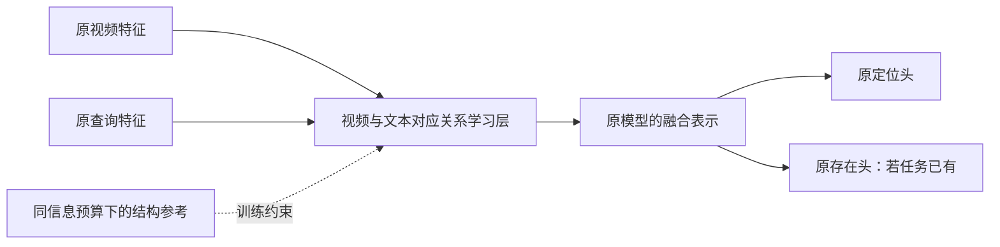

# 固定数据下的视频—文本对应关系泛化：修订研究方案

**最新执行范围覆盖（2026-09-30）：用户要求只训练六组，取消其他任务，不进行同预算核验。** 六组为 A1/QD baseline/regularized/adapter × GMR/正例 VTG，seed=3407、100 epoch。每张GPU同时两个任务；已完成结果复用，目标在跑任务继续，训练完成后自动评测汇总。下方75组、多划分/骨干扩展、成对预算核验均是历史方案，不再执行。模型、原数据、seen-only选择与双轨评测规则保留；最新任务交接见 [progress.md](progress.md) 顶部与 [HANDOFF.md](HANDOFF.md) 顶部。

**进度与任务交接入口：[progress.md](progress.md)。** 本方案定义实验协议；最新结果、最小首轮分析单元及恢复待办见 progress，运行入口见 [HANDOFF.md](HANDOFF.md)。2026-09-30 16:07 核验时，严格 100/best 诊断与三个开发控制已完成，机制门槛未通过、window 跳过，正式简单控制训练已经开始。下文开头的执行状态为早期记录，不代表当前进度。仅 seed=3407，未来不做多 seed；最小 6 次分析单元不替代原 75 次正式矩阵，也不改变活动队列。

日期：2026-09-30。**执行范围更新：用户已要求持久化自动队列，并明确取消多种子实验；本次只运行 seed=3407。以下历史三种子要求不再执行。** 当前主线与原方案的阶段门槛保留；当前执行状态以 [HANDOFF.md](HANDOFF.md) 为准。已做初步诊断及 CPU smoke，未完成正式新方法训练。当前参考来源、可比性及信息预算未充分验证，教师 L2/KL 分支暂停；继续训练侧机制诊断后据证据选择方法。

## 1. 核心科学问题

在训练集、正负样本及其标签完全相同的条件下，如何让模型从已见语义学到可迁移的视频—文本对应关系，使其遇到未见动作或组合时，仍能根据视频内容判断事件是否存在并完成定位？

研究对象是对应关系的泛化。DETR 是第一种实现载体，方法应能接入其他 VTG 模型，不依赖候选 slot、ROI、Hungarian assignment、特殊拒绝器或交叉标签配对。

当前已证实的是存在排序退化和部分正确定位被拒绝；还未证实“对应结构受损”“语义共现捷径”“预训练先验遗忘”中的任意一个是主因。尤其输入 CLIP/SlowFast 已被冻结，不能写成 CLIP 本体被下游训练遗忘。若有变化，首先应检查任务投影、跨模态交互和输出映射如何使用这些固定特征。

## 2. 严格固定的实验条件

- 每个划分 train.jsonl 的 qid 集合、查询文本、视频、正负标签和时间窗均不变，记录 SHA-256。
- 正负采样比例、batch 内样本、训练步数和每条数据暴露次数与对照一致；取消为新方法专用的交叉四元组采样。
- 不新增目标 U 的正例或负例，不生成新查询，不将跨视频随机配对或剪辑视图补成新负标签。
- 使用相同的冻结特征及预训练资源；不单独给新方法增加大模型教师、对象检测器、额外层特征、字幕或外部语料。
- 如果算法必须访问现有特征以外的信息，所有相关基线同步获得该信息并单列预算；原同信息实验仍作为主比较。
- 新方法以同一原始样本中的张量计算结构约束可以改变算法损失，但不得增加语义标注；任何参考分数只视为模型先验，不冒充真值。
- 主对照保留各 backbone 原有定位头、存在头、gate、阈值选择及 checkpoint 规则。头的结构不变、参数正常参与训练；“头结构不变”不等于冻结它的权重。
- 所有选择只依赖训练与 seen validation；真实 U 不用于结构、超参数或阈值选择。

此前的交叉标签审计保留为历史资料，当前方法不依赖其覆盖度，也不将该子集作为专属训练资源。

## 3. 必须先区分的三种失效

| 候选解释 | 需要的诊断 | 不能据此直接推出什么 |
| --- | --- | --- |
| 对应表示仍可区分，存在映射失配 | 固定表示、相同容量/训练数据的简单读出；原阈值与单调校准对照 | 阈值改善不等于对应关系改善 |
| 跨模态交互过度依赖 seen 语义共现 | 不同训练阶段/层的受控图文匹配诊断；同一原始样本上的单模态消融 | attention 图或文本分数变化不能直接证明因果捷径 |
| 原输入已缺少辨别关键动作的证据 | S+ 真值区间内匹配、时间顺序敏感性与物体/动作分组 | 若输入证据不足，不能保证头部正则可修复 |

优先在训练内开发划分和 seen validation 完成诊断。已公开的 U test 可用于一次预先指定的机制检验，但不能反复看 test 后选最有利解释。跨模型读出需固定容量、初始化规则和训练预算；比较原始余弦、任意隐藏层内积与学习后分数时必须说明尺度和空间差异。

## 4. 第一候选方向：对应结构保持与选择性任务适配

这是待评估研究方向，不是已经确认新颖性的命名模型。动机是：下游任务既需要学会精确时间对应，也应避免把跨模态匹配压缩为少数 seen 动作/物体组合的识别规则。仅保留所有预训练相似性会保留原模型的动作盲点；仅拟合下游监督则可能学到难迁移的对应。因此需要研究保留与修正的条件。

### 4.1 通用接入位置

模块接收视频时间序列与文本词元，输出形状兼容的表示或对应矩阵，可放在原投影后/跨模态交互处。DETR 的 decoder、proposal 模型的边界头、传统 start/end 分类器均保留；不同结构只需张量接口适配。标准 VTG 没有存在头时，模块仍须能够训练和推理。

### 4.2 参考可用性是进入条件

优先检查原有 CLIP 视频/文本缓存是否来自可比较的共同嵌入空间，是否保存了所需 projection。相同维度不等于可计算有语义含义的余弦；文本 token hidden state 也不自动与图像最终 embedding 对齐。

若仅句级—帧级参考可靠，就从这一粒度验证，不把它伪称为词元级真值。如果参考需要新编码器或新信息，必须改变所有对照预算或暂停该分支。随机初始化适配层、任务训练到任意时刻的模型也不能直接作为“通用语义教师”。

### 4.3 可实现的最低限度原型

在参考通过验证后，对每个原始样本定义可靠粒度的参考对应分数 R0 与适配分数 Rθ。以视频时间位置为例，正例可构造：

\[
P_0(t\mid q,V)=\operatorname{softmax}_t(R_0/\tau),\qquad
P_\theta(t\mid q,V)=\operatorname{softmax}_t(R_\theta/\tau).
\]

先比较无保持项与普通保持项 `Lkeep=KL(stopgrad(P0)||Pθ)`，再考虑使用已有 S+ 时间窗评估参考是否合理，例如参考概率在已标注目标区域内的质量。可靠性权重必须来自同一训练样本和现有时间标注，并与常数权重、随机权重对照。参考落在窗外不代表窗外已证明 absent；不能据此制造局部负标签。

S− 没有相关时间窗，其 temporal softmax 仍然总和为 1，不能拿它强迫负查询对齐某一帧。最低原型仅对 S+ 使用该时间对应保持项，S− 继续原有任务监督；不为 S− 生成对齐伪真值。是否能由正例对应结构改善 S−/U− 判断是需要实测的问题。

总目标的研究形式为：

\[
L=L_{original\ task}+\lambda\,w(V,q,Y) L_{keep},
\]

其中 Y 是已有标注。时间窗口监督与原定位损失负责允许任务相关修正；不能把保持项权重越大视为越好。该形式本身是普通关系蒸馏，必须先作为基线而非直接宣称新算法。真正潜在的研究贡献应来自对“何种对应结构、在什么条件下需要保持或修正”的机制识别，以及超出普通蒸馏的可重复证据。

若无可靠参考，或普通/选择性保持均无效，不应继续给该路线堆加模块。回到第 3 节，检验训练语义共现导致的交互退化，另行设计不依赖教师的结构学习。当前不同时承诺多条复杂方案。

## 5. 两条验证轨道

### A. 原四象限存在泛化

基线与新方法均使用各组原 S+/S−，保留原 GMR 头和评测。报告 S/U AUROC、U+ FRR、U− RR、raw/gated 定位、正确定位 U+ 的误拒率。方法不得靠减少 seen AUROC 来缩小差距，必须报告 unseen 绝对表现和 seen 代价。

### B. 传统正例 VTG

使用已有定位-only 协议：基线和新方法均使用相同 S+，模型不设置存在头，不增加 S−。分别评估 seen 与 unseen 正例定位，并检查对应关系诊断。这是单独的、双方数据完全一致的轨道，不与四象限训练结果混作同一预算。

至少覆盖 QD-DETR 和一种非 DETR 的 start/end 或 dense grounding 模型。现有 FlashVTG 可作为非 DETR 验证载体，但若要声称广泛适配传统 VTG，仍需明确模型覆盖范围。只有不同 DETR 变体有效，不能声称架构通用。

## 6. 最小对照矩阵

| 对照 | 改变内容 | 作用 |
| --- | --- | --- |
| 原模型 | 无 | 固定数据参照 |
| 参数匹配适配层 | 增加相同容量，无保持目标 | 排除参数量与普通适配收益 |
| 更强常规正则 | dropout/weight decay 的验证选择 | 排除一般防过拟合即可解释 |
| 普通表示 L2 保持 | 同信息参考 | 表示保持基线 |
| 普通对应结构 KL | 相同参考、相同样本 | 关系蒸馏强基线 |
| 候选选择性保持 | 相同样本与参考，改变约束条件 | 检验具体机制的新增价值 |
| 仅原存在头校准 | 表示不变 | 区分匹配泛化与决策校准 |

所有结构/损失候选从训练侧验证选择。不能先看到哪组 U 掉点最大，再为其定制保持强度。额外 forward 只允许同样本，记录计算量；数据访问一致不等于计算成本相同。

## 7. 先证明表示，再证明下游收益

预先定义训练内 pseudo-unseen 语义开发任务，所有对照共用相同样本和子划分，正式模型仍从头在完整 S 训练。辅助探针不能新增跨视频 absence 标签；可使用原已标注正负行、原正例时间窗与已存在的四格标签。

证据链应为：对应结构在语义迁移时发生可测的失效 → 方法改善该失效 → 同一原存在头结构下 U AUROC 改善 → 没有存在头的传统 VTG 中也出现相应定位收益。如果只能证明后两项之一，应缩小“通用对应关系”的表述。

采用层/阶段读出时，先固定探针与预算，不把换了一套更强读出造成的差异当表示质量。可以使用固定 head 的受控实验辅助归因，但必须说明冻结的是同一 checkpoint 的权重，不能把联合训练后不同权重当作同一 head。

正式训练延续 100 epochs、seen-only checkpoint/阈值规则；本次仅 seed=3407，不执行多种子确认。按视频 paired bootstrap 与种子变化分别报告，动作轴与组合轴分开统计。新视频域属于后续独立工作包。

## 8. 明确停止条件

若没有证据说明对应表示是主要瓶颈，不把它写成已知原因；若冻结参考主要匹配物体而不辨动作，不强制学生复制其结构；若普通蒸馏/常规正则同样有效，保留简洁结论而不夸大方法创新；若只提高 U+ 接受、U− 拒绝崩溃，仍算失败；若 unseen 不升而 seen 降，只是差距变小，不算泛化改善；若传统 VTG 无法接入或无对应收益，不能称为通用方法。

## 9. 当前执行优先级

第一步核查现有特征空间与参考对应的可用性；第二步完成原训练模型不同层/阶段的对应关系诊断；第三步在原头、原样本下实现参数匹配适配与普通结构保持基线；只有出现可重复现象后，才冻结选择性适配机制并扩展到非 DETR。当前不执行 Witness-DETR 四元组训练，不将历史数据核查作为主方法创新。

执行审计补充：原 throw 开发视图有 throw/toss 词形残留，已保留旧结果并停止其作为严格语义诊断。当前采用 `pseudo_unseen_a1_throw_strict`，仅在训练侧排除5个额外视频、8行；正式原全 S 数据不改。当前单 seed=3407 自动队列为 `autonomous_queue_20260930_strict`，以其状态和报告为准。
